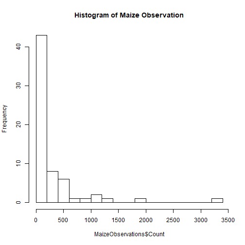
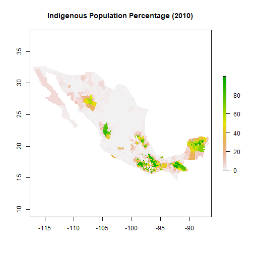
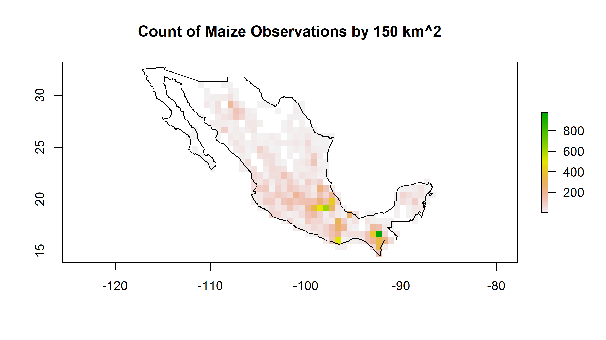
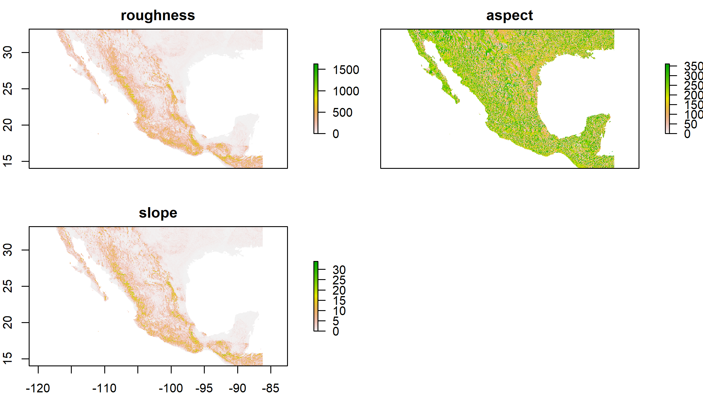

<style>
body {
    overflow: scroll;
}
</style>


Evaluating Impacts of Climate Change on Traditional Mexican Maize
========================================================
author: Steven C. Gonzalez
date: December 6th, 2017
autosize: true
width: 1920
height: 1080
font-family: arial
css: exlaim.css
Presented to:<br />
Dr. Russell Weaver (Chair) <br />
Dr. Jennifer Jensen <br />
Dr. Thomas Ballinger <br />

M.S. Thesis Proposal <br />
Department of Geography  <br />
Texas State University, San Marcos, TX <br />
github: www.github.com/stevenconnorg/maices-enm <br />
contact: scg67@txstate.edu


Introduction
=======================================================
type: section


- Climate change is expected heavily impact natural and human systems worldwide  (Walther, G.-R. et al., 2002; IPCC 2007, 2013; Kang, Y, S. Khan 2009; Hoegh-Guldberg, O. 2010)

- The IPCC reports numerous negative impacts of climate change on domesticated crops regardless of the emission scenario implemented(Brown and Funk 2008; Ureta et al. 2012; IPCC 2013) 

- Ensuring global food security in an increasingly warming world with  exponentially increasing world population requires multidisciplinary research  (Brown and Funk 2008; Ureta et al. 2012; IPCC 2013, 2015) 

*** 
<br/>
<font size = "5px">  Five percent reduction in crop season, sensitivity to change, capacity to cope. Source: CGIAR. </font>


Mexico: Maize's 'C.O.D.'
=======================================================
type: section

- Maize (<i>Zea mays</i> subsp. <i>mays</i> L.) supplies a staple food crop for more than 200 million people worldwide (Nuss and Tanumihardjo 2010; Ureta et al. 2013)

- Climate change is expected to alter maize suitability, especially between the tropics (Ramirez-Cabral et al., 2017)

- Mexico, maize's C.O.D., harbors traditional maize landraces that account for 60% of maize genetic diversity globally (Ureta et al. 2013)

- Preservation of agrobiodiversity at centers of domestication critical for global food security (Thrupp 2000; Esquinas-Alcazar 2005; Ureta et al. 2013).  

***


</br>
<font size = "5px">  Source: The International Maize and Wheat Improvement Center (CIMMYT) </font>

Maize Diversity & Evolution
=======================================================
type: section
</br>
<font size = "5px">  Source: https://lacienciaysusdemonios.com </font>

***

- > 9,000 years from Mexican annual teosinte (<i>Z. mays</i> ssp. <i>Parviglumus</i> and ssp. <i>mexicana</i> ) via artificial selection by indigenous cultures (Matsuoka et al. 2002; Kato et al. 2009)
- Maize landraces have been grown (Ruiz Corral et al. 2008):
      - from sea-level to 2,900 (m asl)
      - avg. growing temp 12.0 &deg;C - 29.1 &deg;C
      - avg. seasonal precip. 400 mm to 3555 mm 
- Regional clusters of phenotypically similar landraces exist (Cutler 1942; Anderson 1947; E.J. Wellhausen et al., 1952; Dyer & Lopez-Feldman 2013)


Maize Mirrors Humanity
=======================================================
type: section
</br>
<font size = "5px">  Source: http://tarotdemaximo.blogspot.com </font>
***

- As a domesticated crop, maize is intimately contingent upon societal influences
- Edgar Anderson - "maize [as] as sensitive mirror of the people of who grow it" (Anderson, 1942, 1947)
- Today, numerous studies indicate human influences on maize distribution and diversity, including:
      - Seed management practices (Anderson 1947; Dyer and Lopez-Feldman 2013)
      - Indigenous religious practices (relating to shape and color) (R. Ortega-Paczka., 2003) 
      - Ethnolinguistic diversity (Perales, Benz, and Brush 2005; Brush and Perales 2007; Rivero-Romero et al. 2016)
      - Indigenous agricultural knowledge (Garcia-Martinez et al. 2016; Rivero-Romero et al. 2016)
      - Agro-technological practices (Garcia-Martinez et al. 2016; Rivero-Romero et al. 2016; Toledo and Barrera-Bassols 2017)
      - variations across ethnic groups (Perales, Benz, and Brush 2005; Brush and Perales 2007)
    
Ethno-linguistic Diversity of Mexico
=======================================================

- <i> La Comisión Nacional para el Conocimiento y Uso de la Biodiversidad </i>(CONABIO)
- 2000 indigenous population % at <i>municipio</i> level
    - Rasterized identical resolution
- 68 indigenous macro-languages in Mexico  <i>(Instituto Nacional de Lenguas Indigenas (INALI)) </i>
    - In reality, many more distinct languages
    - 10-14% identify as indigenous, but only 6% speak an indigenous language
    
*** 




68 macro-languages of Mexico
========================================================
1990 1^st - 4^th major indigenous languages at <i>municipio</i> level 

<div style="border: 1px solid #ddd; padding: 5px; overflow-y: scroll; height:400px; "><table class="table" style="margin-left: auto; margin-right: auto;">
<thead><tr>
<th style="text-align:left;">   </th>
   <th style="text-align:left;"> LENGUA1 </th>
   <th style="text-align:left;"> LENGUA2 </th>
   <th style="text-align:left;"> LENGUA3 </th>
   <th style="text-align:left;"> LENGUA4 </th>
  </tr></thead>
<tbody>
<tr>
<td style="text-align:left;"> 0 </td>
   <td style="text-align:left;"> MIXTECO </td>
   <td style="text-align:left;"> ZAPOTECO </td>
   <td style="text-align:left;"> NA </td>
   <td style="text-align:left;"> NA </td>
  </tr>
<tr>
<td style="text-align:left;"> 1 </td>
   <td style="text-align:left;"> PUREPECHA </td>
   <td style="text-align:left;"> MIXTECO </td>
   <td style="text-align:left;"> NA </td>
   <td style="text-align:left;"> NA </td>
  </tr>
<tr>
<td style="text-align:left;"> 2 </td>
   <td style="text-align:left;"> MIXTECO </td>
   <td style="text-align:left;"> PUREPECHA </td>
   <td style="text-align:left;"> NA </td>
   <td style="text-align:left;"> NA </td>
  </tr>
<tr>
<td style="text-align:left;"> 3 </td>
   <td style="text-align:left;"> CUCAPA </td>
   <td style="text-align:left;"> PUREPECHA </td>
   <td style="text-align:left;"> NA </td>
   <td style="text-align:left;"> NA </td>
  </tr>
<tr>
<td style="text-align:left;"> 5 </td>
   <td style="text-align:left;"> NAHUATL </td>
   <td style="text-align:left;"> MIXTECO </td>
   <td style="text-align:left;"> YAQUI </td>
   <td style="text-align:left;"> NA </td>
  </tr>
<tr>
<td style="text-align:left;"> 6 </td>
   <td style="text-align:left;"> PIMA ALTO </td>
   <td style="text-align:left;"> MAYO </td>
   <td style="text-align:left;"> NA </td>
   <td style="text-align:left;"> NA </td>
  </tr>
<tr>
<td style="text-align:left;"> 7 </td>
   <td style="text-align:left;"> TARAHUMARA </td>
   <td style="text-align:left;"> YAQUI </td>
   <td style="text-align:left;"> PIMA </td>
   <td style="text-align:left;"> NA </td>
  </tr>
<tr>
<td style="text-align:left;"> 8 </td>
   <td style="text-align:left;"> TARAHUMARA </td>
   <td style="text-align:left;"> MAZAHUA </td>
   <td style="text-align:left;"> NA </td>
   <td style="text-align:left;"> NA </td>
  </tr>
<tr>
<td style="text-align:left;"> 9 </td>
   <td style="text-align:left;"> MIXTECO </td>
   <td style="text-align:left;"> ZAPOTECO </td>
   <td style="text-align:left;"> MAYO </td>
   <td style="text-align:left;"> NA </td>
  </tr>
<tr>
<td style="text-align:left;"> 10 </td>
   <td style="text-align:left;"> MAYO </td>
   <td style="text-align:left;"> CHINANTECO </td>
   <td style="text-align:left;"> MIXE </td>
   <td style="text-align:left;"> OTOMI </td>
  </tr>
<tr>
<td style="text-align:left;"> 11 </td>
   <td style="text-align:left;"> PIMA ALTO </td>
   <td style="text-align:left;"> MAYO </td>
   <td style="text-align:left;"> TARAHUMARA </td>
   <td style="text-align:left;"> NA </td>
  </tr>
<tr>
<td style="text-align:left;"> 12 </td>
   <td style="text-align:left;"> TARAHUMARA </td>
   <td style="text-align:left;"> MAYA </td>
   <td style="text-align:left;"> NA </td>
   <td style="text-align:left;"> NA </td>
  </tr>
<tr>
<td style="text-align:left;"> 13 </td>
   <td style="text-align:left;"> MAYA </td>
   <td style="text-align:left;"> NAHUATL </td>
   <td style="text-align:left;"> NA </td>
   <td style="text-align:left;"> NA </td>
  </tr>
<tr>
<td style="text-align:left;"> 14 </td>
   <td style="text-align:left;"> MIXTECO </td>
   <td style="text-align:left;"> MAYO </td>
   <td style="text-align:left;"> NA </td>
   <td style="text-align:left;"> NA </td>
  </tr>
<tr>
<td style="text-align:left;"> 15 </td>
   <td style="text-align:left;"> TARAHUMARA </td>
   <td style="text-align:left;"> ZAPOTECO </td>
   <td style="text-align:left;"> NA </td>
   <td style="text-align:left;"> NA </td>
  </tr>
<tr>
<td style="text-align:left;"> 16 </td>
   <td style="text-align:left;"> TARAHUMARA </td>
   <td style="text-align:left;"> TEPEHUAN </td>
   <td style="text-align:left;"> NA </td>
   <td style="text-align:left;"> NA </td>
  </tr>
<tr>
<td style="text-align:left;"> 17 </td>
   <td style="text-align:left;"> PUREPECHA </td>
   <td style="text-align:left;"> MAYO </td>
   <td style="text-align:left;"> NA </td>
   <td style="text-align:left;"> NA </td>
  </tr>
<tr>
<td style="text-align:left;"> 18 </td>
   <td style="text-align:left;"> YAQUI </td>
   <td style="text-align:left;"> MAYO </td>
   <td style="text-align:left;"> NA </td>
   <td style="text-align:left;"> NA </td>
  </tr>
<tr>
<td style="text-align:left;"> 19 </td>
   <td style="text-align:left;"> TARAHUMARA </td>
   <td style="text-align:left;"> YAQUI </td>
   <td style="text-align:left;"> NA </td>
   <td style="text-align:left;"> NA </td>
  </tr>
<tr>
<td style="text-align:left;"> 20 </td>
   <td style="text-align:left;"> PIMA ALTO </td>
   <td style="text-align:left;"> NA </td>
   <td style="text-align:left;"> NA </td>
   <td style="text-align:left;"> NA </td>
  </tr>
<tr>
<td style="text-align:left;"> 21 </td>
   <td style="text-align:left;"> TARAHUMARA </td>
   <td style="text-align:left;"> NA </td>
   <td style="text-align:left;"> NA </td>
   <td style="text-align:left;"> NA </td>
  </tr>
<tr>
<td style="text-align:left;"> 22 </td>
   <td style="text-align:left;"> MAYO </td>
   <td style="text-align:left;"> YAQUI </td>
   <td style="text-align:left;"> ZAPOTECO </td>
   <td style="text-align:left;"> CHINANTECO </td>
  </tr>
<tr>
<td style="text-align:left;"> 23 </td>
   <td style="text-align:left;"> MAYO </td>
   <td style="text-align:left;"> ZAPOTECO </td>
   <td style="text-align:left;"> NA </td>
   <td style="text-align:left;"> NA </td>
  </tr>
<tr>
<td style="text-align:left;"> 25 </td>
   <td style="text-align:left;"> NA </td>
   <td style="text-align:left;"> NA </td>
   <td style="text-align:left;"> NA </td>
   <td style="text-align:left;"> NA </td>
  </tr>
<tr>
<td style="text-align:left;"> 27 </td>
   <td style="text-align:left;"> TARAHUMARA </td>
   <td style="text-align:left;"> MAYO </td>
   <td style="text-align:left;"> NA </td>
   <td style="text-align:left;"> NA </td>
  </tr>
<tr>
<td style="text-align:left;"> 28 </td>
   <td style="text-align:left;"> SERI </td>
   <td style="text-align:left;"> MAYO </td>
   <td style="text-align:left;"> NA </td>
   <td style="text-align:left;"> NA </td>
  </tr>
<tr>
<td style="text-align:left;"> 31 </td>
   <td style="text-align:left;"> TARAHUMARA </td>
   <td style="text-align:left;"> PIMA </td>
   <td style="text-align:left;"> NA </td>
   <td style="text-align:left;"> NA </td>
  </tr>
<tr>
<td style="text-align:left;"> 33 </td>
   <td style="text-align:left;"> MAYO </td>
   <td style="text-align:left;"> YAQUI </td>
   <td style="text-align:left;"> NA </td>
   <td style="text-align:left;"> NA </td>
  </tr>
<tr>
<td style="text-align:left;"> 34 </td>
   <td style="text-align:left;"> TARAHUMARA </td>
   <td style="text-align:left;"> HUASTECO </td>
   <td style="text-align:left;"> NA </td>
   <td style="text-align:left;"> NA </td>
  </tr>
<tr>
<td style="text-align:left;"> 35 </td>
   <td style="text-align:left;"> MAYO </td>
   <td style="text-align:left;"> NA </td>
   <td style="text-align:left;"> NA </td>
   <td style="text-align:left;"> NA </td>
  </tr>
<tr>
<td style="text-align:left;"> 37 </td>
   <td style="text-align:left;"> MAYO </td>
   <td style="text-align:left;"> YAQUI </td>
   <td style="text-align:left;"> CUCAPA </td>
   <td style="text-align:left;"> NA </td>
  </tr>
<tr>
<td style="text-align:left;"> 43 </td>
   <td style="text-align:left;"> MAYA </td>
   <td style="text-align:left;"> NA </td>
   <td style="text-align:left;"> NA </td>
   <td style="text-align:left;"> NA </td>
  </tr>
<tr>
<td style="text-align:left;"> 44 </td>
   <td style="text-align:left;"> NAHUATL </td>
   <td style="text-align:left;"> NA </td>
   <td style="text-align:left;"> NA </td>
   <td style="text-align:left;"> NA </td>
  </tr>
<tr>
<td style="text-align:left;"> 45 </td>
   <td style="text-align:left;"> TARAHUMARA </td>
   <td style="text-align:left;"> MAYO </td>
   <td style="text-align:left;"> CHOL </td>
   <td style="text-align:left;"> NA </td>
  </tr>
<tr>
<td style="text-align:left;"> 46 </td>
   <td style="text-align:left;"> AMUZGO </td>
   <td style="text-align:left;"> NA </td>
   <td style="text-align:left;"> NA </td>
   <td style="text-align:left;"> NA </td>
  </tr>
<tr>
<td style="text-align:left;"> 52 </td>
   <td style="text-align:left;"> MAYO </td>
   <td style="text-align:left;"> HUASTECO </td>
   <td style="text-align:left;"> TARAHUMARA </td>
   <td style="text-align:left;"> NA </td>
  </tr>
<tr>
<td style="text-align:left;"> 53 </td>
   <td style="text-align:left;"> PIMA </td>
   <td style="text-align:left;"> TARAHUMARA </td>
   <td style="text-align:left;"> NA </td>
   <td style="text-align:left;"> NA </td>
  </tr>
<tr>
<td style="text-align:left;"> 54 </td>
   <td style="text-align:left;"> TOTONACA </td>
   <td style="text-align:left;"> PUREPECHA </td>
   <td style="text-align:left;"> MAYO </td>
   <td style="text-align:left;"> NA </td>
  </tr>
<tr>
<td style="text-align:left;"> 55 </td>
   <td style="text-align:left;"> MAYO </td>
   <td style="text-align:left;"> TARAHUMARA </td>
   <td style="text-align:left;"> NA </td>
   <td style="text-align:left;"> NA </td>
  </tr>
<tr>
<td style="text-align:left;"> 58 </td>
   <td style="text-align:left;"> NAHUATL </td>
   <td style="text-align:left;"> ZAPOTECO </td>
   <td style="text-align:left;"> NA </td>
   <td style="text-align:left;"> NA </td>
  </tr>
<tr>
<td style="text-align:left;"> 60 </td>
   <td style="text-align:left;"> YAQUI </td>
   <td style="text-align:left;"> NA </td>
   <td style="text-align:left;"> NA </td>
   <td style="text-align:left;"> NA </td>
  </tr>
<tr>
<td style="text-align:left;"> 66 </td>
   <td style="text-align:left;"> TARAHUMARA </td>
   <td style="text-align:left;"> CAKCHIQUEL </td>
   <td style="text-align:left;"> NA </td>
   <td style="text-align:left;"> NA </td>
  </tr>
<tr>
<td style="text-align:left;"> 67 </td>
   <td style="text-align:left;"> TARAHUMARA </td>
   <td style="text-align:left;"> MIXTECO </td>
   <td style="text-align:left;"> NA </td>
   <td style="text-align:left;"> NA </td>
  </tr>
<tr>
<td style="text-align:left;"> 71 </td>
   <td style="text-align:left;"> PIMA </td>
   <td style="text-align:left;"> NAHUATL </td>
   <td style="text-align:left;"> NA </td>
   <td style="text-align:left;"> NA </td>
  </tr>
<tr>
<td style="text-align:left;"> 72 </td>
   <td style="text-align:left;"> TARAHUMARA </td>
   <td style="text-align:left;"> PIMA </td>
   <td style="text-align:left;"> OTOMI </td>
   <td style="text-align:left;"> CHOCHO </td>
  </tr>
<tr>
<td style="text-align:left;"> 74 </td>
   <td style="text-align:left;"> MAYA </td>
   <td style="text-align:left;"> PUREPECHA </td>
   <td style="text-align:left;"> ZAPOTECO </td>
   <td style="text-align:left;"> TARAHUMARA </td>
  </tr>
<tr>
<td style="text-align:left;"> 76 </td>
   <td style="text-align:left;"> HUASTECO </td>
   <td style="text-align:left;"> NAHUATL </td>
   <td style="text-align:left;"> MAZAHUA </td>
   <td style="text-align:left;"> HUICHOL </td>
  </tr>
<tr>
<td style="text-align:left;"> 80 </td>
   <td style="text-align:left;"> TARAHUMARA </td>
   <td style="text-align:left;"> PUREPECHA </td>
   <td style="text-align:left;"> NA </td>
   <td style="text-align:left;"> NA </td>
  </tr>
<tr>
<td style="text-align:left;"> 82 </td>
   <td style="text-align:left;"> HUASTECO </td>
   <td style="text-align:left;"> NAHUATL </td>
   <td style="text-align:left;"> NA </td>
   <td style="text-align:left;"> NA </td>
  </tr>
<tr>
<td style="text-align:left;"> 85 </td>
   <td style="text-align:left;"> KIKAPU </td>
   <td style="text-align:left;"> NAHUATL </td>
   <td style="text-align:left;"> NA </td>
   <td style="text-align:left;"> NA </td>
  </tr>
<tr>
<td style="text-align:left;"> 86 </td>
   <td style="text-align:left;"> YAQUI </td>
   <td style="text-align:left;"> NAHUATL </td>
   <td style="text-align:left;"> NA </td>
   <td style="text-align:left;"> NA </td>
  </tr>
<tr>
<td style="text-align:left;"> 87 </td>
   <td style="text-align:left;"> TARAHUMARA </td>
   <td style="text-align:left;"> MAYA </td>
   <td style="text-align:left;"> TEPEHUAN </td>
   <td style="text-align:left;"> NA </td>
  </tr>
<tr>
<td style="text-align:left;"> 88 </td>
   <td style="text-align:left;"> PIMA </td>
   <td style="text-align:left;"> NA </td>
   <td style="text-align:left;"> NA </td>
   <td style="text-align:left;"> NA </td>
  </tr>
<tr>
<td style="text-align:left;"> 89 </td>
   <td style="text-align:left;"> OTOMI </td>
   <td style="text-align:left;"> NAHUATL </td>
   <td style="text-align:left;"> NA </td>
   <td style="text-align:left;"> NA </td>
  </tr>
<tr>
<td style="text-align:left;"> 90 </td>
   <td style="text-align:left;"> TARAHUMARA </td>
   <td style="text-align:left;"> TEPEHUAN </td>
   <td style="text-align:left;"> PIMA </td>
   <td style="text-align:left;"> NA </td>
  </tr>
<tr>
<td style="text-align:left;"> 95 </td>
   <td style="text-align:left;"> NAHUATL </td>
   <td style="text-align:left;"> TOTONACA </td>
   <td style="text-align:left;"> TARAHUMARA </td>
   <td style="text-align:left;"> HUASTECO </td>
  </tr>
<tr>
<td style="text-align:left;"> 96 </td>
   <td style="text-align:left;"> ZAPOTECO </td>
   <td style="text-align:left;"> HUASTECO </td>
   <td style="text-align:left;"> NA </td>
   <td style="text-align:left;"> NA </td>
  </tr>
<tr>
<td style="text-align:left;"> 97 </td>
   <td style="text-align:left;"> PIMA </td>
   <td style="text-align:left;"> YAQUI </td>
   <td style="text-align:left;"> TARAHUMARA </td>
   <td style="text-align:left;"> MAYA </td>
  </tr>
<tr>
<td style="text-align:left;"> 102 </td>
   <td style="text-align:left;"> NAHUATL </td>
   <td style="text-align:left;"> OTOMI </td>
   <td style="text-align:left;"> NA </td>
   <td style="text-align:left;"> NA </td>
  </tr>
<tr>
<td style="text-align:left;"> 103 </td>
   <td style="text-align:left;"> NAHUATL </td>
   <td style="text-align:left;"> TOTONACA </td>
   <td style="text-align:left;"> NA </td>
   <td style="text-align:left;"> NA </td>
  </tr>
<tr>
<td style="text-align:left;"> 104 </td>
   <td style="text-align:left;"> TARAHUMARA </td>
   <td style="text-align:left;"> NAHUATL </td>
   <td style="text-align:left;"> NA </td>
   <td style="text-align:left;"> NA </td>
  </tr>
<tr>
<td style="text-align:left;"> 106 </td>
   <td style="text-align:left;"> MAZAHUA </td>
   <td style="text-align:left;"> YAQUI </td>
   <td style="text-align:left;"> NA </td>
   <td style="text-align:left;"> NA </td>
  </tr>
<tr>
<td style="text-align:left;"> 107 </td>
   <td style="text-align:left;"> OTOMI </td>
   <td style="text-align:left;"> TARAHUMARA </td>
   <td style="text-align:left;"> MAYA </td>
   <td style="text-align:left;"> NA </td>
  </tr>
<tr>
<td style="text-align:left;"> 110 </td>
   <td style="text-align:left;"> MIXE </td>
   <td style="text-align:left;"> ZAPOTECO </td>
   <td style="text-align:left;"> NA </td>
   <td style="text-align:left;"> NA </td>
  </tr>
<tr>
<td style="text-align:left;"> 115 </td>
   <td style="text-align:left;"> TARAHUMARA </td>
   <td style="text-align:left;"> MIXTECO </td>
   <td style="text-align:left;"> NAHUATL </td>
   <td style="text-align:left;"> NA </td>
  </tr>
<tr>
<td style="text-align:left;"> 125 </td>
   <td style="text-align:left;"> TARAHUMARA </td>
   <td style="text-align:left;"> HUICHOL </td>
   <td style="text-align:left;"> NA </td>
   <td style="text-align:left;"> NA </td>
  </tr>
<tr>
<td style="text-align:left;"> 135 </td>
   <td style="text-align:left;"> NAHUATL </td>
   <td style="text-align:left;"> ZAPOTECO </td>
   <td style="text-align:left;"> CHOL </td>
   <td style="text-align:left;"> NA </td>
  </tr>
<tr>
<td style="text-align:left;"> 139 </td>
   <td style="text-align:left;"> TARAHUMARA </td>
   <td style="text-align:left;"> HUAVE </td>
   <td style="text-align:left;"> NA </td>
   <td style="text-align:left;"> NA </td>
  </tr>
<tr>
<td style="text-align:left;"> 144 </td>
   <td style="text-align:left;"> TARAHUMARA </td>
   <td style="text-align:left;"> TOTONACA </td>
   <td style="text-align:left;"> ZAPOTECO DEL ISTMO </td>
   <td style="text-align:left;"> MAYA </td>
  </tr>
<tr>
<td style="text-align:left;"> 149 </td>
   <td style="text-align:left;"> MAYO </td>
   <td style="text-align:left;"> CAHITA </td>
   <td style="text-align:left;"> NA </td>
   <td style="text-align:left;"> NA </td>
  </tr>
<tr>
<td style="text-align:left;"> 150 </td>
   <td style="text-align:left;"> OTOMI </td>
   <td style="text-align:left;"> NA </td>
   <td style="text-align:left;"> NA </td>
   <td style="text-align:left;"> NA </td>
  </tr>
<tr>
<td style="text-align:left;"> 154 </td>
   <td style="text-align:left;"> HUASTECO </td>
   <td style="text-align:left;"> NA </td>
   <td style="text-align:left;"> NA </td>
   <td style="text-align:left;"> NA </td>
  </tr>
<tr>
<td style="text-align:left;"> 160 </td>
   <td style="text-align:left;"> TARAHUMARA </td>
   <td style="text-align:left;"> YAQUI </td>
   <td style="text-align:left;"> TEPEHUAN </td>
   <td style="text-align:left;"> MAYA </td>
  </tr>
<tr>
<td style="text-align:left;"> 163 </td>
   <td style="text-align:left;"> TARAHUMARA </td>
   <td style="text-align:left;"> MAZAHUA </td>
   <td style="text-align:left;"> ZAPOTECO </td>
   <td style="text-align:left;"> NA </td>
  </tr>
<tr>
<td style="text-align:left;"> 164 </td>
   <td style="text-align:left;"> TOTONACA </td>
   <td style="text-align:left;"> NAHUATL </td>
   <td style="text-align:left;"> NA </td>
   <td style="text-align:left;"> NA </td>
  </tr>
<tr>
<td style="text-align:left;"> 171 </td>
   <td style="text-align:left;"> NAHUATL </td>
   <td style="text-align:left;"> POPOLUCA </td>
   <td style="text-align:left;"> NA </td>
   <td style="text-align:left;"> NA </td>
  </tr>
<tr>
<td style="text-align:left;"> 172 </td>
   <td style="text-align:left;"> NAHUATL </td>
   <td style="text-align:left;"> MAYA </td>
   <td style="text-align:left;"> NA </td>
   <td style="text-align:left;"> NA </td>
  </tr>
<tr>
<td style="text-align:left;"> 175 </td>
   <td style="text-align:left;"> NAHUATL </td>
   <td style="text-align:left;"> TARAHUMARA </td>
   <td style="text-align:left;"> MAYA </td>
   <td style="text-align:left;"> ZAPOTECO </td>
  </tr>
<tr>
<td style="text-align:left;"> 179 </td>
   <td style="text-align:left;"> MAZAHUA </td>
   <td style="text-align:left;"> ZAPOTECO </td>
   <td style="text-align:left;"> NA </td>
   <td style="text-align:left;"> NA </td>
  </tr>
<tr>
<td style="text-align:left;"> 180 </td>
   <td style="text-align:left;"> MAYA </td>
   <td style="text-align:left;"> TARAHUMARA </td>
   <td style="text-align:left;"> NA </td>
   <td style="text-align:left;"> NA </td>
  </tr>
<tr>
<td style="text-align:left;"> 187 </td>
   <td style="text-align:left;"> MIXTECO </td>
   <td style="text-align:left;"> MIXTECO DE LA MIXTECA ALTA </td>
   <td style="text-align:left;"> NA </td>
   <td style="text-align:left;"> NA </td>
  </tr>
<tr>
<td style="text-align:left;"> 188 </td>
   <td style="text-align:left;"> HUASTECO </td>
   <td style="text-align:left;"> HUICHOL </td>
   <td style="text-align:left;"> NAHUATL </td>
   <td style="text-align:left;"> NA </td>
  </tr>
<tr>
<td style="text-align:left;"> 190 </td>
   <td style="text-align:left;"> TEPEHUAN </td>
   <td style="text-align:left;"> TARAHUMARA </td>
   <td style="text-align:left;"> NA </td>
   <td style="text-align:left;"> NA </td>
  </tr>
<tr>
<td style="text-align:left;"> 195 </td>
   <td style="text-align:left;"> HUASTECO </td>
   <td style="text-align:left;"> MAYA </td>
   <td style="text-align:left;"> NA </td>
   <td style="text-align:left;"> NA </td>
  </tr>
<tr>
<td style="text-align:left;"> 202 </td>
   <td style="text-align:left;"> HUASTECO </td>
   <td style="text-align:left;"> TARAHUMARA </td>
   <td style="text-align:left;"> NA </td>
   <td style="text-align:left;"> NA </td>
  </tr>
<tr>
<td style="text-align:left;"> 209 </td>
   <td style="text-align:left;"> NAHUATL </td>
   <td style="text-align:left;"> HUASTECO </td>
   <td style="text-align:left;"> NA </td>
   <td style="text-align:left;"> NA </td>
  </tr>
<tr>
<td style="text-align:left;"> 216 </td>
   <td style="text-align:left;"> NAHUATL </td>
   <td style="text-align:left;"> TARAHUMARA </td>
   <td style="text-align:left;"> NA </td>
   <td style="text-align:left;"> NA </td>
  </tr>
<tr>
<td style="text-align:left;"> 217 </td>
   <td style="text-align:left;"> HUASTECO </td>
   <td style="text-align:left;"> CHATINO </td>
   <td style="text-align:left;"> NA </td>
   <td style="text-align:left;"> NA </td>
  </tr>
<tr>
<td style="text-align:left;"> 220 </td>
   <td style="text-align:left;"> CHONTAL </td>
   <td style="text-align:left;"> OTOMI </td>
   <td style="text-align:left;"> NA </td>
   <td style="text-align:left;"> NA </td>
  </tr>
<tr>
<td style="text-align:left;"> 222 </td>
   <td style="text-align:left;"> MIXTECO </td>
   <td style="text-align:left;"> HUASTECO </td>
   <td style="text-align:left;"> NA </td>
   <td style="text-align:left;"> NA </td>
  </tr>
<tr>
<td style="text-align:left;"> 223 </td>
   <td style="text-align:left;"> CHONTAL </td>
   <td style="text-align:left;"> HUASTECO </td>
   <td style="text-align:left;"> TARAHUMARA </td>
   <td style="text-align:left;"> CHOL </td>
  </tr>
<tr>
<td style="text-align:left;"> 229 </td>
   <td style="text-align:left;"> MAYA </td>
   <td style="text-align:left;"> OTOMI </td>
   <td style="text-align:left;"> NA </td>
   <td style="text-align:left;"> NA </td>
  </tr>
<tr>
<td style="text-align:left;"> 235 </td>
   <td style="text-align:left;"> ZAPOTECO </td>
   <td style="text-align:left;"> TEPEHUAN </td>
   <td style="text-align:left;"> MIXTECO </td>
   <td style="text-align:left;"> MAYO </td>
  </tr>
<tr>
<td style="text-align:left;"> 236 </td>
   <td style="text-align:left;"> TARAHUMARA </td>
   <td style="text-align:left;"> MAYA </td>
   <td style="text-align:left;"> NAHUATL </td>
   <td style="text-align:left;"> OTOMI </td>
  </tr>
<tr>
<td style="text-align:left;"> 242 </td>
   <td style="text-align:left;"> NAHUATL </td>
   <td style="text-align:left;"> MAYA </td>
   <td style="text-align:left;"> TARAHUMARA </td>
   <td style="text-align:left;"> NA </td>
  </tr>
<tr>
<td style="text-align:left;"> 244 </td>
   <td style="text-align:left;"> MAZAHUA </td>
   <td style="text-align:left;"> TARAHUMARA </td>
   <td style="text-align:left;"> NA </td>
   <td style="text-align:left;"> NA </td>
  </tr>
<tr>
<td style="text-align:left;"> 247 </td>
   <td style="text-align:left;"> MAYO </td>
   <td style="text-align:left;"> NAHUATL </td>
   <td style="text-align:left;"> NA </td>
   <td style="text-align:left;"> NA </td>
  </tr>
<tr>
<td style="text-align:left;"> 248 </td>
   <td style="text-align:left;"> NAHUATL </td>
   <td style="text-align:left;"> TEPEHUAN </td>
   <td style="text-align:left;"> MAYA </td>
   <td style="text-align:left;"> NA </td>
  </tr>
<tr>
<td style="text-align:left;"> 251 </td>
   <td style="text-align:left;"> MAYA </td>
   <td style="text-align:left;"> TOTONACA </td>
   <td style="text-align:left;"> NAHUATL </td>
   <td style="text-align:left;"> NA </td>
  </tr>
<tr>
<td style="text-align:left;"> 255 </td>
   <td style="text-align:left;"> MAYO </td>
   <td style="text-align:left;"> MAZATECO </td>
   <td style="text-align:left;"> NA </td>
   <td style="text-align:left;"> NA </td>
  </tr>
<tr>
<td style="text-align:left;"> 256 </td>
   <td style="text-align:left;"> TOTONACA </td>
   <td style="text-align:left;"> HUASTECO </td>
   <td style="text-align:left;"> NA </td>
   <td style="text-align:left;"> NA </td>
  </tr>
<tr>
<td style="text-align:left;"> 257 </td>
   <td style="text-align:left;"> CHICHIMECA JONAZ </td>
   <td style="text-align:left;"> MAYA </td>
   <td style="text-align:left;"> NA </td>
   <td style="text-align:left;"> NA </td>
  </tr>
<tr>
<td style="text-align:left;"> 258 </td>
   <td style="text-align:left;"> ZAPOTECO </td>
   <td style="text-align:left;"> MAYA </td>
   <td style="text-align:left;"> NA </td>
   <td style="text-align:left;"> NA </td>
  </tr>
<tr>
<td style="text-align:left;"> 261 </td>
   <td style="text-align:left;"> CHOL </td>
   <td style="text-align:left;"> NAHUATL </td>
   <td style="text-align:left;"> NA </td>
   <td style="text-align:left;"> NA </td>
  </tr>
<tr>
<td style="text-align:left;"> 263 </td>
   <td style="text-align:left;"> TARAHUMARA </td>
   <td style="text-align:left;"> NAHUATL </td>
   <td style="text-align:left;"> MAYA </td>
   <td style="text-align:left;"> NA </td>
  </tr>
<tr>
<td style="text-align:left;"> 264 </td>
   <td style="text-align:left;"> AGUACATECO </td>
   <td style="text-align:left;"> NAHUATL </td>
   <td style="text-align:left;"> NA </td>
   <td style="text-align:left;"> NA </td>
  </tr>
<tr>
<td style="text-align:left;"> 265 </td>
   <td style="text-align:left;"> MAYA </td>
   <td style="text-align:left;"> TARAHUMARA </td>
   <td style="text-align:left;"> HUASTECO </td>
   <td style="text-align:left;"> MIXTECO </td>
  </tr>
<tr>
<td style="text-align:left;"> 270 </td>
   <td style="text-align:left;"> CORA </td>
   <td style="text-align:left;"> NAHUATL </td>
   <td style="text-align:left;"> NA </td>
   <td style="text-align:left;"> NA </td>
  </tr>
<tr>
<td style="text-align:left;"> 272 </td>
   <td style="text-align:left;"> TEPEHUAN </td>
   <td style="text-align:left;"> TARAHUMARA </td>
   <td style="text-align:left;"> ZAPOTECO </td>
   <td style="text-align:left;"> MAYA </td>
  </tr>
<tr>
<td style="text-align:left;"> 274 </td>
   <td style="text-align:left;"> NAHUATL </td>
   <td style="text-align:left;"> PUREPECHA </td>
   <td style="text-align:left;"> HUICHOL </td>
   <td style="text-align:left;"> NA </td>
  </tr>
<tr>
<td style="text-align:left;"> 275 </td>
   <td style="text-align:left;"> MIXTECO </td>
   <td style="text-align:left;"> OTOMI </td>
   <td style="text-align:left;"> HUICHOL </td>
   <td style="text-align:left;"> NA </td>
  </tr>
<tr>
<td style="text-align:left;"> 276 </td>
   <td style="text-align:left;"> TARAHUMARA </td>
   <td style="text-align:left;"> TEPEHUAN </td>
   <td style="text-align:left;"> OTOMI </td>
   <td style="text-align:left;"> NA </td>
  </tr>
<tr>
<td style="text-align:left;"> 284 </td>
   <td style="text-align:left;"> OTOMI </td>
   <td style="text-align:left;"> TEPEHUAN </td>
   <td style="text-align:left;"> NAHUATL </td>
   <td style="text-align:left;"> NA </td>
  </tr>
<tr>
<td style="text-align:left;"> 291 </td>
   <td style="text-align:left;"> CHOL </td>
   <td style="text-align:left;"> MIXTECO </td>
   <td style="text-align:left;"> PUREPECHA </td>
   <td style="text-align:left;"> NA </td>
  </tr>
<tr>
<td style="text-align:left;"> 292 </td>
   <td style="text-align:left;"> HUASTECO </td>
   <td style="text-align:left;"> TEPEHUAN </td>
   <td style="text-align:left;"> NA </td>
   <td style="text-align:left;"> NA </td>
  </tr>
<tr>
<td style="text-align:left;"> 293 </td>
   <td style="text-align:left;"> TEPEHUAN </td>
   <td style="text-align:left;"> OTOMI </td>
   <td style="text-align:left;"> NA </td>
   <td style="text-align:left;"> NA </td>
  </tr>
<tr>
<td style="text-align:left;"> 295 </td>
   <td style="text-align:left;"> MAZAHUA </td>
   <td style="text-align:left;"> NA </td>
   <td style="text-align:left;"> NA </td>
   <td style="text-align:left;"> NA </td>
  </tr>
<tr>
<td style="text-align:left;"> 299 </td>
   <td style="text-align:left;"> NAHUATL </td>
   <td style="text-align:left;"> HUICHOL </td>
   <td style="text-align:left;"> MAYA </td>
   <td style="text-align:left;"> NA </td>
  </tr>
<tr>
<td style="text-align:left;"> 300 </td>
   <td style="text-align:left;"> HUASTECO </td>
   <td style="text-align:left;"> NAHUATL </td>
   <td style="text-align:left;"> ZAPOTECO </td>
   <td style="text-align:left;"> NA </td>
  </tr>
<tr>
<td style="text-align:left;"> 303 </td>
   <td style="text-align:left;"> TEPEHUAN </td>
   <td style="text-align:left;"> NAHUATL </td>
   <td style="text-align:left;"> NA </td>
   <td style="text-align:left;"> NA </td>
  </tr>
<tr>
<td style="text-align:left;"> 304 </td>
   <td style="text-align:left;"> NAHUATL </td>
   <td style="text-align:left;"> MAYA </td>
   <td style="text-align:left;"> HUASTECO </td>
   <td style="text-align:left;"> NA </td>
  </tr>
<tr>
<td style="text-align:left;"> 305 </td>
   <td style="text-align:left;"> TEPEHUAN </td>
   <td style="text-align:left;"> MAYO </td>
   <td style="text-align:left;"> MAYA </td>
   <td style="text-align:left;"> HUICHOL </td>
  </tr>
<tr>
<td style="text-align:left;"> 306 </td>
   <td style="text-align:left;"> MIXTECO </td>
   <td style="text-align:left;"> ZAPOTECO </td>
   <td style="text-align:left;"> NAHUATL </td>
   <td style="text-align:left;"> CORA </td>
  </tr>
<tr>
<td style="text-align:left;"> 307 </td>
   <td style="text-align:left;"> MIXTECO </td>
   <td style="text-align:left;"> TARAHUMARA </td>
   <td style="text-align:left;"> NA </td>
   <td style="text-align:left;"> NA </td>
  </tr>
<tr>
<td style="text-align:left;"> 309 </td>
   <td style="text-align:left;"> NAHUATL </td>
   <td style="text-align:left;"> TOTONACA </td>
   <td style="text-align:left;"> HUASTECO </td>
   <td style="text-align:left;"> MAYA </td>
  </tr>
<tr>
<td style="text-align:left;"> 311 </td>
   <td style="text-align:left;"> OTOMI </td>
   <td style="text-align:left;"> PUREPECHA </td>
   <td style="text-align:left;"> NAHUATL </td>
   <td style="text-align:left;"> NA </td>
  </tr>
<tr>
<td style="text-align:left;"> 313 </td>
   <td style="text-align:left;"> HUAVE </td>
   <td style="text-align:left;"> MAYA </td>
   <td style="text-align:left;"> TEPEHUAN </td>
   <td style="text-align:left;"> ZAPOTECO </td>
  </tr>
<tr>
<td style="text-align:left;"> 314 </td>
   <td style="text-align:left;"> ZAPOTECO </td>
   <td style="text-align:left;"> MAYA </td>
   <td style="text-align:left;"> MAZAHUA </td>
   <td style="text-align:left;"> NAHUATL </td>
  </tr>
<tr>
<td style="text-align:left;"> 316 </td>
   <td style="text-align:left;"> CHONTAL DE OAXACA </td>
   <td style="text-align:left;"> MIXTECO </td>
   <td style="text-align:left;"> NA </td>
   <td style="text-align:left;"> NA </td>
  </tr>
<tr>
<td style="text-align:left;"> 317 </td>
   <td style="text-align:left;"> HUASTECO </td>
   <td style="text-align:left;"> OTOMI </td>
   <td style="text-align:left;"> NA </td>
   <td style="text-align:left;"> NA </td>
  </tr>
<tr>
<td style="text-align:left;"> 322 </td>
   <td style="text-align:left;"> ZAPOTECO </td>
   <td style="text-align:left;"> NAHUATL </td>
   <td style="text-align:left;"> NA </td>
   <td style="text-align:left;"> NA </td>
  </tr>
<tr>
<td style="text-align:left;"> 328 </td>
   <td style="text-align:left;"> TEPEHUAN </td>
   <td style="text-align:left;"> HUICHOL </td>
   <td style="text-align:left;"> NA </td>
   <td style="text-align:left;"> NA </td>
  </tr>
<tr>
<td style="text-align:left;"> 329 </td>
   <td style="text-align:left;"> CORA </td>
   <td style="text-align:left;"> MAYO </td>
   <td style="text-align:left;"> MIXTECO </td>
   <td style="text-align:left;"> NAHUATL </td>
  </tr>
<tr>
<td style="text-align:left;"> 331 </td>
   <td style="text-align:left;"> TEPEHUAN </td>
   <td style="text-align:left;"> TOTONACA </td>
   <td style="text-align:left;"> NA </td>
   <td style="text-align:left;"> NA </td>
  </tr>
<tr>
<td style="text-align:left;"> 333 </td>
   <td style="text-align:left;"> NAHUATL </td>
   <td style="text-align:left;"> MIXTECO </td>
   <td style="text-align:left;"> NA </td>
   <td style="text-align:left;"> NA </td>
  </tr>
<tr>
<td style="text-align:left;"> 336 </td>
   <td style="text-align:left;"> HUICHOL </td>
   <td style="text-align:left;"> MAZAHUA </td>
   <td style="text-align:left;"> NA </td>
   <td style="text-align:left;"> NA </td>
  </tr>
<tr>
<td style="text-align:left;"> 338 </td>
   <td style="text-align:left;"> NAHUATL </td>
   <td style="text-align:left;"> PUREPECHA </td>
   <td style="text-align:left;"> NA </td>
   <td style="text-align:left;"> NA </td>
  </tr>
<tr>
<td style="text-align:left;"> 343 </td>
   <td style="text-align:left;"> TEPEHUAN </td>
   <td style="text-align:left;"> MAYO </td>
   <td style="text-align:left;"> NA </td>
   <td style="text-align:left;"> NA </td>
  </tr>
<tr>
<td style="text-align:left;"> 345 </td>
   <td style="text-align:left;"> OTOMI </td>
   <td style="text-align:left;"> PUREPECHA </td>
   <td style="text-align:left;"> TOTONACA </td>
   <td style="text-align:left;"> HUASTECO </td>
  </tr>
<tr>
<td style="text-align:left;"> 348 </td>
   <td style="text-align:left;"> OTOMI </td>
   <td style="text-align:left;"> NAHUATL </td>
   <td style="text-align:left;"> TARAHUMARA </td>
   <td style="text-align:left;"> NA </td>
  </tr>
<tr>
<td style="text-align:left;"> 349 </td>
   <td style="text-align:left;"> CHONTAL DE OAXACA </td>
   <td style="text-align:left;"> NAHUATL </td>
   <td style="text-align:left;"> NA </td>
   <td style="text-align:left;"> NA </td>
  </tr>
<tr>
<td style="text-align:left;"> 350 </td>
   <td style="text-align:left;"> NAHUATL </td>
   <td style="text-align:left;"> CHICHIMECA JONAZ </td>
   <td style="text-align:left;"> NA </td>
   <td style="text-align:left;"> NA </td>
  </tr>
<tr>
<td style="text-align:left;"> 356 </td>
   <td style="text-align:left;"> TEPEHUAN </td>
   <td style="text-align:left;"> CORA </td>
   <td style="text-align:left;"> NA </td>
   <td style="text-align:left;"> NA </td>
  </tr>
<tr>
<td style="text-align:left;"> 357 </td>
   <td style="text-align:left;"> AGUACATECO </td>
   <td style="text-align:left;"> MIXTECO </td>
   <td style="text-align:left;"> NAHUATL </td>
   <td style="text-align:left;"> NA </td>
  </tr>
<tr>
<td style="text-align:left;"> 360 </td>
   <td style="text-align:left;"> PUREPECHA </td>
   <td style="text-align:left;"> NAHUATL </td>
   <td style="text-align:left;"> NA </td>
   <td style="text-align:left;"> NA </td>
  </tr>
<tr>
<td style="text-align:left;"> 362 </td>
   <td style="text-align:left;"> MAYA </td>
   <td style="text-align:left;"> MAZAHUA </td>
   <td style="text-align:left;"> NA </td>
   <td style="text-align:left;"> NA </td>
  </tr>
<tr>
<td style="text-align:left;"> 363 </td>
   <td style="text-align:left;"> OTOMI </td>
   <td style="text-align:left;"> HUICHOL </td>
   <td style="text-align:left;"> NA </td>
   <td style="text-align:left;"> NA </td>
  </tr>
<tr>
<td style="text-align:left;"> 367 </td>
   <td style="text-align:left;"> NAHUATL </td>
   <td style="text-align:left;"> MAZAHUA </td>
   <td style="text-align:left;"> NA </td>
   <td style="text-align:left;"> NA </td>
  </tr>
<tr>
<td style="text-align:left;"> 368 </td>
   <td style="text-align:left;"> MIXTECO </td>
   <td style="text-align:left;"> NAHUATL </td>
   <td style="text-align:left;"> OTOMI </td>
   <td style="text-align:left;"> NA </td>
  </tr>
<tr>
<td style="text-align:left;"> 372 </td>
   <td style="text-align:left;"> PAME </td>
   <td style="text-align:left;"> HUASTECO </td>
   <td style="text-align:left;"> NA </td>
   <td style="text-align:left;"> NA </td>
  </tr>
<tr>
<td style="text-align:left;"> 373 </td>
   <td style="text-align:left;"> HUICHOL </td>
   <td style="text-align:left;"> TEPEHUA </td>
   <td style="text-align:left;"> NA </td>
   <td style="text-align:left;"> NA </td>
  </tr>
<tr>
<td style="text-align:left;"> 374 </td>
   <td style="text-align:left;"> MAZAHUA </td>
   <td style="text-align:left;"> PUREPECHA </td>
   <td style="text-align:left;"> NA </td>
   <td style="text-align:left;"> NA </td>
  </tr>
<tr>
<td style="text-align:left;"> 375 </td>
   <td style="text-align:left;"> ZAPOTECO </td>
   <td style="text-align:left;"> OTOMI </td>
   <td style="text-align:left;"> HUICHOL </td>
   <td style="text-align:left;"> NAHUATL </td>
  </tr>
<tr>
<td style="text-align:left;"> 377 </td>
   <td style="text-align:left;"> HUASTECO </td>
   <td style="text-align:left;"> NAHUATL </td>
   <td style="text-align:left;"> OTOMI </td>
   <td style="text-align:left;"> NA </td>
  </tr>
<tr>
<td style="text-align:left;"> 378 </td>
   <td style="text-align:left;"> ZAPOTECO </td>
   <td style="text-align:left;"> TEPEHUAN </td>
   <td style="text-align:left;"> HUICHOL </td>
   <td style="text-align:left;"> NAHUATL </td>
  </tr>
<tr>
<td style="text-align:left;"> 380 </td>
   <td style="text-align:left;"> MAYA </td>
   <td style="text-align:left;"> TEPEHUAN </td>
   <td style="text-align:left;"> ZAPOTECO </td>
   <td style="text-align:left;"> NA </td>
  </tr>
<tr>
<td style="text-align:left;"> 382 </td>
   <td style="text-align:left;"> ZAPOTECO </td>
   <td style="text-align:left;"> TOTONACA </td>
   <td style="text-align:left;"> NA </td>
   <td style="text-align:left;"> NA </td>
  </tr>
<tr>
<td style="text-align:left;"> 383 </td>
   <td style="text-align:left;"> CORA </td>
   <td style="text-align:left;"> HUICHOL </td>
   <td style="text-align:left;"> NA </td>
   <td style="text-align:left;"> NA </td>
  </tr>
<tr>
<td style="text-align:left;"> 387 </td>
   <td style="text-align:left;"> MIXTECO </td>
   <td style="text-align:left;"> NAHUATL </td>
   <td style="text-align:left;"> NA </td>
   <td style="text-align:left;"> NA </td>
  </tr>
<tr>
<td style="text-align:left;"> 389 </td>
   <td style="text-align:left;"> HUICHOL </td>
   <td style="text-align:left;"> CORA </td>
   <td style="text-align:left;"> NA </td>
   <td style="text-align:left;"> NA </td>
  </tr>
<tr>
<td style="text-align:left;"> 390 </td>
   <td style="text-align:left;"> CORA </td>
   <td style="text-align:left;"> TEPEHUAN </td>
   <td style="text-align:left;"> NA </td>
   <td style="text-align:left;"> NA </td>
  </tr>
<tr>
<td style="text-align:left;"> 391 </td>
   <td style="text-align:left;"> OTOMI </td>
   <td style="text-align:left;"> MAZAHUA </td>
   <td style="text-align:left;"> NA </td>
   <td style="text-align:left;"> NA </td>
  </tr>
<tr>
<td style="text-align:left;"> 404 </td>
   <td style="text-align:left;"> NAHUATL </td>
   <td style="text-align:left;"> MAZAHUA </td>
   <td style="text-align:left;"> MIXTECO </td>
   <td style="text-align:left;"> NA </td>
  </tr>
<tr>
<td style="text-align:left;"> 406 </td>
   <td style="text-align:left;"> MAZAHUA </td>
   <td style="text-align:left;"> NAHUATL </td>
   <td style="text-align:left;"> NA </td>
   <td style="text-align:left;"> NA </td>
  </tr>
<tr>
<td style="text-align:left;"> 413 </td>
   <td style="text-align:left;"> OTOMI </td>
   <td style="text-align:left;"> MIXE </td>
   <td style="text-align:left;"> NAHUATL </td>
   <td style="text-align:left;"> NA </td>
  </tr>
<tr>
<td style="text-align:left;"> 418 </td>
   <td style="text-align:left;"> HUICHOL </td>
   <td style="text-align:left;"> MAYA </td>
   <td style="text-align:left;"> NAHUATL </td>
   <td style="text-align:left;"> NA </td>
  </tr>
<tr>
<td style="text-align:left;"> 420 </td>
   <td style="text-align:left;"> MAYA </td>
   <td style="text-align:left;"> ZAPOTECO </td>
   <td style="text-align:left;"> NA </td>
   <td style="text-align:left;"> NA </td>
  </tr>
<tr>
<td style="text-align:left;"> 421 </td>
   <td style="text-align:left;"> PAME </td>
   <td style="text-align:left;"> HUASTECO </td>
   <td style="text-align:left;"> HUICHOL </td>
   <td style="text-align:left;"> NA </td>
  </tr>
<tr>
<td style="text-align:left;"> 423 </td>
   <td style="text-align:left;"> HUICHOL </td>
   <td style="text-align:left;"> MAYA </td>
   <td style="text-align:left;"> NAHUATL </td>
   <td style="text-align:left;"> CHONTAL DE OAXACA </td>
  </tr>
<tr>
<td style="text-align:left;"> 424 </td>
   <td style="text-align:left;"> HUICHOL </td>
   <td style="text-align:left;"> NAHUATL </td>
   <td style="text-align:left;"> NA </td>
   <td style="text-align:left;"> NA </td>
  </tr>
<tr>
<td style="text-align:left;"> 429 </td>
   <td style="text-align:left;"> NAHUATL </td>
   <td style="text-align:left;"> PAME </td>
   <td style="text-align:left;"> NA </td>
   <td style="text-align:left;"> NA </td>
  </tr>
<tr>
<td style="text-align:left;"> 431 </td>
   <td style="text-align:left;"> NAHUATL </td>
   <td style="text-align:left;"> OTOMI </td>
   <td style="text-align:left;"> HUASTECO </td>
   <td style="text-align:left;"> ZAPOTECO </td>
  </tr>
<tr>
<td style="text-align:left;"> 432 </td>
   <td style="text-align:left;"> HUICHOL </td>
   <td style="text-align:left;"> ZAPOTECO </td>
   <td style="text-align:left;"> NAHUATL </td>
   <td style="text-align:left;"> MAYA </td>
  </tr>
<tr>
<td style="text-align:left;"> 434 </td>
   <td style="text-align:left;"> PUREPECHA </td>
   <td style="text-align:left;"> NA </td>
   <td style="text-align:left;"> NA </td>
   <td style="text-align:left;"> NA </td>
  </tr>
<tr>
<td style="text-align:left;"> 436 </td>
   <td style="text-align:left;"> NAHUATL </td>
   <td style="text-align:left;"> MAYA </td>
   <td style="text-align:left;"> MIXTECO </td>
   <td style="text-align:left;"> NA </td>
  </tr>
<tr>
<td style="text-align:left;"> 442 </td>
   <td style="text-align:left;"> HUICHOL </td>
   <td style="text-align:left;"> NA </td>
   <td style="text-align:left;"> NA </td>
   <td style="text-align:left;"> NA </td>
  </tr>
<tr>
<td style="text-align:left;"> 446 </td>
   <td style="text-align:left;"> PAME </td>
   <td style="text-align:left;"> CHICHIMECA JONAZ </td>
   <td style="text-align:left;"> NA </td>
   <td style="text-align:left;"> NA </td>
  </tr>
<tr>
<td style="text-align:left;"> 451 </td>
   <td style="text-align:left;"> PUREPECHA </td>
   <td style="text-align:left;"> MAYA </td>
   <td style="text-align:left;"> NA </td>
   <td style="text-align:left;"> NA </td>
  </tr>
<tr>
<td style="text-align:left;"> 455 </td>
   <td style="text-align:left;"> OTOMI </td>
   <td style="text-align:left;"> CORA </td>
   <td style="text-align:left;"> ZAPOTECO </td>
   <td style="text-align:left;"> NA </td>
  </tr>
<tr>
<td style="text-align:left;"> 456 </td>
   <td style="text-align:left;"> ZAPOTECO </td>
   <td style="text-align:left;"> NA </td>
   <td style="text-align:left;"> NA </td>
   <td style="text-align:left;"> NA </td>
  </tr>
<tr>
<td style="text-align:left;"> 457 </td>
   <td style="text-align:left;"> NAHUATL </td>
   <td style="text-align:left;"> HUASTECO </td>
   <td style="text-align:left;"> ZAPOTECO </td>
   <td style="text-align:left;"> NA </td>
  </tr>
<tr>
<td style="text-align:left;"> 458 </td>
   <td style="text-align:left;"> HUICHOL </td>
   <td style="text-align:left;"> ZOQUE </td>
   <td style="text-align:left;"> NA </td>
   <td style="text-align:left;"> NA </td>
  </tr>
<tr>
<td style="text-align:left;"> 459 </td>
   <td style="text-align:left;"> HUICHOL </td>
   <td style="text-align:left;"> MAYA </td>
   <td style="text-align:left;"> NA </td>
   <td style="text-align:left;"> NA </td>
  </tr>
<tr>
<td style="text-align:left;"> 461 </td>
   <td style="text-align:left;"> MAYA </td>
   <td style="text-align:left;"> PUREPECHA </td>
   <td style="text-align:left;"> NAHUATL </td>
   <td style="text-align:left;"> NA </td>
  </tr>
<tr>
<td style="text-align:left;"> 462 </td>
   <td style="text-align:left;"> CHICHIMECA JONAZ </td>
   <td style="text-align:left;"> PAME </td>
   <td style="text-align:left;"> NA </td>
   <td style="text-align:left;"> NA </td>
  </tr>
<tr>
<td style="text-align:left;"> 463 </td>
   <td style="text-align:left;"> PAME DEL SUR </td>
   <td style="text-align:left;"> PAME </td>
   <td style="text-align:left;"> NA </td>
   <td style="text-align:left;"> NA </td>
  </tr>
<tr>
<td style="text-align:left;"> 464 </td>
   <td style="text-align:left;"> NAHUATL </td>
   <td style="text-align:left;"> HUICHOL </td>
   <td style="text-align:left;"> NA </td>
   <td style="text-align:left;"> NA </td>
  </tr>
<tr>
<td style="text-align:left;"> 465 </td>
   <td style="text-align:left;"> NAHUATL </td>
   <td style="text-align:left;"> MIXTECO </td>
   <td style="text-align:left;"> OTOMI </td>
   <td style="text-align:left;"> NA </td>
  </tr>
<tr>
<td style="text-align:left;"> 469 </td>
   <td style="text-align:left;"> CORA </td>
   <td style="text-align:left;"> MAYA </td>
   <td style="text-align:left;"> NA </td>
   <td style="text-align:left;"> NA </td>
  </tr>
<tr>
<td style="text-align:left;"> 470 </td>
   <td style="text-align:left;"> CHICHIMECA JONAZ </td>
   <td style="text-align:left;"> OTOMI </td>
   <td style="text-align:left;"> NA </td>
   <td style="text-align:left;"> NA </td>
  </tr>
<tr>
<td style="text-align:left;"> 477 </td>
   <td style="text-align:left;"> NAHUATL </td>
   <td style="text-align:left;"> CHICHIMECA JONAZ </td>
   <td style="text-align:left;"> MAYA </td>
   <td style="text-align:left;"> NA </td>
  </tr>
<tr>
<td style="text-align:left;"> 484 </td>
   <td style="text-align:left;"> NAHUATL </td>
   <td style="text-align:left;"> TARAHUMARA </td>
   <td style="text-align:left;"> ZOQUE </td>
   <td style="text-align:left;"> NA </td>
  </tr>
<tr>
<td style="text-align:left;"> 486 </td>
   <td style="text-align:left;"> MAYA </td>
   <td style="text-align:left;"> TZELTAL </td>
   <td style="text-align:left;"> NA </td>
   <td style="text-align:left;"> NA </td>
  </tr>
<tr>
<td style="text-align:left;"> 489 </td>
   <td style="text-align:left;"> PAME </td>
   <td style="text-align:left;"> ZAPOTECO </td>
   <td style="text-align:left;"> MAZATECO </td>
   <td style="text-align:left;"> NA </td>
  </tr>
<tr>
<td style="text-align:left;"> 501 </td>
   <td style="text-align:left;"> NAHUATL </td>
   <td style="text-align:left;"> TLAPANECO </td>
   <td style="text-align:left;"> NA </td>
   <td style="text-align:left;"> NA </td>
  </tr>
<tr>
<td style="text-align:left;"> 502 </td>
   <td style="text-align:left;"> MAYA </td>
   <td style="text-align:left;"> TZELTAL </td>
   <td style="text-align:left;"> ZAPOTECO </td>
   <td style="text-align:left;"> NAHUATL </td>
  </tr>
<tr>
<td style="text-align:left;"> 506 </td>
   <td style="text-align:left;"> HUICHOL </td>
   <td style="text-align:left;"> HUASTECO </td>
   <td style="text-align:left;"> MAYA </td>
   <td style="text-align:left;"> MAZAHUA </td>
  </tr>
<tr>
<td style="text-align:left;"> 510 </td>
   <td style="text-align:left;"> MAZAHUA </td>
   <td style="text-align:left;"> YAQUI </td>
   <td style="text-align:left;"> ZOQUE </td>
   <td style="text-align:left;"> NAHUATL </td>
  </tr>
<tr>
<td style="text-align:left;"> 515 </td>
   <td style="text-align:left;"> CHICHIMECA JONAZ </td>
   <td style="text-align:left;"> NAHUATL </td>
   <td style="text-align:left;"> TOTONACA </td>
   <td style="text-align:left;"> NA </td>
  </tr>
<tr>
<td style="text-align:left;"> 516 </td>
   <td style="text-align:left;"> MAYA </td>
   <td style="text-align:left;"> ZAPOTECO </td>
   <td style="text-align:left;"> MAZATECO </td>
   <td style="text-align:left;"> NA </td>
  </tr>
<tr>
<td style="text-align:left;"> 519 </td>
   <td style="text-align:left;"> MAYA </td>
   <td style="text-align:left;"> TOTONACA </td>
   <td style="text-align:left;"> ZAPOTECO </td>
   <td style="text-align:left;"> NA </td>
  </tr>
<tr>
<td style="text-align:left;"> 523 </td>
   <td style="text-align:left;"> HUICHOL </td>
   <td style="text-align:left;"> CORA </td>
   <td style="text-align:left;"> MAZATECO </td>
   <td style="text-align:left;"> NA </td>
  </tr>
<tr>
<td style="text-align:left;"> 531 </td>
   <td style="text-align:left;"> MAZAHUA </td>
   <td style="text-align:left;"> CAHITA </td>
   <td style="text-align:left;"> CHONTAL </td>
   <td style="text-align:left;"> HUICHOL </td>
  </tr>
<tr>
<td style="text-align:left;"> 535 </td>
   <td style="text-align:left;"> TOTONACA </td>
   <td style="text-align:left;"> NA </td>
   <td style="text-align:left;"> NA </td>
   <td style="text-align:left;"> NA </td>
  </tr>
<tr>
<td style="text-align:left;"> 546 </td>
   <td style="text-align:left;"> MAYA </td>
   <td style="text-align:left;"> MIXE </td>
   <td style="text-align:left;"> NAHUATL </td>
   <td style="text-align:left;"> OCUILTECO </td>
  </tr>
<tr>
<td style="text-align:left;"> 547 </td>
   <td style="text-align:left;"> NAHUATL </td>
   <td style="text-align:left;"> HUASTECO </td>
   <td style="text-align:left;"> TOTONACA </td>
   <td style="text-align:left;"> NA </td>
  </tr>
<tr>
<td style="text-align:left;"> 549 </td>
   <td style="text-align:left;"> MAYA </td>
   <td style="text-align:left;"> NAHUATL </td>
   <td style="text-align:left;"> ZAPOTECO </td>
   <td style="text-align:left;"> NA </td>
  </tr>
<tr>
<td style="text-align:left;"> 553 </td>
   <td style="text-align:left;"> PAME </td>
   <td style="text-align:left;"> COCHIMI </td>
   <td style="text-align:left;"> NA </td>
   <td style="text-align:left;"> NA </td>
  </tr>
<tr>
<td style="text-align:left;"> 560 </td>
   <td style="text-align:left;"> HUICHOL </td>
   <td style="text-align:left;"> PUREPECHA </td>
   <td style="text-align:left;"> NA </td>
   <td style="text-align:left;"> NA </td>
  </tr>
<tr>
<td style="text-align:left;"> 571 </td>
   <td style="text-align:left;"> MAYA </td>
   <td style="text-align:left;"> ZAPOTECO </td>
   <td style="text-align:left;"> OTOMI </td>
   <td style="text-align:left;"> NA </td>
  </tr>
<tr>
<td style="text-align:left;"> 580 </td>
   <td style="text-align:left;"> NAHUATL </td>
   <td style="text-align:left;"> OTOMI </td>
   <td style="text-align:left;"> HUASTECO </td>
   <td style="text-align:left;"> TOTONACA </td>
  </tr>
<tr>
<td style="text-align:left;"> 589 </td>
   <td style="text-align:left;"> NAHUATL </td>
   <td style="text-align:left;"> MAZATECO </td>
   <td style="text-align:left;"> HUASTECO </td>
   <td style="text-align:left;"> MIXTECO </td>
  </tr>
<tr>
<td style="text-align:left;"> 590 </td>
   <td style="text-align:left;"> MAYA </td>
   <td style="text-align:left;"> NAHUATL </td>
   <td style="text-align:left;"> TARAHUMARA </td>
   <td style="text-align:left;"> NA </td>
  </tr>
<tr>
<td style="text-align:left;"> 591 </td>
   <td style="text-align:left;"> OTOMI </td>
   <td style="text-align:left;"> HUASTECO </td>
   <td style="text-align:left;"> NA </td>
   <td style="text-align:left;"> NA </td>
  </tr>
<tr>
<td style="text-align:left;"> 593 </td>
   <td style="text-align:left;"> OTOMI </td>
   <td style="text-align:left;"> MIXTECO </td>
   <td style="text-align:left;"> NA </td>
   <td style="text-align:left;"> NA </td>
  </tr>
<tr>
<td style="text-align:left;"> 598 </td>
   <td style="text-align:left;"> MAYA </td>
   <td style="text-align:left;"> CAKCHIQUEL </td>
   <td style="text-align:left;"> ZAPOTECO </td>
   <td style="text-align:left;"> NA </td>
  </tr>
<tr>
<td style="text-align:left;"> 599 </td>
   <td style="text-align:left;"> HUICHOL </td>
   <td style="text-align:left;"> MIXTECO </td>
   <td style="text-align:left;"> NA </td>
   <td style="text-align:left;"> NA </td>
  </tr>
<tr>
<td style="text-align:left;"> 603 </td>
   <td style="text-align:left;"> OTOMI </td>
   <td style="text-align:left;"> CHINANTECO </td>
   <td style="text-align:left;"> NA </td>
   <td style="text-align:left;"> NA </td>
  </tr>
<tr>
<td style="text-align:left;"> 608 </td>
   <td style="text-align:left;"> MAYA </td>
   <td style="text-align:left;"> CHOL </td>
   <td style="text-align:left;"> ZAPOTECO </td>
   <td style="text-align:left;"> NA </td>
  </tr>
<tr>
<td style="text-align:left;"> 610 </td>
   <td style="text-align:left;"> MAYA </td>
   <td style="text-align:left;"> PUREPECHA </td>
   <td style="text-align:left;"> MAZAHUA </td>
   <td style="text-align:left;"> NA </td>
  </tr>
<tr>
<td style="text-align:left;"> 612 </td>
   <td style="text-align:left;"> OTOMI </td>
   <td style="text-align:left;"> ZAPOTECO </td>
   <td style="text-align:left;"> NA </td>
   <td style="text-align:left;"> NA </td>
  </tr>
<tr>
<td style="text-align:left;"> 620 </td>
   <td style="text-align:left;"> HUICHOL </td>
   <td style="text-align:left;"> CORA </td>
   <td style="text-align:left;"> MAYA </td>
   <td style="text-align:left;"> NAHUATL </td>
  </tr>
<tr>
<td style="text-align:left;"> 623 </td>
   <td style="text-align:left;"> NAHUATL </td>
   <td style="text-align:left;"> HUASTECO </td>
   <td style="text-align:left;"> OTOMI </td>
   <td style="text-align:left;"> MAZATECO </td>
  </tr>
<tr>
<td style="text-align:left;"> 630 </td>
   <td style="text-align:left;"> NAHUATL </td>
   <td style="text-align:left;"> OTOMI </td>
   <td style="text-align:left;"> MIXTECO </td>
   <td style="text-align:left;"> NA </td>
  </tr>
<tr>
<td style="text-align:left;"> 634 </td>
   <td style="text-align:left;"> MAYA </td>
   <td style="text-align:left;"> ZOQUE </td>
   <td style="text-align:left;"> NA </td>
   <td style="text-align:left;"> NA </td>
  </tr>
<tr>
<td style="text-align:left;"> 641 </td>
   <td style="text-align:left;"> HUICHOL </td>
   <td style="text-align:left;"> ZAPOTECO </td>
   <td style="text-align:left;"> NA </td>
   <td style="text-align:left;"> NA </td>
  </tr>
<tr>
<td style="text-align:left;"> 643 </td>
   <td style="text-align:left;"> CORA </td>
   <td style="text-align:left;"> NA </td>
   <td style="text-align:left;"> NA </td>
   <td style="text-align:left;"> NA </td>
  </tr>
<tr>
<td style="text-align:left;"> 649 </td>
   <td style="text-align:left;"> MAYA </td>
   <td style="text-align:left;"> PUREPECHA </td>
   <td style="text-align:left;"> NA </td>
   <td style="text-align:left;"> NA </td>
  </tr>
<tr>
<td style="text-align:left;"> 656 </td>
   <td style="text-align:left;"> TZOTZIL </td>
   <td style="text-align:left;"> HUICHOL </td>
   <td style="text-align:left;"> OTOMI </td>
   <td style="text-align:left;"> NA </td>
  </tr>
<tr>
<td style="text-align:left;"> 659 </td>
   <td style="text-align:left;"> MAYA </td>
   <td style="text-align:left;"> MIXE </td>
   <td style="text-align:left;"> NA </td>
   <td style="text-align:left;"> NA </td>
  </tr>
<tr>
<td style="text-align:left;"> 664 </td>
   <td style="text-align:left;"> MAYA </td>
   <td style="text-align:left;"> NAHUATL </td>
   <td style="text-align:left;"> PUREPECHA </td>
   <td style="text-align:left;"> NA </td>
  </tr>
<tr>
<td style="text-align:left;"> 671 </td>
   <td style="text-align:left;"> PUREPECHA </td>
   <td style="text-align:left;"> ZAPOTECO </td>
   <td style="text-align:left;"> NA </td>
   <td style="text-align:left;"> NA </td>
  </tr>
<tr>
<td style="text-align:left;"> 672 </td>
   <td style="text-align:left;"> HUICHOL </td>
   <td style="text-align:left;"> NAHUATL </td>
   <td style="text-align:left;"> MAYA </td>
   <td style="text-align:left;"> NA </td>
  </tr>
<tr>
<td style="text-align:left;"> 676 </td>
   <td style="text-align:left;"> OTOMI </td>
   <td style="text-align:left;"> PUREPECHA </td>
   <td style="text-align:left;"> NA </td>
   <td style="text-align:left;"> NA </td>
  </tr>
<tr>
<td style="text-align:left;"> 685 </td>
   <td style="text-align:left;"> MAYA </td>
   <td style="text-align:left;"> MAZAHUA </td>
   <td style="text-align:left;"> NAHUATL </td>
   <td style="text-align:left;"> PUREPECHA </td>
  </tr>
<tr>
<td style="text-align:left;"> 688 </td>
   <td style="text-align:left;"> ZOQUE </td>
   <td style="text-align:left;"> NA </td>
   <td style="text-align:left;"> NA </td>
   <td style="text-align:left;"> NA </td>
  </tr>
<tr>
<td style="text-align:left;"> 692 </td>
   <td style="text-align:left;"> MAZAHUA </td>
   <td style="text-align:left;"> OTOMI </td>
   <td style="text-align:left;"> NA </td>
   <td style="text-align:left;"> NA </td>
  </tr>
<tr>
<td style="text-align:left;"> 696 </td>
   <td style="text-align:left;"> OTOMI </td>
   <td style="text-align:left;"> TARAHUMARA </td>
   <td style="text-align:left;"> NA </td>
   <td style="text-align:left;"> NA </td>
  </tr>
<tr>
<td style="text-align:left;"> 701 </td>
   <td style="text-align:left;"> TEPEHUA </td>
   <td style="text-align:left;"> OTOMI </td>
   <td style="text-align:left;"> NA </td>
   <td style="text-align:left;"> NA </td>
  </tr>
<tr>
<td style="text-align:left;"> 703 </td>
   <td style="text-align:left;"> MAYA </td>
   <td style="text-align:left;"> MIXE </td>
   <td style="text-align:left;"> TZELTAL </td>
   <td style="text-align:left;"> NA </td>
  </tr>
<tr>
<td style="text-align:left;"> 704 </td>
   <td style="text-align:left;"> MAZATECO </td>
   <td style="text-align:left;"> ZAPOTECO </td>
   <td style="text-align:left;"> PUREPECHA </td>
   <td style="text-align:left;"> PAME </td>
  </tr>
<tr>
<td style="text-align:left;"> 706 </td>
   <td style="text-align:left;"> OTOMI </td>
   <td style="text-align:left;"> NAHUATL </td>
   <td style="text-align:left;"> PUREPECHA </td>
   <td style="text-align:left;"> NA </td>
  </tr>
<tr>
<td style="text-align:left;"> 711 </td>
   <td style="text-align:left;"> PUREPECHA </td>
   <td style="text-align:left;"> HUASTECO </td>
   <td style="text-align:left;"> NAHUATL </td>
   <td style="text-align:left;"> ZAPOTECO </td>
  </tr>
<tr>
<td style="text-align:left;"> 717 </td>
   <td style="text-align:left;"> OTOMI </td>
   <td style="text-align:left;"> TEPEHUA </td>
   <td style="text-align:left;"> NA </td>
   <td style="text-align:left;"> NA </td>
  </tr>
<tr>
<td style="text-align:left;"> 719 </td>
   <td style="text-align:left;"> TOTONACA </td>
   <td style="text-align:left;"> OTOMI </td>
   <td style="text-align:left;"> NA </td>
   <td style="text-align:left;"> NA </td>
  </tr>
<tr>
<td style="text-align:left;"> 725 </td>
   <td style="text-align:left;"> OTRAS LENGUAS </td>
   <td style="text-align:left;"> PUREPECHA </td>
   <td style="text-align:left;"> NA </td>
   <td style="text-align:left;"> NA </td>
  </tr>
<tr>
<td style="text-align:left;"> 730 </td>
   <td style="text-align:left;"> NAHUATL </td>
   <td style="text-align:left;"> TEPEHUA </td>
   <td style="text-align:left;"> MIXTECO </td>
   <td style="text-align:left;"> OTOMI </td>
  </tr>
<tr>
<td style="text-align:left;"> 731 </td>
   <td style="text-align:left;"> PUREPECHA </td>
   <td style="text-align:left;"> NAHUATL </td>
   <td style="text-align:left;"> OTOMI </td>
   <td style="text-align:left;"> NA </td>
  </tr>
<tr>
<td style="text-align:left;"> 739 </td>
   <td style="text-align:left;"> HUASTECO </td>
   <td style="text-align:left;"> HUICHOL </td>
   <td style="text-align:left;"> MAYA </td>
   <td style="text-align:left;"> NA </td>
  </tr>
<tr>
<td style="text-align:left;"> 743 </td>
   <td style="text-align:left;"> MAYA </td>
   <td style="text-align:left;"> CHONTAL </td>
   <td style="text-align:left;"> NA </td>
   <td style="text-align:left;"> NA </td>
  </tr>
<tr>
<td style="text-align:left;"> 746 </td>
   <td style="text-align:left;"> PUREPECHA </td>
   <td style="text-align:left;"> HUASTECO </td>
   <td style="text-align:left;"> NA </td>
   <td style="text-align:left;"> NA </td>
  </tr>
<tr>
<td style="text-align:left;"> 750 </td>
   <td style="text-align:left;"> NAHUATL </td>
   <td style="text-align:left;"> TZELTAL </td>
   <td style="text-align:left;"> MAYA </td>
   <td style="text-align:left;"> HUICHOL </td>
  </tr>
<tr>
<td style="text-align:left;"> 754 </td>
   <td style="text-align:left;"> YAQUI </td>
   <td style="text-align:left;"> TZOTZIL </td>
   <td style="text-align:left;"> NA </td>
   <td style="text-align:left;"> NA </td>
  </tr>
<tr>
<td style="text-align:left;"> 756 </td>
   <td style="text-align:left;"> HUASTECO </td>
   <td style="text-align:left;"> MAYA </td>
   <td style="text-align:left;"> MIXTECO </td>
   <td style="text-align:left;"> NAHUATL </td>
  </tr>
<tr>
<td style="text-align:left;"> 770 </td>
   <td style="text-align:left;"> OTOMI </td>
   <td style="text-align:left;"> NAHUATL </td>
   <td style="text-align:left;"> TOTONACA </td>
   <td style="text-align:left;"> NA </td>
  </tr>
<tr>
<td style="text-align:left;"> 772 </td>
   <td style="text-align:left;"> OTOMI </td>
   <td style="text-align:left;"> NAHUATL </td>
   <td style="text-align:left;"> PIMA BAJO </td>
   <td style="text-align:left;"> NA </td>
  </tr>
<tr>
<td style="text-align:left;"> 778 </td>
   <td style="text-align:left;"> TOTONACA </td>
   <td style="text-align:left;"> HUICHOL </td>
   <td style="text-align:left;"> MAYA </td>
   <td style="text-align:left;"> MAZAHUA </td>
  </tr>
<tr>
<td style="text-align:left;"> 785 </td>
   <td style="text-align:left;"> MAZATECO </td>
   <td style="text-align:left;"> NAHUATL </td>
   <td style="text-align:left;"> ZAPOTECO </td>
   <td style="text-align:left;"> NA </td>
  </tr>
<tr>
<td style="text-align:left;"> 788 </td>
   <td style="text-align:left;"> TZELTAL </td>
   <td style="text-align:left;"> NA </td>
   <td style="text-align:left;"> NA </td>
   <td style="text-align:left;"> NA </td>
  </tr>
<tr>
<td style="text-align:left;"> 792 </td>
   <td style="text-align:left;"> MAYA </td>
   <td style="text-align:left;"> POPOLUCA </td>
   <td style="text-align:left;"> HUASTECO </td>
   <td style="text-align:left;"> HUICHOL </td>
  </tr>
<tr>
<td style="text-align:left;"> 800 </td>
   <td style="text-align:left;"> NAHUATL </td>
   <td style="text-align:left;"> TRIQUI </td>
   <td style="text-align:left;"> NA </td>
   <td style="text-align:left;"> NA </td>
  </tr>
<tr>
<td style="text-align:left;"> 801 </td>
   <td style="text-align:left;"> MAYA </td>
   <td style="text-align:left;"> CHOL </td>
   <td style="text-align:left;"> NA </td>
   <td style="text-align:left;"> NA </td>
  </tr>
<tr>
<td style="text-align:left;"> 802 </td>
   <td style="text-align:left;"> PUREPECHA </td>
   <td style="text-align:left;"> MAZAHUA </td>
   <td style="text-align:left;"> NA </td>
   <td style="text-align:left;"> NA </td>
  </tr>
<tr>
<td style="text-align:left;"> 806 </td>
   <td style="text-align:left;"> MAYA </td>
   <td style="text-align:left;"> TZOTZIL </td>
   <td style="text-align:left;"> NA </td>
   <td style="text-align:left;"> NA </td>
  </tr>
<tr>
<td style="text-align:left;"> 823 </td>
   <td style="text-align:left;"> PUREPECHA </td>
   <td style="text-align:left;"> OTOMI </td>
   <td style="text-align:left;"> NA </td>
   <td style="text-align:left;"> NA </td>
  </tr>
<tr>
<td style="text-align:left;"> 829 </td>
   <td style="text-align:left;"> MAYA </td>
   <td style="text-align:left;"> KEKCHI </td>
   <td style="text-align:left;"> NA </td>
   <td style="text-align:left;"> NA </td>
  </tr>
<tr>
<td style="text-align:left;"> 836 </td>
   <td style="text-align:left;"> ZAPOTECO </td>
   <td style="text-align:left;"> PUREPECHA </td>
   <td style="text-align:left;"> NA </td>
   <td style="text-align:left;"> NA </td>
  </tr>
<tr>
<td style="text-align:left;"> 845 </td>
   <td style="text-align:left;"> OTOMI </td>
   <td style="text-align:left;"> MAZAHUA </td>
   <td style="text-align:left;"> PUREPECHA </td>
   <td style="text-align:left;"> NA </td>
  </tr>
<tr>
<td style="text-align:left;"> 849 </td>
   <td style="text-align:left;"> OTOMI </td>
   <td style="text-align:left;"> ZAPOTECO </td>
   <td style="text-align:left;"> NAHUATL </td>
   <td style="text-align:left;"> NA </td>
  </tr>
<tr>
<td style="text-align:left;"> 862 </td>
   <td style="text-align:left;"> PUREPECHA </td>
   <td style="text-align:left;"> NAHUATL </td>
   <td style="text-align:left;"> OTOMI </td>
   <td style="text-align:left;"> TARAHUMARA </td>
  </tr>
<tr>
<td style="text-align:left;"> 863 </td>
   <td style="text-align:left;"> MAZAHUA </td>
   <td style="text-align:left;"> NAHUATL </td>
   <td style="text-align:left;"> PUREPECHA </td>
   <td style="text-align:left;"> NA </td>
  </tr>
<tr>
<td style="text-align:left;"> 868 </td>
   <td style="text-align:left;"> MAZAHUA </td>
   <td style="text-align:left;"> PUREPECHA </td>
   <td style="text-align:left;"> NAHUATL </td>
   <td style="text-align:left;"> NA </td>
  </tr>
<tr>
<td style="text-align:left;"> 882 </td>
   <td style="text-align:left;"> PUREPECHA </td>
   <td style="text-align:left;"> ZAPOTECO </td>
   <td style="text-align:left;"> OTOMI </td>
   <td style="text-align:left;"> MAZAHUA </td>
  </tr>
<tr>
<td style="text-align:left;"> 885 </td>
   <td style="text-align:left;"> MAYA </td>
   <td style="text-align:left;"> CHINANTECO DE OJITLAN </td>
   <td style="text-align:left;"> NA </td>
   <td style="text-align:left;"> NA </td>
  </tr>
<tr>
<td style="text-align:left;"> 890 </td>
   <td style="text-align:left;"> HUICHOL </td>
   <td style="text-align:left;"> PUREPECHA </td>
   <td style="text-align:left;"> NAHUATL </td>
   <td style="text-align:left;"> OTOMI </td>
  </tr>
<tr>
<td style="text-align:left;"> 904 </td>
   <td style="text-align:left;"> OTOMI </td>
   <td style="text-align:left;"> NAHUATL </td>
   <td style="text-align:left;"> ZAPOTECO </td>
   <td style="text-align:left;"> NA </td>
  </tr>
<tr>
<td style="text-align:left;"> 916 </td>
   <td style="text-align:left;"> OTOMI </td>
   <td style="text-align:left;"> HUAVE </td>
   <td style="text-align:left;"> NA </td>
   <td style="text-align:left;"> NA </td>
  </tr>
<tr>
<td style="text-align:left;"> 921 </td>
   <td style="text-align:left;"> PUREPECHA </td>
   <td style="text-align:left;"> MAZAHUA </td>
   <td style="text-align:left;"> NAHUATL </td>
   <td style="text-align:left;"> NA </td>
  </tr>
<tr>
<td style="text-align:left;"> 923 </td>
   <td style="text-align:left;"> NAHUATL </td>
   <td style="text-align:left;"> OTOMI </td>
   <td style="text-align:left;"> TOTONACA </td>
   <td style="text-align:left;"> NA </td>
  </tr>
<tr>
<td style="text-align:left;"> 943 </td>
   <td style="text-align:left;"> TOTONACA </td>
   <td style="text-align:left;"> NAHUATL </td>
   <td style="text-align:left;"> ZAPOTECO </td>
   <td style="text-align:left;"> NA </td>
  </tr>
<tr>
<td style="text-align:left;"> 952 </td>
   <td style="text-align:left;"> PUREPECHA </td>
   <td style="text-align:left;"> MAZAHUA </td>
   <td style="text-align:left;"> MAYA </td>
   <td style="text-align:left;"> NA </td>
  </tr>
<tr>
<td style="text-align:left;"> 955 </td>
   <td style="text-align:left;"> OTOMI </td>
   <td style="text-align:left;"> ZAPOTECO </td>
   <td style="text-align:left;"> TOTONACA </td>
   <td style="text-align:left;"> NA </td>
  </tr>
<tr>
<td style="text-align:left;"> 960 </td>
   <td style="text-align:left;"> PUREPECHA </td>
   <td style="text-align:left;"> CORA </td>
   <td style="text-align:left;"> HUASTECO </td>
   <td style="text-align:left;"> NA </td>
  </tr>
<tr>
<td style="text-align:left;"> 968 </td>
   <td style="text-align:left;"> YAQUI </td>
   <td style="text-align:left;"> ZOQUE </td>
   <td style="text-align:left;"> NA </td>
   <td style="text-align:left;"> NA </td>
  </tr>
<tr>
<td style="text-align:left;"> 972 </td>
   <td style="text-align:left;"> HUASTECO </td>
   <td style="text-align:left;"> NAHUATL </td>
   <td style="text-align:left;"> TOTONACA </td>
   <td style="text-align:left;"> NA </td>
  </tr>
<tr>
<td style="text-align:left;"> 975 </td>
   <td style="text-align:left;"> PUREPECHA </td>
   <td style="text-align:left;"> TARAHUMARA </td>
   <td style="text-align:left;"> NA </td>
   <td style="text-align:left;"> NA </td>
  </tr>
<tr>
<td style="text-align:left;"> 981 </td>
   <td style="text-align:left;"> PUREPECHA </td>
   <td style="text-align:left;"> ZAPOTECO </td>
   <td style="text-align:left;"> MAYA </td>
   <td style="text-align:left;"> NA </td>
  </tr>
<tr>
<td style="text-align:left;"> 986 </td>
   <td style="text-align:left;"> MAYA </td>
   <td style="text-align:left;"> TOTONACA </td>
   <td style="text-align:left;"> MAYO </td>
   <td style="text-align:left;"> NAHUATL </td>
  </tr>
<tr>
<td style="text-align:left;"> 997 </td>
   <td style="text-align:left;"> MAYA </td>
   <td style="text-align:left;"> MAME </td>
   <td style="text-align:left;"> NA </td>
   <td style="text-align:left;"> NA </td>
  </tr>
<tr>
<td style="text-align:left;"> 998 </td>
   <td style="text-align:left;"> PUREPECHA </td>
   <td style="text-align:left;"> CORA </td>
   <td style="text-align:left;"> NAHUATL </td>
   <td style="text-align:left;"> OTOMI </td>
  </tr>
<tr>
<td style="text-align:left;"> 1000 </td>
   <td style="text-align:left;"> PUREPECHA </td>
   <td style="text-align:left;"> NAHUATL </td>
   <td style="text-align:left;"> ZAPOTECO </td>
   <td style="text-align:left;"> TOTONACA </td>
  </tr>
<tr>
<td style="text-align:left;"> 1002 </td>
   <td style="text-align:left;"> NAHUATL </td>
   <td style="text-align:left;"> MIXTECO </td>
   <td style="text-align:left;"> TLAPANECO </td>
   <td style="text-align:left;"> NA </td>
  </tr>
<tr>
<td style="text-align:left;"> 1003 </td>
   <td style="text-align:left;"> CHONTAL DE OAXACA </td>
   <td style="text-align:left;"> TOTONACA </td>
   <td style="text-align:left;"> NA </td>
   <td style="text-align:left;"> NA </td>
  </tr>
<tr>
<td style="text-align:left;"> 1012 </td>
   <td style="text-align:left;"> PUREPECHA </td>
   <td style="text-align:left;"> CHIAPANECO </td>
   <td style="text-align:left;"> NA </td>
   <td style="text-align:left;"> NA </td>
  </tr>
<tr>
<td style="text-align:left;"> 1015 </td>
   <td style="text-align:left;"> NAHUATL </td>
   <td style="text-align:left;"> CHINANTECO </td>
   <td style="text-align:left;"> NA </td>
   <td style="text-align:left;"> NA </td>
  </tr>
<tr>
<td style="text-align:left;"> 1024 </td>
   <td style="text-align:left;"> PUREPECHA </td>
   <td style="text-align:left;"> ZAPOTECO </td>
   <td style="text-align:left;"> MIXTECO </td>
   <td style="text-align:left;"> NA </td>
  </tr>
<tr>
<td style="text-align:left;"> 1030 </td>
   <td style="text-align:left;"> NAHUATL </td>
   <td style="text-align:left;"> ZAPOTECO </td>
   <td style="text-align:left;"> TOTONACA </td>
   <td style="text-align:left;"> NA </td>
  </tr>
<tr>
<td style="text-align:left;"> 1033 </td>
   <td style="text-align:left;"> MAYA </td>
   <td style="text-align:left;"> NAHUATL </td>
   <td style="text-align:left;"> OTOMI </td>
   <td style="text-align:left;"> NA </td>
  </tr>
<tr>
<td style="text-align:left;"> 1041 </td>
   <td style="text-align:left;"> NAHUATL </td>
   <td style="text-align:left;"> TOTONACA </td>
   <td style="text-align:left;"> TZELTAL </td>
   <td style="text-align:left;"> ZAPOTECO </td>
  </tr>
<tr>
<td style="text-align:left;"> 1045 </td>
   <td style="text-align:left;"> ZAPOTECO </td>
   <td style="text-align:left;"> MAYA </td>
   <td style="text-align:left;"> OTOMI </td>
   <td style="text-align:left;"> PUREPECHA </td>
  </tr>
<tr>
<td style="text-align:left;"> 1064 </td>
   <td style="text-align:left;"> PUREPECHA </td>
   <td style="text-align:left;"> MAZAHUA </td>
   <td style="text-align:left;"> ZAPOTECO </td>
   <td style="text-align:left;"> NA </td>
  </tr>
<tr>
<td style="text-align:left;"> 1071 </td>
   <td style="text-align:left;"> NAHUATL </td>
   <td style="text-align:left;"> PUREPECHA </td>
   <td style="text-align:left;"> HUASTECO </td>
   <td style="text-align:left;"> NA </td>
  </tr>
<tr>
<td style="text-align:left;"> 1075 </td>
   <td style="text-align:left;"> MIXTECO </td>
   <td style="text-align:left;"> OTOMI </td>
   <td style="text-align:left;"> NA </td>
   <td style="text-align:left;"> NA </td>
  </tr>
<tr>
<td style="text-align:left;"> 1076 </td>
   <td style="text-align:left;"> MAYA </td>
   <td style="text-align:left;"> MAZATECO </td>
   <td style="text-align:left;"> NA </td>
   <td style="text-align:left;"> NA </td>
  </tr>
<tr>
<td style="text-align:left;"> 1079 </td>
   <td style="text-align:left;"> PUREPECHA </td>
   <td style="text-align:left;"> OTOMI </td>
   <td style="text-align:left;"> TZOTZIL </td>
   <td style="text-align:left;"> NA </td>
  </tr>
<tr>
<td style="text-align:left;"> 1090 </td>
   <td style="text-align:left;"> TOTONACA </td>
   <td style="text-align:left;"> MAYA </td>
   <td style="text-align:left;"> NA </td>
   <td style="text-align:left;"> NA </td>
  </tr>
<tr>
<td style="text-align:left;"> 1091 </td>
   <td style="text-align:left;"> TOTONACA </td>
   <td style="text-align:left;"> ZAPOTECO </td>
   <td style="text-align:left;"> NA </td>
   <td style="text-align:left;"> NA </td>
  </tr>
<tr>
<td style="text-align:left;"> 1093 </td>
   <td style="text-align:left;"> OTOMI </td>
   <td style="text-align:left;"> TZELTAL </td>
   <td style="text-align:left;"> NA </td>
   <td style="text-align:left;"> NA </td>
  </tr>
<tr>
<td style="text-align:left;"> 1098 </td>
   <td style="text-align:left;"> MAYA </td>
   <td style="text-align:left;"> KANJOBAL </td>
   <td style="text-align:left;"> NA </td>
   <td style="text-align:left;"> NA </td>
  </tr>
<tr>
<td style="text-align:left;"> 1102 </td>
   <td style="text-align:left;"> MAZAHUA </td>
   <td style="text-align:left;"> MIXE </td>
   <td style="text-align:left;"> NA </td>
   <td style="text-align:left;"> NA </td>
  </tr>
<tr>
<td style="text-align:left;"> 1103 </td>
   <td style="text-align:left;"> CAHITA </td>
   <td style="text-align:left;"> PUREPECHA </td>
   <td style="text-align:left;"> TARAHUMARA </td>
   <td style="text-align:left;"> NA </td>
  </tr>
<tr>
<td style="text-align:left;"> 1105 </td>
   <td style="text-align:left;"> PUREPECHA </td>
   <td style="text-align:left;"> IXCATECO </td>
   <td style="text-align:left;"> OTOMI </td>
   <td style="text-align:left;"> ZAPOTECO </td>
  </tr>
<tr>
<td style="text-align:left;"> 1110 </td>
   <td style="text-align:left;"> MAZAHUA </td>
   <td style="text-align:left;"> TOJOLABAL </td>
   <td style="text-align:left;"> MAYA </td>
   <td style="text-align:left;"> NA </td>
  </tr>
<tr>
<td style="text-align:left;"> 1112 </td>
   <td style="text-align:left;"> NAHUATL </td>
   <td style="text-align:left;"> OTOMI </td>
   <td style="text-align:left;"> ZAPOTECO </td>
   <td style="text-align:left;"> NA </td>
  </tr>
<tr>
<td style="text-align:left;"> 1120 </td>
   <td style="text-align:left;"> CHINANTECO </td>
   <td style="text-align:left;"> NA </td>
   <td style="text-align:left;"> NA </td>
   <td style="text-align:left;"> NA </td>
  </tr>
<tr>
<td style="text-align:left;"> 1121 </td>
   <td style="text-align:left;"> HUASTECO </td>
   <td style="text-align:left;"> TOTONACA </td>
   <td style="text-align:left;"> NA </td>
   <td style="text-align:left;"> NA </td>
  </tr>
<tr>
<td style="text-align:left;"> 1123 </td>
   <td style="text-align:left;"> NAHUATL </td>
   <td style="text-align:left;"> TZOTZIL </td>
   <td style="text-align:left;"> NA </td>
   <td style="text-align:left;"> NA </td>
  </tr>
<tr>
<td style="text-align:left;"> 1129 </td>
   <td style="text-align:left;"> NAHUATL </td>
   <td style="text-align:left;"> MIXE </td>
   <td style="text-align:left;"> ZAPOTECO </td>
   <td style="text-align:left;"> NA </td>
  </tr>
<tr>
<td style="text-align:left;"> 1132 </td>
   <td style="text-align:left;"> PUREPECHA </td>
   <td style="text-align:left;"> MAYA </td>
   <td style="text-align:left;"> NAHUATL </td>
   <td style="text-align:left;"> NA </td>
  </tr>
<tr>
<td style="text-align:left;"> 1139 </td>
   <td style="text-align:left;"> PUREPECHA </td>
   <td style="text-align:left;"> YUMA </td>
   <td style="text-align:left;"> NA </td>
   <td style="text-align:left;"> NA </td>
  </tr>
<tr>
<td style="text-align:left;"> 1157 </td>
   <td style="text-align:left;"> NAHUATL </td>
   <td style="text-align:left;"> OTOMI </td>
   <td style="text-align:left;"> MAZATECO </td>
   <td style="text-align:left;"> NA </td>
  </tr>
<tr>
<td style="text-align:left;"> 1160 </td>
   <td style="text-align:left;"> OTOMI </td>
   <td style="text-align:left;"> MAZAHUA </td>
   <td style="text-align:left;"> MIXTECO </td>
   <td style="text-align:left;"> NA </td>
  </tr>
<tr>
<td style="text-align:left;"> 1162 </td>
   <td style="text-align:left;"> PUREPECHA </td>
   <td style="text-align:left;"> TARAHUMARA </td>
   <td style="text-align:left;"> NAHUATL </td>
   <td style="text-align:left;"> NA </td>
  </tr>
<tr>
<td style="text-align:left;"> 1163 </td>
   <td style="text-align:left;"> PUREPECHA </td>
   <td style="text-align:left;"> TLAPANECO </td>
   <td style="text-align:left;"> NA </td>
   <td style="text-align:left;"> NA </td>
  </tr>
<tr>
<td style="text-align:left;"> 1165 </td>
   <td style="text-align:left;"> NAHUATL </td>
   <td style="text-align:left;"> TOTONACA </td>
   <td style="text-align:left;"> ZAPOTECO </td>
   <td style="text-align:left;"> NA </td>
  </tr>
<tr>
<td style="text-align:left;"> 1170 </td>
   <td style="text-align:left;"> PUREPECHA </td>
   <td style="text-align:left;"> MIXTECO </td>
   <td style="text-align:left;"> ZAPOTECO </td>
   <td style="text-align:left;"> NA </td>
  </tr>
<tr>
<td style="text-align:left;"> 1171 </td>
   <td style="text-align:left;"> MIXTECO </td>
   <td style="text-align:left;"> TOTONACA </td>
   <td style="text-align:left;"> NAHUATL </td>
   <td style="text-align:left;"> NA </td>
  </tr>
<tr>
<td style="text-align:left;"> 1183 </td>
   <td style="text-align:left;"> NAHUATL </td>
   <td style="text-align:left;"> MAZAHUA </td>
   <td style="text-align:left;"> OTOMI </td>
   <td style="text-align:left;"> NA </td>
  </tr>
<tr>
<td style="text-align:left;"> 1195 </td>
   <td style="text-align:left;"> MAZAHUA </td>
   <td style="text-align:left;"> MAYA </td>
   <td style="text-align:left;"> NA </td>
   <td style="text-align:left;"> NA </td>
  </tr>
<tr>
<td style="text-align:left;"> 1202 </td>
   <td style="text-align:left;"> NAHUATL </td>
   <td style="text-align:left;"> TOTONACA </td>
   <td style="text-align:left;"> OTOMI </td>
   <td style="text-align:left;"> NA </td>
  </tr>
<tr>
<td style="text-align:left;"> 1204 </td>
   <td style="text-align:left;"> PUREPECHA </td>
   <td style="text-align:left;"> TOTONACA </td>
   <td style="text-align:left;"> NA </td>
   <td style="text-align:left;"> NA </td>
  </tr>
<tr>
<td style="text-align:left;"> 1213 </td>
   <td style="text-align:left;"> NAHUATL </td>
   <td style="text-align:left;"> MAYA </td>
   <td style="text-align:left;"> OTOMI </td>
   <td style="text-align:left;"> TOTONACA </td>
  </tr>
<tr>
<td style="text-align:left;"> 1231 </td>
   <td style="text-align:left;"> NAHUATL </td>
   <td style="text-align:left;"> MIXTECO </td>
   <td style="text-align:left;"> MAZATECO </td>
   <td style="text-align:left;"> NA </td>
  </tr>
<tr>
<td style="text-align:left;"> 1253 </td>
   <td style="text-align:left;"> NAHUATL </td>
   <td style="text-align:left;"> CHOCHO </td>
   <td style="text-align:left;"> MAZAHUA </td>
   <td style="text-align:left;"> MIXTECO </td>
  </tr>
<tr>
<td style="text-align:left;"> 1254 </td>
   <td style="text-align:left;"> NAHUATL </td>
   <td style="text-align:left;"> MIXTECO </td>
   <td style="text-align:left;"> TOTONACA </td>
   <td style="text-align:left;"> NA </td>
  </tr>
<tr>
<td style="text-align:left;"> 1268 </td>
   <td style="text-align:left;"> NAHUATL </td>
   <td style="text-align:left;"> OTOMI </td>
   <td style="text-align:left;"> MIXTECO </td>
   <td style="text-align:left;"> MAZATECO </td>
  </tr>
<tr>
<td style="text-align:left;"> 1270 </td>
   <td style="text-align:left;"> NAHUATL </td>
   <td style="text-align:left;"> IXCATECO </td>
   <td style="text-align:left;"> NA </td>
   <td style="text-align:left;"> NA </td>
  </tr>
<tr>
<td style="text-align:left;"> 1274 </td>
   <td style="text-align:left;"> PUREPECHA </td>
   <td style="text-align:left;"> TARAHUMARA </td>
   <td style="text-align:left;"> HUASTECO </td>
   <td style="text-align:left;"> NA </td>
  </tr>
<tr>
<td style="text-align:left;"> 1276 </td>
   <td style="text-align:left;"> PUREPECHA </td>
   <td style="text-align:left;"> OTOMI </td>
   <td style="text-align:left;"> ZAPOTECO </td>
   <td style="text-align:left;"> NA </td>
  </tr>
<tr>
<td style="text-align:left;"> 1278 </td>
   <td style="text-align:left;"> NAHUATL </td>
   <td style="text-align:left;"> TOTONACA </td>
   <td style="text-align:left;"> TZELTAL </td>
   <td style="text-align:left;"> CHINANTECO </td>
  </tr>
<tr>
<td style="text-align:left;"> 1290 </td>
   <td style="text-align:left;"> MATLATZINCA </td>
   <td style="text-align:left;"> NAHUATL </td>
   <td style="text-align:left;"> NA </td>
   <td style="text-align:left;"> NA </td>
  </tr>
<tr>
<td style="text-align:left;"> 1299 </td>
   <td style="text-align:left;"> AMUZGO </td>
   <td style="text-align:left;"> MIXTECO </td>
   <td style="text-align:left;"> NA </td>
   <td style="text-align:left;"> NA </td>
  </tr>
<tr>
<td style="text-align:left;"> 1304 </td>
   <td style="text-align:left;"> NAHUATL </td>
   <td style="text-align:left;"> PUREPECHA </td>
   <td style="text-align:left;"> TOTONACA </td>
   <td style="text-align:left;"> NA </td>
  </tr>
<tr>
<td style="text-align:left;"> 1315 </td>
   <td style="text-align:left;"> NAHUATL </td>
   <td style="text-align:left;"> TOTONACA </td>
   <td style="text-align:left;"> MAYA </td>
   <td style="text-align:left;"> NA </td>
  </tr>
<tr>
<td style="text-align:left;"> 1318 </td>
   <td style="text-align:left;"> NAHUATL </td>
   <td style="text-align:left;"> MATLATZINCA </td>
   <td style="text-align:left;"> MIXTECO </td>
   <td style="text-align:left;"> OTOMI </td>
  </tr>
<tr>
<td style="text-align:left;"> 1322 </td>
   <td style="text-align:left;"> NAHUATL </td>
   <td style="text-align:left;"> MAZATECO </td>
   <td style="text-align:left;"> ZAPOTECO </td>
   <td style="text-align:left;"> NA </td>
  </tr>
<tr>
<td style="text-align:left;"> 1329 </td>
   <td style="text-align:left;"> NAHUATL </td>
   <td style="text-align:left;"> ZAPOTECO </td>
   <td style="text-align:left;"> OTOMI </td>
   <td style="text-align:left;"> TARAHUMARA </td>
  </tr>
<tr>
<td style="text-align:left;"> 1340 </td>
   <td style="text-align:left;"> ZAPOTECO </td>
   <td style="text-align:left;"> MIXTECO </td>
   <td style="text-align:left;"> NA </td>
   <td style="text-align:left;"> NA </td>
  </tr>
<tr>
<td style="text-align:left;"> 1341 </td>
   <td style="text-align:left;"> NAHUATL </td>
   <td style="text-align:left;"> ZAPOTECO </td>
   <td style="text-align:left;"> TOTONACA </td>
   <td style="text-align:left;"> TARAHUMARA </td>
  </tr>
<tr>
<td style="text-align:left;"> 1354 </td>
   <td style="text-align:left;"> NAHUATL </td>
   <td style="text-align:left;"> ZAPOTECO </td>
   <td style="text-align:left;"> MAYA </td>
   <td style="text-align:left;"> NA </td>
  </tr>
<tr>
<td style="text-align:left;"> 1357 </td>
   <td style="text-align:left;"> CHINANTECO </td>
   <td style="text-align:left;"> MAZATECO </td>
   <td style="text-align:left;"> NA </td>
   <td style="text-align:left;"> NA </td>
  </tr>
<tr>
<td style="text-align:left;"> 1358 </td>
   <td style="text-align:left;"> NAHUATL </td>
   <td style="text-align:left;"> MAZAHUA </td>
   <td style="text-align:left;"> TZOTZIL </td>
   <td style="text-align:left;"> NA </td>
  </tr>
<tr>
<td style="text-align:left;"> 1368 </td>
   <td style="text-align:left;"> OCUILTECO </td>
   <td style="text-align:left;"> MAZAHUA </td>
   <td style="text-align:left;"> NA </td>
   <td style="text-align:left;"> NA </td>
  </tr>
<tr>
<td style="text-align:left;"> 1374 </td>
   <td style="text-align:left;"> PUREPECHA </td>
   <td style="text-align:left;"> KEKCHI </td>
   <td style="text-align:left;"> MIXE </td>
   <td style="text-align:left;"> NA </td>
  </tr>
<tr>
<td style="text-align:left;"> 1375 </td>
   <td style="text-align:left;"> MIXTECO </td>
   <td style="text-align:left;"> NAHUATL </td>
   <td style="text-align:left;"> OTOMI </td>
   <td style="text-align:left;"> TOTONACA </td>
  </tr>
<tr>
<td style="text-align:left;"> 1379 </td>
   <td style="text-align:left;"> HUASTECO </td>
   <td style="text-align:left;"> MAYA </td>
   <td style="text-align:left;"> TOTONACA </td>
   <td style="text-align:left;"> NA </td>
  </tr>
<tr>
<td style="text-align:left;"> 1380 </td>
   <td style="text-align:left;"> ZAPOTECO </td>
   <td style="text-align:left;"> ZOQUE </td>
   <td style="text-align:left;"> NA </td>
   <td style="text-align:left;"> NA </td>
  </tr>
<tr>
<td style="text-align:left;"> 1387 </td>
   <td style="text-align:left;"> NAHUATL </td>
   <td style="text-align:left;"> MAYA </td>
   <td style="text-align:left;"> PUREPECHA </td>
   <td style="text-align:left;"> NA </td>
  </tr>
<tr>
<td style="text-align:left;"> 1388 </td>
   <td style="text-align:left;"> OTOMI </td>
   <td style="text-align:left;"> MAZAHUA </td>
   <td style="text-align:left;"> NAHUATL </td>
   <td style="text-align:left;"> NA </td>
  </tr>
<tr>
<td style="text-align:left;"> 1389 </td>
   <td style="text-align:left;"> CHOL </td>
   <td style="text-align:left;"> MAYA </td>
   <td style="text-align:left;"> NA </td>
   <td style="text-align:left;"> NA </td>
  </tr>
<tr>
<td style="text-align:left;"> 1390 </td>
   <td style="text-align:left;"> NAHUATL </td>
   <td style="text-align:left;"> ZAPOTECO </td>
   <td style="text-align:left;"> TOTONACA </td>
   <td style="text-align:left;"> MAYA </td>
  </tr>
<tr>
<td style="text-align:left;"> 1393 </td>
   <td style="text-align:left;"> NAHUATL </td>
   <td style="text-align:left;"> OTOMI </td>
   <td style="text-align:left;"> MAZATECO </td>
   <td style="text-align:left;"> ZAPOTECO </td>
  </tr>
<tr>
<td style="text-align:left;"> 1396 </td>
   <td style="text-align:left;"> NAHUATL </td>
   <td style="text-align:left;"> MAZATECO </td>
   <td style="text-align:left;"> NA </td>
   <td style="text-align:left;"> NA </td>
  </tr>
<tr>
<td style="text-align:left;"> 1397 </td>
   <td style="text-align:left;"> NAHUATL </td>
   <td style="text-align:left;"> OTOMI </td>
   <td style="text-align:left;"> MIXE </td>
   <td style="text-align:left;"> NA </td>
  </tr>
<tr>
<td style="text-align:left;"> 1398 </td>
   <td style="text-align:left;"> NAHUATL </td>
   <td style="text-align:left;"> HUASTECO </td>
   <td style="text-align:left;"> MAYA </td>
   <td style="text-align:left;"> NA </td>
  </tr>
<tr>
<td style="text-align:left;"> 1403 </td>
   <td style="text-align:left;"> NAHUATL </td>
   <td style="text-align:left;"> OTRAS LENGUAS </td>
   <td style="text-align:left;"> NA </td>
   <td style="text-align:left;"> NA </td>
  </tr>
<tr>
<td style="text-align:left;"> 1407 </td>
   <td style="text-align:left;"> NAHUATL </td>
   <td style="text-align:left;"> CORA </td>
   <td style="text-align:left;"> PUREPECHA </td>
   <td style="text-align:left;"> NA </td>
  </tr>
<tr>
<td style="text-align:left;"> 1410 </td>
   <td style="text-align:left;"> NAHUATL </td>
   <td style="text-align:left;"> ZAPOTECO </td>
   <td style="text-align:left;"> MAZATECO </td>
   <td style="text-align:left;"> NA </td>
  </tr>
<tr>
<td style="text-align:left;"> 1414 </td>
   <td style="text-align:left;"> NAHUATL </td>
   <td style="text-align:left;"> CHOCHO </td>
   <td style="text-align:left;"> NA </td>
   <td style="text-align:left;"> NA </td>
  </tr>
<tr>
<td style="text-align:left;"> 1421 </td>
   <td style="text-align:left;"> CHINANTECO </td>
   <td style="text-align:left;"> CHINANTECO DE OJITLAN </td>
   <td style="text-align:left;"> NA </td>
   <td style="text-align:left;"> NA </td>
  </tr>
<tr>
<td style="text-align:left;"> 1425 </td>
   <td style="text-align:left;"> NAHUATL </td>
   <td style="text-align:left;"> PUREPECHA </td>
   <td style="text-align:left;"> MAYA </td>
   <td style="text-align:left;"> NA </td>
  </tr>
<tr>
<td style="text-align:left;"> 1426 </td>
   <td style="text-align:left;"> NAHUATL </td>
   <td style="text-align:left;"> CHOCHO </td>
   <td style="text-align:left;"> CHINANTECO </td>
   <td style="text-align:left;"> NA </td>
  </tr>
<tr>
<td style="text-align:left;"> 1427 </td>
   <td style="text-align:left;"> NAHUATL </td>
   <td style="text-align:left;"> ZAPOTECO </td>
   <td style="text-align:left;"> MIXTECO </td>
   <td style="text-align:left;"> MAZATECO </td>
  </tr>
<tr>
<td style="text-align:left;"> 1434 </td>
   <td style="text-align:left;"> NAHUATL </td>
   <td style="text-align:left;"> MIXE </td>
   <td style="text-align:left;"> MIXTECO </td>
   <td style="text-align:left;"> TOTONACA </td>
  </tr>
<tr>
<td style="text-align:left;"> 1435 </td>
   <td style="text-align:left;"> OTOMI </td>
   <td style="text-align:left;"> MAYA </td>
   <td style="text-align:left;"> MIXTECO </td>
   <td style="text-align:left;"> NA </td>
  </tr>
<tr>
<td style="text-align:left;"> 1440 </td>
   <td style="text-align:left;"> NAHUATL </td>
   <td style="text-align:left;"> ZAPOTECO </td>
   <td style="text-align:left;"> MIXTECO </td>
   <td style="text-align:left;"> NA </td>
  </tr>
<tr>
<td style="text-align:left;"> 1442 </td>
   <td style="text-align:left;"> NAHUATL </td>
   <td style="text-align:left;"> TLAPANECO </td>
   <td style="text-align:left;"> TEPEHUA </td>
   <td style="text-align:left;"> MAZAHUA </td>
  </tr>
<tr>
<td style="text-align:left;"> 1443 </td>
   <td style="text-align:left;"> ZAPOTECO </td>
   <td style="text-align:left;"> MIXTECO </td>
   <td style="text-align:left;"> NAHUATL </td>
   <td style="text-align:left;"> NA </td>
  </tr>
<tr>
<td style="text-align:left;"> 1447 </td>
   <td style="text-align:left;"> NAHUATL </td>
   <td style="text-align:left;"> PUREPECHA </td>
   <td style="text-align:left;"> OTOMI </td>
   <td style="text-align:left;"> MIXTECO </td>
  </tr>
<tr>
<td style="text-align:left;"> 1448 </td>
   <td style="text-align:left;"> NAHUATL </td>
   <td style="text-align:left;"> CHONTAL DE OAXACA </td>
   <td style="text-align:left;"> MAZATECO </td>
   <td style="text-align:left;"> NA </td>
  </tr>
<tr>
<td style="text-align:left;"> 1457 </td>
   <td style="text-align:left;"> NAHUATL </td>
   <td style="text-align:left;"> TOTONACA </td>
   <td style="text-align:left;"> MIXTECO </td>
   <td style="text-align:left;"> NA </td>
  </tr>
<tr>
<td style="text-align:left;"> 1462 </td>
   <td style="text-align:left;"> NAHUATL </td>
   <td style="text-align:left;"> ZAPOTECO </td>
   <td style="text-align:left;"> OTOMI </td>
   <td style="text-align:left;"> MAYA </td>
  </tr>
<tr>
<td style="text-align:left;"> 1470 </td>
   <td style="text-align:left;"> NAHUATL </td>
   <td style="text-align:left;"> TLAPANECO </td>
   <td style="text-align:left;"> TOTONACA </td>
   <td style="text-align:left;"> MIXE </td>
  </tr>
<tr>
<td style="text-align:left;"> 1473 </td>
   <td style="text-align:left;"> NAHUATL </td>
   <td style="text-align:left;"> CHINANTECO </td>
   <td style="text-align:left;"> MAZAHUA </td>
   <td style="text-align:left;"> ZAPOTECO </td>
  </tr>
<tr>
<td style="text-align:left;"> 1477 </td>
   <td style="text-align:left;"> MAYA </td>
   <td style="text-align:left;"> MIXTECO DE LA MIXTECA BAJA </td>
   <td style="text-align:left;"> NAHUATL </td>
   <td style="text-align:left;"> NA </td>
  </tr>
<tr>
<td style="text-align:left;"> 1484 </td>
   <td style="text-align:left;"> CHINANTECO </td>
   <td style="text-align:left;"> CHINANTECO DE OJITLAN </td>
   <td style="text-align:left;"> MAYA </td>
   <td style="text-align:left;"> NA </td>
  </tr>
<tr>
<td style="text-align:left;"> 1489 </td>
   <td style="text-align:left;"> CAKCHIQUEL </td>
   <td style="text-align:left;"> NAHUATL </td>
   <td style="text-align:left;"> NA </td>
   <td style="text-align:left;"> NA </td>
  </tr>
<tr>
<td style="text-align:left;"> 1490 </td>
   <td style="text-align:left;"> ZAPOTECO </td>
   <td style="text-align:left;"> POPOLUCA </td>
   <td style="text-align:left;"> NAHUATL </td>
   <td style="text-align:left;"> NA </td>
  </tr>
<tr>
<td style="text-align:left;"> 1493 </td>
   <td style="text-align:left;"> NAHUATL </td>
   <td style="text-align:left;"> CHINANTECO </td>
   <td style="text-align:left;"> MAZATECO </td>
   <td style="text-align:left;"> NA </td>
  </tr>
<tr>
<td style="text-align:left;"> 1494 </td>
   <td style="text-align:left;"> CHOCHO </td>
   <td style="text-align:left;"> NAHUATL </td>
   <td style="text-align:left;"> NA </td>
   <td style="text-align:left;"> NA </td>
  </tr>
<tr>
<td style="text-align:left;"> 1503 </td>
   <td style="text-align:left;"> TZOTZIL </td>
   <td style="text-align:left;"> NA </td>
   <td style="text-align:left;"> NA </td>
   <td style="text-align:left;"> NA </td>
  </tr>
<tr>
<td style="text-align:left;"> 1508 </td>
   <td style="text-align:left;"> NAHUATL </td>
   <td style="text-align:left;"> MIXE </td>
   <td style="text-align:left;"> NA </td>
   <td style="text-align:left;"> NA </td>
  </tr>
<tr>
<td style="text-align:left;"> 1513 </td>
   <td style="text-align:left;"> NAHUATL </td>
   <td style="text-align:left;"> MIXTECO </td>
   <td style="text-align:left;"> TZOTZIL </td>
   <td style="text-align:left;"> NA </td>
  </tr>
<tr>
<td style="text-align:left;"> 1530 </td>
   <td style="text-align:left;"> CHOCHO </td>
   <td style="text-align:left;"> POPOLUCA </td>
   <td style="text-align:left;"> NA </td>
   <td style="text-align:left;"> NA </td>
  </tr>
<tr>
<td style="text-align:left;"> 1531 </td>
   <td style="text-align:left;"> NAHUATL </td>
   <td style="text-align:left;"> MIXE </td>
   <td style="text-align:left;"> TOTONACA </td>
   <td style="text-align:left;"> NA </td>
  </tr>
<tr>
<td style="text-align:left;"> 1538 </td>
   <td style="text-align:left;"> NAHUATL </td>
   <td style="text-align:left;"> TARAHUMARA </td>
   <td style="text-align:left;"> MAZAHUA </td>
   <td style="text-align:left;"> NA </td>
  </tr>
<tr>
<td style="text-align:left;"> 1541 </td>
   <td style="text-align:left;"> CHONTAL </td>
   <td style="text-align:left;"> CHONTAL DE TABASCO </td>
   <td style="text-align:left;"> NA </td>
   <td style="text-align:left;"> NA </td>
  </tr>
<tr>
<td style="text-align:left;"> 1542 </td>
   <td style="text-align:left;"> MIXTECO </td>
   <td style="text-align:left;"> TOTONACA </td>
   <td style="text-align:left;"> NA </td>
   <td style="text-align:left;"> NA </td>
  </tr>
<tr>
<td style="text-align:left;"> 1543 </td>
   <td style="text-align:left;"> MIXTECO </td>
   <td style="text-align:left;"> NA </td>
   <td style="text-align:left;"> NA </td>
   <td style="text-align:left;"> NA </td>
  </tr>
<tr>
<td style="text-align:left;"> 1546 </td>
   <td style="text-align:left;"> CHINANTECO DE OJITLAN </td>
   <td style="text-align:left;"> ZAPOTECO </td>
   <td style="text-align:left;"> NA </td>
   <td style="text-align:left;"> NA </td>
  </tr>
<tr>
<td style="text-align:left;"> 1547 </td>
   <td style="text-align:left;"> MIXTECO </td>
   <td style="text-align:left;"> MAYA </td>
   <td style="text-align:left;"> NA </td>
   <td style="text-align:left;"> NA </td>
  </tr>
<tr>
<td style="text-align:left;"> 1552 </td>
   <td style="text-align:left;"> NAHUATL </td>
   <td style="text-align:left;"> PUREPECHA </td>
   <td style="text-align:left;"> MIXTECO </td>
   <td style="text-align:left;"> NA </td>
  </tr>
<tr>
<td style="text-align:left;"> 1555 </td>
   <td style="text-align:left;"> NAHUATL </td>
   <td style="text-align:left;"> CHATINO </td>
   <td style="text-align:left;"> TOTONACA </td>
   <td style="text-align:left;"> NA </td>
  </tr>
<tr>
<td style="text-align:left;"> 1557 </td>
   <td style="text-align:left;"> MAZATECO </td>
   <td style="text-align:left;"> NAHUATL </td>
   <td style="text-align:left;"> NA </td>
   <td style="text-align:left;"> NA </td>
  </tr>
<tr>
<td style="text-align:left;"> 1563 </td>
   <td style="text-align:left;"> CHINANTECO </td>
   <td style="text-align:left;"> ZAPOTECO </td>
   <td style="text-align:left;"> NA </td>
   <td style="text-align:left;"> NA </td>
  </tr>
<tr>
<td style="text-align:left;"> 1567 </td>
   <td style="text-align:left;"> TLAPANECO </td>
   <td style="text-align:left;"> NAHUATL </td>
   <td style="text-align:left;"> NA </td>
   <td style="text-align:left;"> NA </td>
  </tr>
<tr>
<td style="text-align:left;"> 1570 </td>
   <td style="text-align:left;"> POPOLUCA </td>
   <td style="text-align:left;"> NAHUATL </td>
   <td style="text-align:left;"> NA </td>
   <td style="text-align:left;"> NA </td>
  </tr>
<tr>
<td style="text-align:left;"> 1573 </td>
   <td style="text-align:left;"> MAZATECO </td>
   <td style="text-align:left;"> NAHUATL </td>
   <td style="text-align:left;"> MIXTECO </td>
   <td style="text-align:left;"> NA </td>
  </tr>
<tr>
<td style="text-align:left;"> 1578 </td>
   <td style="text-align:left;"> OTOMI </td>
   <td style="text-align:left;"> TLAPANECO </td>
   <td style="text-align:left;"> NAHUATL </td>
   <td style="text-align:left;"> MIXE </td>
  </tr>
<tr>
<td style="text-align:left;"> 1579 </td>
   <td style="text-align:left;"> MIXTECO </td>
   <td style="text-align:left;"> ZAPOTECO </td>
   <td style="text-align:left;"> MAYA </td>
   <td style="text-align:left;"> NA </td>
  </tr>
<tr>
<td style="text-align:left;"> 1584 </td>
   <td style="text-align:left;"> CHONTAL DE TABASCO </td>
   <td style="text-align:left;"> CHONTAL </td>
   <td style="text-align:left;"> NA </td>
   <td style="text-align:left;"> NA </td>
  </tr>
<tr>
<td style="text-align:left;"> 1586 </td>
   <td style="text-align:left;"> NAHUATL </td>
   <td style="text-align:left;"> TOTONACA </td>
   <td style="text-align:left;"> MAZAHUA </td>
   <td style="text-align:left;"> NA </td>
  </tr>
<tr>
<td style="text-align:left;"> 1587 </td>
   <td style="text-align:left;"> NAHUATL </td>
   <td style="text-align:left;"> MIXE </td>
   <td style="text-align:left;"> MIXTECO </td>
   <td style="text-align:left;"> ZAPOTECO </td>
  </tr>
<tr>
<td style="text-align:left;"> 1590 </td>
   <td style="text-align:left;"> NAHUATL </td>
   <td style="text-align:left;"> TLAPANECO </td>
   <td style="text-align:left;"> OTOMI </td>
   <td style="text-align:left;"> NA </td>
  </tr>
<tr>
<td style="text-align:left;"> 1593 </td>
   <td style="text-align:left;"> NAHUATL </td>
   <td style="text-align:left;"> CHONTAL DE TABASCO </td>
   <td style="text-align:left;"> NA </td>
   <td style="text-align:left;"> NA </td>
  </tr>
<tr>
<td style="text-align:left;"> 1594 </td>
   <td style="text-align:left;"> MIXTECO </td>
   <td style="text-align:left;"> CHOCHO </td>
   <td style="text-align:left;"> NA </td>
   <td style="text-align:left;"> NA </td>
  </tr>
<tr>
<td style="text-align:left;"> 1602 </td>
   <td style="text-align:left;"> MIXTECO </td>
   <td style="text-align:left;"> CHOCHO </td>
   <td style="text-align:left;"> TOTONACA </td>
   <td style="text-align:left;"> NA </td>
  </tr>
<tr>
<td style="text-align:left;"> 1603 </td>
   <td style="text-align:left;"> MAZATECO </td>
   <td style="text-align:left;"> CHINANTECO </td>
   <td style="text-align:left;"> NA </td>
   <td style="text-align:left;"> NA </td>
  </tr>
<tr>
<td style="text-align:left;"> 1605 </td>
   <td style="text-align:left;"> MIXTECO </td>
   <td style="text-align:left;"> NAHUATL </td>
   <td style="text-align:left;"> MIXTECO DE LA MIXTECA BAJA </td>
   <td style="text-align:left;"> MAYA </td>
  </tr>
<tr>
<td style="text-align:left;"> 1608 </td>
   <td style="text-align:left;"> CHINANTECO </td>
   <td style="text-align:left;"> MIXTECO </td>
   <td style="text-align:left;"> NA </td>
   <td style="text-align:left;"> NA </td>
  </tr>
<tr>
<td style="text-align:left;"> 1614 </td>
   <td style="text-align:left;"> MIXTECO </td>
   <td style="text-align:left;"> TOTONACA </td>
   <td style="text-align:left;"> ZAPOTECO </td>
   <td style="text-align:left;"> NA </td>
  </tr>
<tr>
<td style="text-align:left;"> 1618 </td>
   <td style="text-align:left;"> POPOLUCA </td>
   <td style="text-align:left;"> POPOLUCA DE TEXISTEPEC </td>
   <td style="text-align:left;"> NA </td>
   <td style="text-align:left;"> NA </td>
  </tr>
<tr>
<td style="text-align:left;"> 1622 </td>
   <td style="text-align:left;"> MAZATECO </td>
   <td style="text-align:left;"> MAME </td>
   <td style="text-align:left;"> NA </td>
   <td style="text-align:left;"> NA </td>
  </tr>
<tr>
<td style="text-align:left;"> 1624 </td>
   <td style="text-align:left;"> MIXTECO </td>
   <td style="text-align:left;"> ZAPOTECO </td>
   <td style="text-align:left;"> MAZATECO </td>
   <td style="text-align:left;"> MIXE </td>
  </tr>
<tr>
<td style="text-align:left;"> 1626 </td>
   <td style="text-align:left;"> MIXTECO </td>
   <td style="text-align:left;"> MIXTECO DE LA MIXTECA BAJA </td>
   <td style="text-align:left;"> NA </td>
   <td style="text-align:left;"> NA </td>
  </tr>
<tr>
<td style="text-align:left;"> 1633 </td>
   <td style="text-align:left;"> ZAPOTECO </td>
   <td style="text-align:left;"> CHINANTECO </td>
   <td style="text-align:left;"> NA </td>
   <td style="text-align:left;"> NA </td>
  </tr>
<tr>
<td style="text-align:left;"> 1634 </td>
   <td style="text-align:left;"> MIXTECO </td>
   <td style="text-align:left;"> AMUZGO </td>
   <td style="text-align:left;"> NA </td>
   <td style="text-align:left;"> NA </td>
  </tr>
<tr>
<td style="text-align:left;"> 1635 </td>
   <td style="text-align:left;"> NAHUATL </td>
   <td style="text-align:left;"> AMUZGO </td>
   <td style="text-align:left;"> TARAHUMARA </td>
   <td style="text-align:left;"> NA </td>
  </tr>
<tr>
<td style="text-align:left;"> 1636 </td>
   <td style="text-align:left;"> MAZATECO </td>
   <td style="text-align:left;"> NA </td>
   <td style="text-align:left;"> NA </td>
   <td style="text-align:left;"> NA </td>
  </tr>
<tr>
<td style="text-align:left;"> 1638 </td>
   <td style="text-align:left;"> MAZATECO </td>
   <td style="text-align:left;"> MIXTECO </td>
   <td style="text-align:left;"> NA </td>
   <td style="text-align:left;"> NA </td>
  </tr>
<tr>
<td style="text-align:left;"> 1640 </td>
   <td style="text-align:left;"> MAZATECO </td>
   <td style="text-align:left;"> ZAPOTECO </td>
   <td style="text-align:left;"> NAHUATL </td>
   <td style="text-align:left;"> MIXTECO </td>
  </tr>
<tr>
<td style="text-align:left;"> 1646 </td>
   <td style="text-align:left;"> MAZATECO </td>
   <td style="text-align:left;"> ZAPOTECO </td>
   <td style="text-align:left;"> NA </td>
   <td style="text-align:left;"> NA </td>
  </tr>
<tr>
<td style="text-align:left;"> 1648 </td>
   <td style="text-align:left;"> CHONTAL </td>
   <td style="text-align:left;"> MAYA </td>
   <td style="text-align:left;"> NA </td>
   <td style="text-align:left;"> NA </td>
  </tr>
<tr>
<td style="text-align:left;"> 1650 </td>
   <td style="text-align:left;"> MIXTECO </td>
   <td style="text-align:left;"> MAYA </td>
   <td style="text-align:left;"> NAHUATL </td>
   <td style="text-align:left;"> NA </td>
  </tr>
<tr>
<td style="text-align:left;"> 1658 </td>
   <td style="text-align:left;"> MAZATECO </td>
   <td style="text-align:left;"> MIXE </td>
   <td style="text-align:left;"> NA </td>
   <td style="text-align:left;"> NA </td>
  </tr>
<tr>
<td style="text-align:left;"> 1662 </td>
   <td style="text-align:left;"> MAZATECO </td>
   <td style="text-align:left;"> MIXTECO </td>
   <td style="text-align:left;"> NAHUATL </td>
   <td style="text-align:left;"> ZAPOTECO </td>
  </tr>
<tr>
<td style="text-align:left;"> 1669 </td>
   <td style="text-align:left;"> MIXTECO </td>
   <td style="text-align:left;"> HUASTECO </td>
   <td style="text-align:left;"> MAZATECO </td>
   <td style="text-align:left;"> NAHUATL </td>
  </tr>
<tr>
<td style="text-align:left;"> 1671 </td>
   <td style="text-align:left;"> POPOLUCA </td>
   <td style="text-align:left;"> ZAPOTECO </td>
   <td style="text-align:left;"> NA </td>
   <td style="text-align:left;"> NA </td>
  </tr>
<tr>
<td style="text-align:left;"> 1682 </td>
   <td style="text-align:left;"> MIXTECO </td>
   <td style="text-align:left;"> MAZATECO </td>
   <td style="text-align:left;"> NA </td>
   <td style="text-align:left;"> NA </td>
  </tr>
<tr>
<td style="text-align:left;"> 1685 </td>
   <td style="text-align:left;"> TRIQUI </td>
   <td style="text-align:left;"> NA </td>
   <td style="text-align:left;"> NA </td>
   <td style="text-align:left;"> NA </td>
  </tr>
<tr>
<td style="text-align:left;"> 1702 </td>
   <td style="text-align:left;"> MAZATECO </td>
   <td style="text-align:left;"> CUICATECO </td>
   <td style="text-align:left;"> NA </td>
   <td style="text-align:left;"> NA </td>
  </tr>
<tr>
<td style="text-align:left;"> 1705 </td>
   <td style="text-align:left;"> MIXTECO </td>
   <td style="text-align:left;"> CUICATECO </td>
   <td style="text-align:left;"> NA </td>
   <td style="text-align:left;"> NA </td>
  </tr>
<tr>
<td style="text-align:left;"> 1706 </td>
   <td style="text-align:left;"> CUICATECO </td>
   <td style="text-align:left;"> CHINANTECO </td>
   <td style="text-align:left;"> NA </td>
   <td style="text-align:left;"> NA </td>
  </tr>
<tr>
<td style="text-align:left;"> 1710 </td>
   <td style="text-align:left;"> MIXTECO </td>
   <td style="text-align:left;"> TRIQUI </td>
   <td style="text-align:left;"> NA </td>
   <td style="text-align:left;"> NA </td>
  </tr>
<tr>
<td style="text-align:left;"> 1716 </td>
   <td style="text-align:left;"> ZOQUE </td>
   <td style="text-align:left;"> TZOTZIL </td>
   <td style="text-align:left;"> NA </td>
   <td style="text-align:left;"> NA </td>
  </tr>
<tr>
<td style="text-align:left;"> 1719 </td>
   <td style="text-align:left;"> CHINANTECO </td>
   <td style="text-align:left;"> NAHUATL </td>
   <td style="text-align:left;"> NA </td>
   <td style="text-align:left;"> NA </td>
  </tr>
<tr>
<td style="text-align:left;"> 1720 </td>
   <td style="text-align:left;"> POPOLUCA </td>
   <td style="text-align:left;"> CHOCHO </td>
   <td style="text-align:left;"> NA </td>
   <td style="text-align:left;"> NA </td>
  </tr>
<tr>
<td style="text-align:left;"> 1721 </td>
   <td style="text-align:left;"> CHINANTECO </td>
   <td style="text-align:left;"> CUICATECO </td>
   <td style="text-align:left;"> NA </td>
   <td style="text-align:left;"> NA </td>
  </tr>
<tr>
<td style="text-align:left;"> 1728 </td>
   <td style="text-align:left;"> CUICATECO </td>
   <td style="text-align:left;"> MIXTECO </td>
   <td style="text-align:left;"> NA </td>
   <td style="text-align:left;"> NA </td>
  </tr>
<tr>
<td style="text-align:left;"> 1738 </td>
   <td style="text-align:left;"> CHOL </td>
   <td style="text-align:left;"> TZELTAL </td>
   <td style="text-align:left;"> NA </td>
   <td style="text-align:left;"> NA </td>
  </tr>
<tr>
<td style="text-align:left;"> 1741 </td>
   <td style="text-align:left;"> IXCATECO </td>
   <td style="text-align:left;"> MIXTECO </td>
   <td style="text-align:left;"> NA </td>
   <td style="text-align:left;"> NA </td>
  </tr>
<tr>
<td style="text-align:left;"> 1746 </td>
   <td style="text-align:left;"> ZAPOTECO </td>
   <td style="text-align:left;"> MAZATECO </td>
   <td style="text-align:left;"> NA </td>
   <td style="text-align:left;"> NA </td>
  </tr>
<tr>
<td style="text-align:left;"> 1751 </td>
   <td style="text-align:left;"> CHOCHO </td>
   <td style="text-align:left;"> MIXTECO </td>
   <td style="text-align:left;"> NA </td>
   <td style="text-align:left;"> NA </td>
  </tr>
<tr>
<td style="text-align:left;"> 1754 </td>
   <td style="text-align:left;"> MIXTECO </td>
   <td style="text-align:left;"> MAYA </td>
   <td style="text-align:left;"> ZAPOTECO SUREÑO </td>
   <td style="text-align:left;"> NA </td>
  </tr>
<tr>
<td style="text-align:left;"> 1756 </td>
   <td style="text-align:left;"> NAHUATL </td>
   <td style="text-align:left;"> ZAPOTECO </td>
   <td style="text-align:left;"> MIXTECO </td>
   <td style="text-align:left;"> KEKCHI </td>
  </tr>
<tr>
<td style="text-align:left;"> 1758 </td>
   <td style="text-align:left;"> MIXTECO </td>
   <td style="text-align:left;"> NAHUATL </td>
   <td style="text-align:left;"> MAZATECO </td>
   <td style="text-align:left;"> NA </td>
  </tr>
<tr>
<td style="text-align:left;"> 1760 </td>
   <td style="text-align:left;"> CUICATECO </td>
   <td style="text-align:left;"> NA </td>
   <td style="text-align:left;"> NA </td>
   <td style="text-align:left;"> NA </td>
  </tr>
<tr>
<td style="text-align:left;"> 1766 </td>
   <td style="text-align:left;"> ZOQUE </td>
   <td style="text-align:left;"> CHOL </td>
   <td style="text-align:left;"> NA </td>
   <td style="text-align:left;"> NA </td>
  </tr>
<tr>
<td style="text-align:left;"> 1781 </td>
   <td style="text-align:left;"> MIXTECO </td>
   <td style="text-align:left;"> CHOCHO </td>
   <td style="text-align:left;"> MAZATECO </td>
   <td style="text-align:left;"> NA </td>
  </tr>
<tr>
<td style="text-align:left;"> 1786 </td>
   <td style="text-align:left;"> CHOCHO </td>
   <td style="text-align:left;"> NA </td>
   <td style="text-align:left;"> NA </td>
   <td style="text-align:left;"> NA </td>
  </tr>
<tr>
<td style="text-align:left;"> 1800 </td>
   <td style="text-align:left;"> ZAPOTECO </td>
   <td style="text-align:left;"> MIXE </td>
   <td style="text-align:left;"> NA </td>
   <td style="text-align:left;"> NA </td>
  </tr>
<tr>
<td style="text-align:left;"> 1803 </td>
   <td style="text-align:left;"> MIXTECO </td>
   <td style="text-align:left;"> CHOCHO </td>
   <td style="text-align:left;"> NAHUATL </td>
   <td style="text-align:left;"> ZAPOTECO </td>
  </tr>
<tr>
<td style="text-align:left;"> 1808 </td>
   <td style="text-align:left;"> MIXTECO </td>
   <td style="text-align:left;"> SOLTECO </td>
   <td style="text-align:left;"> CHINANTECO </td>
   <td style="text-align:left;"> NA </td>
  </tr>
<tr>
<td style="text-align:left;"> 1817 </td>
   <td style="text-align:left;"> ZOQUE </td>
   <td style="text-align:left;"> MIXTECO </td>
   <td style="text-align:left;"> NA </td>
   <td style="text-align:left;"> NA </td>
  </tr>
<tr>
<td style="text-align:left;"> 1818 </td>
   <td style="text-align:left;"> CHOL </td>
   <td style="text-align:left;"> TZOTZIL </td>
   <td style="text-align:left;"> NA </td>
   <td style="text-align:left;"> NA </td>
  </tr>
<tr>
<td style="text-align:left;"> 1823 </td>
   <td style="text-align:left;"> MIXTECO </td>
   <td style="text-align:left;"> ZAPOTECO </td>
   <td style="text-align:left;"> NAHUATL </td>
   <td style="text-align:left;"> NA </td>
  </tr>
<tr>
<td style="text-align:left;"> 1825 </td>
   <td style="text-align:left;"> TZELTAL </td>
   <td style="text-align:left;"> CHOL </td>
   <td style="text-align:left;"> NA </td>
   <td style="text-align:left;"> NA </td>
  </tr>
<tr>
<td style="text-align:left;"> 1831 </td>
   <td style="text-align:left;"> MIXTECO </td>
   <td style="text-align:left;"> CHOCHO </td>
   <td style="text-align:left;"> ZAPOTECO </td>
   <td style="text-align:left;"> NA </td>
  </tr>
<tr>
<td style="text-align:left;"> 1839 </td>
   <td style="text-align:left;"> MIXTECO </td>
   <td style="text-align:left;"> TLAPANECO </td>
   <td style="text-align:left;"> NA </td>
   <td style="text-align:left;"> NA </td>
  </tr>
<tr>
<td style="text-align:left;"> 1845 </td>
   <td style="text-align:left;"> MIXE </td>
   <td style="text-align:left;"> MAZATECO </td>
   <td style="text-align:left;"> NA </td>
   <td style="text-align:left;"> NA </td>
  </tr>
<tr>
<td style="text-align:left;"> 1850 </td>
   <td style="text-align:left;"> CHINANTECO </td>
   <td style="text-align:left;"> MIXE </td>
   <td style="text-align:left;"> NA </td>
   <td style="text-align:left;"> NA </td>
  </tr>
<tr>
<td style="text-align:left;"> 1853 </td>
   <td style="text-align:left;"> MIXTECO </td>
   <td style="text-align:left;"> MIXE </td>
   <td style="text-align:left;"> NA </td>
   <td style="text-align:left;"> NA </td>
  </tr>
<tr>
<td style="text-align:left;"> 1865 </td>
   <td style="text-align:left;"> MIXTECO </td>
   <td style="text-align:left;"> CHATINO </td>
   <td style="text-align:left;"> NA </td>
   <td style="text-align:left;"> NA </td>
  </tr>
<tr>
<td style="text-align:left;"> 1867 </td>
   <td style="text-align:left;"> TZOTZIL </td>
   <td style="text-align:left;"> ZOQUE </td>
   <td style="text-align:left;"> NA </td>
   <td style="text-align:left;"> NA </td>
  </tr>
<tr>
<td style="text-align:left;"> 1870 </td>
   <td style="text-align:left;"> MIXTECO </td>
   <td style="text-align:left;"> MIXE </td>
   <td style="text-align:left;"> ZAPOTECO </td>
   <td style="text-align:left;"> NA </td>
  </tr>
<tr>
<td style="text-align:left;"> 1890 </td>
   <td style="text-align:left;"> MIXTECO </td>
   <td style="text-align:left;"> TRIQUI </td>
   <td style="text-align:left;"> ZAPOTECO </td>
   <td style="text-align:left;"> NA </td>
  </tr>
<tr>
<td style="text-align:left;"> 1896 </td>
   <td style="text-align:left;"> TLAPANECO </td>
   <td style="text-align:left;"> ZAPOTECO </td>
   <td style="text-align:left;"> NA </td>
   <td style="text-align:left;"> NA </td>
  </tr>
<tr>
<td style="text-align:left;"> 1899 </td>
   <td style="text-align:left;"> ZAPOTECO </td>
   <td style="text-align:left;"> ZAPOTECO DE IXTLAN </td>
   <td style="text-align:left;"> NA </td>
   <td style="text-align:left;"> NA </td>
  </tr>
<tr>
<td style="text-align:left;"> 1916 </td>
   <td style="text-align:left;"> ZAPOTECO </td>
   <td style="text-align:left;"> CHINANTECO </td>
   <td style="text-align:left;"> NAHUATL </td>
   <td style="text-align:left;"> NA </td>
  </tr>
<tr>
<td style="text-align:left;"> 1932 </td>
   <td style="text-align:left;"> ZOQUE </td>
   <td style="text-align:left;"> TZELTAL </td>
   <td style="text-align:left;"> NA </td>
   <td style="text-align:left;"> NA </td>
  </tr>
<tr>
<td style="text-align:left;"> 1937 </td>
   <td style="text-align:left;"> MIXE </td>
   <td style="text-align:left;"> MIXTECO </td>
   <td style="text-align:left;"> NA </td>
   <td style="text-align:left;"> NA </td>
  </tr>
<tr>
<td style="text-align:left;"> 1943 </td>
   <td style="text-align:left;"> TZOTZIL </td>
   <td style="text-align:left;"> CHOL </td>
   <td style="text-align:left;"> NA </td>
   <td style="text-align:left;"> NA </td>
  </tr>
<tr>
<td style="text-align:left;"> 1944 </td>
   <td style="text-align:left;"> TLAPANECO </td>
   <td style="text-align:left;"> MIXTECO </td>
   <td style="text-align:left;"> NA </td>
   <td style="text-align:left;"> NA </td>
  </tr>
<tr>
<td style="text-align:left;"> 1948 </td>
   <td style="text-align:left;"> MIXTECO </td>
   <td style="text-align:left;"> MIXE </td>
   <td style="text-align:left;"> NAHUATL </td>
   <td style="text-align:left;"> NA </td>
  </tr>
<tr>
<td style="text-align:left;"> 1949 </td>
   <td style="text-align:left;"> MIXTECO </td>
   <td style="text-align:left;"> CHONTAL </td>
   <td style="text-align:left;"> TRIQUI </td>
   <td style="text-align:left;"> ZAPOTECO </td>
  </tr>
<tr>
<td style="text-align:left;"> 1962 </td>
   <td style="text-align:left;"> ZAPOTECO </td>
   <td style="text-align:left;"> CHINANTECO </td>
   <td style="text-align:left;"> MIXTECO </td>
   <td style="text-align:left;"> NA </td>
  </tr>
<tr>
<td style="text-align:left;"> 1966 </td>
   <td style="text-align:left;"> TZOTZIL </td>
   <td style="text-align:left;"> TZELTAL </td>
   <td style="text-align:left;"> NA </td>
   <td style="text-align:left;"> NA </td>
  </tr>
<tr>
<td style="text-align:left;"> 1975 </td>
   <td style="text-align:left;"> ZOQUE </td>
   <td style="text-align:left;"> TZELTAL </td>
   <td style="text-align:left;"> TOTONACA </td>
   <td style="text-align:left;"> NA </td>
  </tr>
<tr>
<td style="text-align:left;"> 1983 </td>
   <td style="text-align:left;"> ZAPOTECO </td>
   <td style="text-align:left;"> CHINANTECO </td>
   <td style="text-align:left;"> MIXE </td>
   <td style="text-align:left;"> NA </td>
  </tr>
<tr>
<td style="text-align:left;"> 1984 </td>
   <td style="text-align:left;"> TRIQUI </td>
   <td style="text-align:left;"> MIXTECO </td>
   <td style="text-align:left;"> NA </td>
   <td style="text-align:left;"> NA </td>
  </tr>
<tr>
<td style="text-align:left;"> 2009 </td>
   <td style="text-align:left;"> MIXE </td>
   <td style="text-align:left;"> NA </td>
   <td style="text-align:left;"> NA </td>
   <td style="text-align:left;"> NA </td>
  </tr>
<tr>
<td style="text-align:left;"> 2013 </td>
   <td style="text-align:left;"> ZAPOTECO </td>
   <td style="text-align:left;"> MIXE </td>
   <td style="text-align:left;"> MIXTECO </td>
   <td style="text-align:left;"> MAYA </td>
  </tr>
<tr>
<td style="text-align:left;"> 2023 </td>
   <td style="text-align:left;"> MIXTECO </td>
   <td style="text-align:left;"> TRIQUI </td>
   <td style="text-align:left;"> MAZAHUA </td>
   <td style="text-align:left;"> ZAPOTECO </td>
  </tr>
<tr>
<td style="text-align:left;"> 2025 </td>
   <td style="text-align:left;"> ZAPOTECO </td>
   <td style="text-align:left;"> MIXE </td>
   <td style="text-align:left;"> MIXTECO </td>
   <td style="text-align:left;"> NAHUATL </td>
  </tr>
<tr>
<td style="text-align:left;"> 2031 </td>
   <td style="text-align:left;"> MIXE </td>
   <td style="text-align:left;"> ZAPOTECO </td>
   <td style="text-align:left;"> MIXTECO </td>
   <td style="text-align:left;"> NA </td>
  </tr>
<tr>
<td style="text-align:left;"> 2045 </td>
   <td style="text-align:left;"> MIXE </td>
   <td style="text-align:left;"> TOTONACA </td>
   <td style="text-align:left;"> ZAPOTECO </td>
   <td style="text-align:left;"> NA </td>
  </tr>
<tr>
<td style="text-align:left;"> 2046 </td>
   <td style="text-align:left;"> TZOTZIL </td>
   <td style="text-align:left;"> ZAPOTECO </td>
   <td style="text-align:left;"> NA </td>
   <td style="text-align:left;"> NA </td>
  </tr>
<tr>
<td style="text-align:left;"> 2047 </td>
   <td style="text-align:left;"> TZELTAL </td>
   <td style="text-align:left;"> TZOTZIL </td>
   <td style="text-align:left;"> NA </td>
   <td style="text-align:left;"> NA </td>
  </tr>
<tr>
<td style="text-align:left;"> 2049 </td>
   <td style="text-align:left;"> MIXE </td>
   <td style="text-align:left;"> CHINANTECO </td>
   <td style="text-align:left;"> NA </td>
   <td style="text-align:left;"> NA </td>
  </tr>
<tr>
<td style="text-align:left;"> 2055 </td>
   <td style="text-align:left;"> MIXE </td>
   <td style="text-align:left;"> MIXTECO </td>
   <td style="text-align:left;"> ZAPOTECO </td>
   <td style="text-align:left;"> NA </td>
  </tr>
<tr>
<td style="text-align:left;"> 2059 </td>
   <td style="text-align:left;"> MIXE </td>
   <td style="text-align:left;"> NAHUATL </td>
   <td style="text-align:left;"> NA </td>
   <td style="text-align:left;"> NA </td>
  </tr>
<tr>
<td style="text-align:left;"> 2065 </td>
   <td style="text-align:left;"> MIXTECO </td>
   <td style="text-align:left;"> TRIQUI </td>
   <td style="text-align:left;"> MIXE </td>
   <td style="text-align:left;"> NA </td>
  </tr>
<tr>
<td style="text-align:left;"> 2073 </td>
   <td style="text-align:left;"> MIXTECO </td>
   <td style="text-align:left;"> CHINANTECO </td>
   <td style="text-align:left;"> NA </td>
   <td style="text-align:left;"> NA </td>
  </tr>
<tr>
<td style="text-align:left;"> 2084 </td>
   <td style="text-align:left;"> ZAPOTECO VALLISTA </td>
   <td style="text-align:left;"> ZAPOTECO </td>
   <td style="text-align:left;"> NA </td>
   <td style="text-align:left;"> NA </td>
  </tr>
<tr>
<td style="text-align:left;"> 2092 </td>
   <td style="text-align:left;"> TZOTZIL </td>
   <td style="text-align:left;"> ZOQUE </td>
   <td style="text-align:left;"> TZELTAL </td>
   <td style="text-align:left;"> NA </td>
  </tr>
<tr>
<td style="text-align:left;"> 2101 </td>
   <td style="text-align:left;"> MIXTECO </td>
   <td style="text-align:left;"> NAHUATL </td>
   <td style="text-align:left;"> MAZATECO </td>
   <td style="text-align:left;"> ZAPOTECO </td>
  </tr>
<tr>
<td style="text-align:left;"> 2117 </td>
   <td style="text-align:left;"> MIXTECO </td>
   <td style="text-align:left;"> MIXE </td>
   <td style="text-align:left;"> NAHUATL </td>
   <td style="text-align:left;"> TRIQUI </td>
  </tr>
<tr>
<td style="text-align:left;"> 2125 </td>
   <td style="text-align:left;"> ZAPOTECO </td>
   <td style="text-align:left;"> CHATINO </td>
   <td style="text-align:left;"> NA </td>
   <td style="text-align:left;"> NA </td>
  </tr>
<tr>
<td style="text-align:left;"> 2144 </td>
   <td style="text-align:left;"> ZAPOTECO </td>
   <td style="text-align:left;"> CUICATECO </td>
   <td style="text-align:left;"> NA </td>
   <td style="text-align:left;"> NA </td>
  </tr>
<tr>
<td style="text-align:left;"> 2146 </td>
   <td style="text-align:left;"> ZAPOTECO </td>
   <td style="text-align:left;"> ZAPOTECO VALLISTA </td>
   <td style="text-align:left;"> NA </td>
   <td style="text-align:left;"> NA </td>
  </tr>
<tr>
<td style="text-align:left;"> 2151 </td>
   <td style="text-align:left;"> TZELTAL </td>
   <td style="text-align:left;"> CHOL </td>
   <td style="text-align:left;"> TZOTZIL </td>
   <td style="text-align:left;"> NA </td>
  </tr>
<tr>
<td style="text-align:left;"> 2152 </td>
   <td style="text-align:left;"> CHATINO </td>
   <td style="text-align:left;"> NA </td>
   <td style="text-align:left;"> NA </td>
   <td style="text-align:left;"> NA </td>
  </tr>
<tr>
<td style="text-align:left;"> 2154 </td>
   <td style="text-align:left;"> ZAPOTECO </td>
   <td style="text-align:left;"> CHONTAL DE OAXACA </td>
   <td style="text-align:left;"> NA </td>
   <td style="text-align:left;"> NA </td>
  </tr>
<tr>
<td style="text-align:left;"> 2156 </td>
   <td style="text-align:left;"> MIXTECO </td>
   <td style="text-align:left;"> CHINANTECO </td>
   <td style="text-align:left;"> CHOCHO </td>
   <td style="text-align:left;"> NA </td>
  </tr>
<tr>
<td style="text-align:left;"> 2159 </td>
   <td style="text-align:left;"> MIXTECO DE LA MIXTECA BAJA </td>
   <td style="text-align:left;"> MIXTECO </td>
   <td style="text-align:left;"> NA </td>
   <td style="text-align:left;"> NA </td>
  </tr>
<tr>
<td style="text-align:left;"> 2162 </td>
   <td style="text-align:left;"> ZAPOTECO </td>
   <td style="text-align:left;"> HUAVE </td>
   <td style="text-align:left;"> NA </td>
   <td style="text-align:left;"> NA </td>
  </tr>
<tr>
<td style="text-align:left;"> 2163 </td>
   <td style="text-align:left;"> ZAPOTECO </td>
   <td style="text-align:left;"> MAZATECO </td>
   <td style="text-align:left;"> NAHUATL </td>
   <td style="text-align:left;"> NA </td>
  </tr>
<tr>
<td style="text-align:left;"> 2167 </td>
   <td style="text-align:left;"> TZELTAL </td>
   <td style="text-align:left;"> TOJOLABAL </td>
   <td style="text-align:left;"> NA </td>
   <td style="text-align:left;"> NA </td>
  </tr>
<tr>
<td style="text-align:left;"> 2175 </td>
   <td style="text-align:left;"> ZAPOTECO </td>
   <td style="text-align:left;"> TZOTZIL </td>
   <td style="text-align:left;"> NA </td>
   <td style="text-align:left;"> NA </td>
  </tr>
<tr>
<td style="text-align:left;"> 2198 </td>
   <td style="text-align:left;"> MIXTECO </td>
   <td style="text-align:left;"> ZAPOTECO </td>
   <td style="text-align:left;"> AMUZGO </td>
   <td style="text-align:left;"> NA </td>
  </tr>
<tr>
<td style="text-align:left;"> 2201 </td>
   <td style="text-align:left;"> ZAPOTECO </td>
   <td style="text-align:left;"> OCUILTECO </td>
   <td style="text-align:left;"> NA </td>
   <td style="text-align:left;"> NA </td>
  </tr>
<tr>
<td style="text-align:left;"> 2210 </td>
   <td style="text-align:left;"> ZAPOTECO </td>
   <td style="text-align:left;"> ZAPOTECO SUREÑO </td>
   <td style="text-align:left;"> NA </td>
   <td style="text-align:left;"> NA </td>
  </tr>
<tr>
<td style="text-align:left;"> 2218 </td>
   <td style="text-align:left;"> ZAPOTECO </td>
   <td style="text-align:left;"> CHONTAL </td>
   <td style="text-align:left;"> MIXE </td>
   <td style="text-align:left;"> NA </td>
  </tr>
<tr>
<td style="text-align:left;"> 2220 </td>
   <td style="text-align:left;"> ZAPOTECO </td>
   <td style="text-align:left;"> MAYA </td>
   <td style="text-align:left;"> TZELTAL </td>
   <td style="text-align:left;"> TZOTZIL </td>
  </tr>
<tr>
<td style="text-align:left;"> 2221 </td>
   <td style="text-align:left;"> TZOTZIL </td>
   <td style="text-align:left;"> POPOLUCA </td>
   <td style="text-align:left;"> NA </td>
   <td style="text-align:left;"> NA </td>
  </tr>
<tr>
<td style="text-align:left;"> 2222 </td>
   <td style="text-align:left;"> TOJOLABAL </td>
   <td style="text-align:left;"> KANJOBAL </td>
   <td style="text-align:left;"> NA </td>
   <td style="text-align:left;"> NA </td>
  </tr>
<tr>
<td style="text-align:left;"> 2234 </td>
   <td style="text-align:left;"> ZAPOTECO </td>
   <td style="text-align:left;"> TZELTAL </td>
   <td style="text-align:left;"> TRIQUI </td>
   <td style="text-align:left;"> MIXE </td>
  </tr>
<tr>
<td style="text-align:left;"> 2242 </td>
   <td style="text-align:left;"> CHATINO </td>
   <td style="text-align:left;"> CHINANTECO </td>
   <td style="text-align:left;"> MIXTECO </td>
   <td style="text-align:left;"> NA </td>
  </tr>
<tr>
<td style="text-align:left;"> 2243 </td>
   <td style="text-align:left;"> ZAPOTECO SUREÑO </td>
   <td style="text-align:left;"> ZAPOTECO </td>
   <td style="text-align:left;"> NA </td>
   <td style="text-align:left;"> NA </td>
  </tr>
<tr>
<td style="text-align:left;"> 2244 </td>
   <td style="text-align:left;"> TZOTZIL </td>
   <td style="text-align:left;"> TOJOLABAL </td>
   <td style="text-align:left;"> NA </td>
   <td style="text-align:left;"> NA </td>
  </tr>
<tr>
<td style="text-align:left;"> 2249 </td>
   <td style="text-align:left;"> MIXE </td>
   <td style="text-align:left;"> CHONTAL </td>
   <td style="text-align:left;"> NA </td>
   <td style="text-align:left;"> NA </td>
  </tr>
<tr>
<td style="text-align:left;"> 2252 </td>
   <td style="text-align:left;"> TZELTAL </td>
   <td style="text-align:left;"> TOJOLABAL </td>
   <td style="text-align:left;"> TZOTZIL </td>
   <td style="text-align:left;"> NA </td>
  </tr>
<tr>
<td style="text-align:left;"> 2258 </td>
   <td style="text-align:left;"> MIXTECO </td>
   <td style="text-align:left;"> MIXTECO DE LA COSTA </td>
   <td style="text-align:left;"> NA </td>
   <td style="text-align:left;"> NA </td>
  </tr>
<tr>
<td style="text-align:left;"> 2274 </td>
   <td style="text-align:left;"> CHATINO </td>
   <td style="text-align:left;"> ZAPOTECO </td>
   <td style="text-align:left;"> NA </td>
   <td style="text-align:left;"> NA </td>
  </tr>
<tr>
<td style="text-align:left;"> 2291 </td>
   <td style="text-align:left;"> HUAVE </td>
   <td style="text-align:left;"> ZAPOTECO </td>
   <td style="text-align:left;"> NA </td>
   <td style="text-align:left;"> NA </td>
  </tr>
<tr>
<td style="text-align:left;"> 2297 </td>
   <td style="text-align:left;"> CHONTAL </td>
   <td style="text-align:left;"> CHONTAL DE OAXACA </td>
   <td style="text-align:left;"> NA </td>
   <td style="text-align:left;"> NA </td>
  </tr>
<tr>
<td style="text-align:left;"> 2308 </td>
   <td style="text-align:left;"> ZAPOTECO </td>
   <td style="text-align:left;"> NAHUATL </td>
   <td style="text-align:left;"> OTOMI </td>
   <td style="text-align:left;"> ZAPOTECO SUREÑO </td>
  </tr>
<tr>
<td style="text-align:left;"> 2311 </td>
   <td style="text-align:left;"> CHONTAL DE OAXACA </td>
   <td style="text-align:left;"> CHONTAL </td>
   <td style="text-align:left;"> NA </td>
   <td style="text-align:left;"> NA </td>
  </tr>
<tr>
<td style="text-align:left;"> 2312 </td>
   <td style="text-align:left;"> CHATINO </td>
   <td style="text-align:left;"> MIXTECO </td>
   <td style="text-align:left;"> NA </td>
   <td style="text-align:left;"> NA </td>
  </tr>
<tr>
<td style="text-align:left;"> 2315 </td>
   <td style="text-align:left;"> MIXTECO </td>
   <td style="text-align:left;"> TLAPANECO </td>
   <td style="text-align:left;"> AMUZGO </td>
   <td style="text-align:left;"> NA </td>
  </tr>
<tr>
<td style="text-align:left;"> 2316 </td>
   <td style="text-align:left;"> ZAPOTECO </td>
   <td style="text-align:left;"> CHONTAL </td>
   <td style="text-align:left;"> NA </td>
   <td style="text-align:left;"> NA </td>
  </tr>
<tr>
<td style="text-align:left;"> 2349 </td>
   <td style="text-align:left;"> ZAPOTECO </td>
   <td style="text-align:left;"> MIXTECO </td>
   <td style="text-align:left;"> TRIQUI </td>
   <td style="text-align:left;"> NA </td>
  </tr>
<tr>
<td style="text-align:left;"> 2350 </td>
   <td style="text-align:left;"> KANJOBAL </td>
   <td style="text-align:left;"> TOJOLABAL </td>
   <td style="text-align:left;"> NA </td>
   <td style="text-align:left;"> NA </td>
  </tr>
<tr>
<td style="text-align:left;"> 2354 </td>
   <td style="text-align:left;"> CHATINO </td>
   <td style="text-align:left;"> CHINANTECO </td>
   <td style="text-align:left;"> NA </td>
   <td style="text-align:left;"> NA </td>
  </tr>
<tr>
<td style="text-align:left;"> 2367 </td>
   <td style="text-align:left;"> ZAPOTECO </td>
   <td style="text-align:left;"> HUASTECO </td>
   <td style="text-align:left;"> ZAPOTECO DEL ISTMO </td>
   <td style="text-align:left;"> NA </td>
  </tr>
<tr>
<td style="text-align:left;"> 2369 </td>
   <td style="text-align:left;"> CHONTAL </td>
   <td style="text-align:left;"> ZAPOTECO </td>
   <td style="text-align:left;"> NA </td>
   <td style="text-align:left;"> NA </td>
  </tr>
<tr>
<td style="text-align:left;"> 2375 </td>
   <td style="text-align:left;"> KANJOBAL </td>
   <td style="text-align:left;"> TZOTZIL </td>
   <td style="text-align:left;"> NA </td>
   <td style="text-align:left;"> NA </td>
  </tr>
<tr>
<td style="text-align:left;"> 2376 </td>
   <td style="text-align:left;"> MAME </td>
   <td style="text-align:left;"> JACALTECO </td>
   <td style="text-align:left;"> NA </td>
   <td style="text-align:left;"> NA </td>
  </tr>
<tr>
<td style="text-align:left;"> 2381 </td>
   <td style="text-align:left;"> ZAPOTECO </td>
   <td style="text-align:left;"> TZELTAL </td>
   <td style="text-align:left;"> NA </td>
   <td style="text-align:left;"> NA </td>
  </tr>
<tr>
<td style="text-align:left;"> 2383 </td>
   <td style="text-align:left;"> MAME </td>
   <td style="text-align:left;"> KANJOBAL </td>
   <td style="text-align:left;"> NA </td>
   <td style="text-align:left;"> NA </td>
  </tr>
<tr>
<td style="text-align:left;"> 2386 </td>
   <td style="text-align:left;"> MAME </td>
   <td style="text-align:left;"> ZAPOTECO </td>
   <td style="text-align:left;"> NA </td>
   <td style="text-align:left;"> NA </td>
  </tr>
<tr>
<td style="text-align:left;"> 2387 </td>
   <td style="text-align:left;"> MAME </td>
   <td style="text-align:left;"> TZOTZIL </td>
   <td style="text-align:left;"> CAKCHIQUEL </td>
   <td style="text-align:left;"> NA </td>
  </tr>
<tr>
<td style="text-align:left;"> 2388 </td>
   <td style="text-align:left;"> MAME </td>
   <td style="text-align:left;"> TZELTAL </td>
   <td style="text-align:left;"> NA </td>
   <td style="text-align:left;"> NA </td>
  </tr>
<tr>
<td style="text-align:left;"> 2390 </td>
   <td style="text-align:left;"> MAME </td>
   <td style="text-align:left;"> CAKCHIQUEL </td>
   <td style="text-align:left;"> NA </td>
   <td style="text-align:left;"> NA </td>
  </tr>
<tr>
<td style="text-align:left;"> 2391 </td>
   <td style="text-align:left;"> MAME </td>
   <td style="text-align:left;"> MOTOCINTLECO </td>
   <td style="text-align:left;"> NA </td>
   <td style="text-align:left;"> NA </td>
  </tr>
<tr>
<td style="text-align:left;"> 2395 </td>
   <td style="text-align:left;"> ZAPOTECO </td>
   <td style="text-align:left;"> MAME </td>
   <td style="text-align:left;"> NA </td>
   <td style="text-align:left;"> NA </td>
  </tr>
<tr>
<td style="text-align:left;"> 2396 </td>
   <td style="text-align:left;"> MAME </td>
   <td style="text-align:left;"> TZOTZIL </td>
   <td style="text-align:left;"> NA </td>
   <td style="text-align:left;"> NA </td>
  </tr>
<tr>
<td style="text-align:left;"> 2399 </td>
   <td style="text-align:left;"> MAME </td>
   <td style="text-align:left;"> ZAPOTECO </td>
   <td style="text-align:left;"> TZELTAL </td>
   <td style="text-align:left;"> NA </td>
  </tr>
<tr>
<td style="text-align:left;"> 2404 </td>
   <td style="text-align:left;"> MAME </td>
   <td style="text-align:left;"> ZAPOTECO </td>
   <td style="text-align:left;"> CHONTAL DE OAXACA </td>
   <td style="text-align:left;"> NA </td>
  </tr>
<tr>
<td style="text-align:left;"> 2405 </td>
   <td style="text-align:left;"> ZAPOTECO </td>
   <td style="text-align:left;"> QUICHE </td>
   <td style="text-align:left;"> NA </td>
   <td style="text-align:left;"> NA </td>
  </tr>
</tbody>
</table></div>


Purpose Statements
=======================================================
1. Model current relationships between maize landraces and their niches 
    + Project maize niches into geographic space 
    + Forecast these projections with future climate models 
2. Identify patterns
    + Evaluate spatio-temporal relationships between indigeneity and maize diversity (Variable importance)
    + Quantify maize landrace diversity and it's projected change (Shannon Diversity Index)
    + Identify similarities among species occurrence patterns (Jaccard similarity)
    + Geovisualization
3. Provide the groundwork for future work


Research Questions
=======================================================
1. How do social and environmental factors contribute to maize landraces' current distribution? 
2.	What are the characteristics of each maize landraces ''bioclimate envelope''?
3.	Can the contributions of indigeneity and society to maize landraces distribution and diversity be discerned and modelled at the national level?
4.	What is the nature of the relationship between maize landrace diversity and indigeneity in Mexico? 
5.	How is climate change projected to alter current maize landrace distributions?
6.	Which maize landraces are suseptible of extinction/expansion?

Ecological Niche
=======================================================
type: section
</br>
<font size = "5px">  Source: http://lakes.chebucto.org/PEOPLE/PIC/hutchinson_tree.jpg </font>

***
<br />
- Strongly guided by developments of the term 'ecological niche' in the 20th century. 
- Joseph Grinnell (Grinnell, 1917), Charles Elton (Elton, 1927)
    - systematically associating environmental attributes to specific niches
    - niches corresponded to species' environments 
- George Evelyn Hutchinson claimed biological niches as the roles a community or species performs at any particular time (Colwell and Rangel 2009). 
- The Hutchinsonian Niche is an attribute of a species in relation to its biotic (bionomic) and abiotic (scenopoetic) environment to <i>n</i>-level of ecological space (Colwell and Rangel 2009; Holt 2009). 
- Under this definition, a species' biological niche defines its role in its habitat, but not solely its habitat itself.


Fundamental vs. Realized Niche
=======================================================
type: sub-section
</br>
<font size = "5px"> Source: https://www.frontiersin.org/ </font>

*** 
<br />
- hyper-dimensional niche volume in which "every point... corresponds to a state of the environment that would permit [a] species... to exist indefinitely" (Hutchinson 1957; Holt 2009). 
- A species' potential geographic distribution in true 4D space, constrained by its n-dimensional bioclimatic envelope. 
- 'Grinnellian niche'
- In reality, a species'niche is inherently limited by 'bionomic' interactions. 
- Hutchinson argued that two species that shared resources cannot coexist in a "limited system" (Pulliam 2000)
- A true "realized niche" is necessarily smaller than the fundamental niche. 
- A species' realized niches represents the portion of a species' fundamental niche that exists in reality and that does not overlap with other species niches (Griesemer 1992)


Biotic-Abiotic-Mobility Diagram
=======================================================

 </br>
<font size = "5px"> Source: (Guisan et al., 2017) Credit: (Guisan et al., 2017,A. Townsend Peterson et al. 2011; Soberon & Peterson, 2005) </font>

***

- G : Studied geographic area
  - A : Suitable abiotic environment (Grinellean niche)
  - B : Suitable biotic environment (Eltonian niche)
  - C : Colonizable range

1.  Realize Niche, suitable to all three (Hutchinson's Niche)
2. Sutiable abiotic with unsuitable biotic conditions (e.g.: high competition)
3. Colonization outside of suitable environment (sink populations)
4. Sink in unsuitable biotic and abiotic environments (historical effects)

Ecological Niche Modelling
=======================================================
type: section

- Uses species presence and/or absence observation data and ecological data at those observation sites to estimate complex relationships of species niche (Elith et al. 2011). 
- Project hyperdimensional ecological space onto 2- or 3D geographic space
- Numerous uses including:
      1. Identifying potential spread of vector borne diseases 
      2. Identifying range of invasive species
      3. Threatened species management
      4. Crop modelling
- Numerous ecological niche modeling algorithms have been developed to project ecological niche spaces into geographic spaces (e.g.: Bioclimatic Envelopes, Genetic Algorithm Rule-set Production, Maximum Entropy, Artificial Neural Networks, Support Vector Machines, Boosted Regression Trees)
- Ensemble Ecological Niche Modelling weights individual models based on performance; increases performance (Filho et. al, 2010, Araujo & New 2007)
- WA and Mean consensus methods provided significantly more robust predictions than single-models and the other consensus methods (Marimon et al., 2009)


Data
=======================================================
1. Georeferenced maize observations
2. Ethno-linguistic Data
3. Gridded Climatologies
  - derived "Bioclimatic Variables"
4. Topography/Land Cover

Georeferenced Maize Observations
=======================================================


- 22931 available through <i>La Comision Nacional para el Conocimiento y Uso de la Biodiversidad </i>(CONABIO)
- Cleaned records of erroneous records and those flagged 'Inconsistent'
- 18060 remaining records
- 64 unique maize races


*** 




Climatological Data
=======================================================
type: section
- WorldClim 
  - 30 arc-second resolution
  - ANUSPLIN up to 60,000 weather stations (with >10 years data)
  - largest available archive of downscaled climate data for ecology  (Guisan et al., 2017)
  - >2,700 citations for ecological studies including ENMs and SDMs (Booth et al., 2014)

- Current Data from WorldClim 2.0 (Fick & Hijmans, 2017)
  - 1970-2000
  - Maximum and Minimum Monthly Temperatures (&deg;C * 10)
  - Monthly Precipitation (mm)
  - also includes solar radiation, windspeed, water vapor pressure

- Future Data from Worldclim 1.4 (Hijmans et al., 2005)
  - 2041-2060, 2061-2080
  - dynamically-downscaled from 19 GCM used in CMIP5 (Coupled Model Intercomparison Project 5; Meehl et al., 2009) and the Fifth Assessment Report (IPCC, 2013 )
  - RCP 8.5 

Projecting onto Future Climatologies
=======================================================
type: sub-section
- Ensemble future climate models to reduce uncertainty across:
    - Relative Concentration Pathways
    - GCM
- Monthly future climatologies were averaged across five GCMs:
    - CCSM4 (Community Climate System Model, UCAR)
    - MIROC5 (Model for Interdisciplinary Research on Climate)
    - MPI-ESM-LR (Max-Plank Institute) 
    - HADGEM2-ES (Met Office Hadley)
    - GFDL-CM3 (Geophysical Fluid Dynamics Laboratory )
- Any of these five model performs better singularly than ensemble of all other models in predicting previous climatologies (Conde et al. 2011)
- 5th National Communication of Mexico for the United Nations Framework Convention on Climate Change (2012)
- Here, using updated analogs of GCMs used in (Conde et al. 2011) 


Bioclimatic Variable Processing
=======================================================
type: sub-section

- Derived from first ecological niche modelling alogorithm 'BIOCLIM' (Nix, 1986)
- More ecologically importance predictor variables
- Can reduce multicollineary, VIF; expands options
- Calculated from monthly Tmax, Tmin, Tmean, and Prec
- 19 Bioclimatic proxy variables from monthly means using 'dismo' (Hijmans et al., 2017)
- Potentially 16 'complementary' variables from 'envirem' package in R (Title & Bemmels, 2017)
    - Must use (WorldClim 2.0) current terrestial solar radiation for both current and future climatologies
    - Must average Tmin and Tmax to get Tmean (.99 R^2) (Title & Bemmels, 2017)

'dismo' Biovars
=======================================================

- BIO1 = Annual Mean Temperature
- BIO2 = Mean Diurnal Range (Mean of monthly (max temp - min temp))
- BIO3 = Isothermality (BIO2/BIO7) (* 100)
- BIO4 = Temperature Seasonality (standard deviation *100)
- BIO5 = Max Temperature of Warmest Month
- BIO6 = Min Temperature of Coldest Month
- BIO7 = Temperature Annual Range (BIO5-BIO6)
- BIO8 = Mean Temperature of Wettest Quarter
- BIO9 = Mean Temperature of Driest Quarter
- BIO10 = Mean Temperature of Warmest Quarter 

***

- BIO11 = Mean Temperature of Coldest Quarter
- BIO12 = Annual Precipitation
- BIO13 = Precipitation of Wettest Month
- BIO14 = Precipitation of Driest Month
- BIO15 = Precipitation Seasonality (Coefficient of Variation)
- BIO16 = Precipitation of Wettest Quarter
- BIO17 = Precipitation of Driest Quarter
- BIO18 = Precipitation of Warmest Quarter
- BIO19 = Precipitation of Coldest Quarter

'envirem' Biovars
=======================================================

- Annual PET
- Thornthwaite Aridity Index 
- Climatic Moisture Index
- Continentality
- EmbergerQ
- Growing Deg Days 0
- Growing Deg Days 5
- Growing Deg Days 10
- Max Temp Coldest
- Min Temp Warmest

***

- Month Count By Temp 10
- PET Coldest Quarter
- PET Driest Quarter
- PET seasonality
- PET Warmest Quarter
- PET Wettest Quarter
- Thermicity Index

======================================================
<div align="center">


</div>

Topographic Variable Processing
======================================================
- Terrain Indices from Elevation from WorldClim 1.4 via SRTM (Shuttle Radar Topographic Mission)  with 'raster' package (Hijmans, 2017)
  - Aspect
  - Slope
  - Roughness (difference between the maximum and the minimum value of a cell and its 8 surrounding cells) as in Wilson et al. (2007)

***



Land Cover and Soils
======================================================
FAO Harmonized Soil Database 1.2 (Fischer et al., 2008)
- Soil Quality Data  (Ordered Factor 1-4; 'No or slight limitations' to 'Very severe limitations')
    1. Nutrient availability
    2. Nutrient retention capacity
    3. Rooting conditions
    4. Oxygen availability to roots
    5. Excess salts
    6. Toxicity
    7. Workability (constraining field management)
- Land cover (Continuous)
    1. rain-fed cultivated land
    2. irrigated cultivated land, according to GMIA 4.0
    3. total cultivated land
    4. forest land, calibrated to FRA2000 land statistics
    5. grass/scrub/woodland
    6. built-up land (residential and infrastructure)
    7. barren/very sparsely vegetated land
    8. Mapped Water Bodies


Variables to Thin
======================================================
- Indigenous Population Percentage
- Land Cover Classification
- Soil Quality 1-7
- 19 'dismo' bioclimatic variables
- 16 supplemental 'envirem' bioclimatic variables

Method
- 'usdm' R package vif function (Naimi et al., 2014)
- preferred over correlation thresholds due to 'hidden' correlation structures (Guisan et al., 2017)
- correlation structures may change over time
- select variables of ecological importance
- 'vifstep' with VIF threshold of 10 to get remaining variables (Guisan et al., 2017)


'vif' results
======================================================


```
               Variables          VIF
1        BIO1AnnMeanTemp 1.261212e+05
2   BIO2MeanDiurnalRange 3.433839e+02
3           BIO3Isotherm 1.008546e+02
4              BIO4TSeas 6.573645e+03
5      BIO5TWarmestMonth          Inf
6   BIO6MinTColdestMonth          Inf
7          BIO7TAnnRange          Inf
8      BIO8MeanTWettestQ 5.934433e+01
9       BIO9MeanTDriestQ 7.722524e+01
10    BIO10MeanTWarmestQ 2.508201e+03
11    BIO11MeanTColdestQ 1.265249e+04
12          BIO12AnnPrec 4.731866e+02
13 BIO13PrecWettestMonth 9.654969e+01
14  BIO14PrecDriestMonth 7.876804e+01
15     BIO15PrecSeas.COV 1.770142e+01
16     BIO16PrecWettestQ 1.680402e+02
17      BIO17PrecDriestQ 1.399311e+02
18     BIO18PrecWarmestQ 8.106017e+00
19     BIO19PrecColdestQ 2.657508e+01
20             EVMannPET 1.820028e+02
21     EVMthornthwaiteAI 1.348320e+08
22         EVMclimaticMI 1.348336e+08
23     EVMcontinentality 2.263212e+03
24          EVMembergerQ 7.249427e+01
25    EVMgrowingDegDays0 1.255414e+05
26    EVMgrowingDegDays5 1.173782e+02
27     EVMmaxTempColdest 5.476294e+02
28     EVMminTempWarmest 3.243490e+02
29    EVMmonthCountByT10 4.614369e+00
30        EVMPETColdestQ 2.230254e+02
31         EVMPETDriestQ 6.754274e+01
32            EVMPETseas 4.166684e+02
33        EVMPETWarmestQ 1.473191e+02
34        EVMPETWettestQ 5.270414e+01
35    EVMthermicityIndex 6.416108e+01
36             TotalCult 5.655149e+03
37               IrrCult 1.057087e+03
38          Rain.fedCult 4.608966e+03
39              Forested 4.483750e+01
40        Grass.Woodland 4.050543e+01
41                Barren 1.699018e+01
42                 Urban 1.927545e+00
43                 Water 2.626440e+00
44             roughness 1.458907e+01
45                aspect 1.029889e+00
46                 slope 1.279400e+01
```

'vifstep' results
======================================================


```r
presvifstep@results
```

```
               Variables      VIF
1      BIO8MeanTWettestQ 3.169749
2  BIO13PrecWettestMonth 7.203552
3      BIO15PrecSeas.COV 5.426713
4      BIO18PrecWarmestQ 5.112587
5      BIO19PrecColdestQ 6.479971
6      EVMminTempWarmest 3.258270
7     EVMmonthCountByT10 2.206976
8         EVMPETColdestQ 5.539127
9          EVMPETDriestQ 2.507005
10        EVMPETWarmestQ 4.670706
11               IrrCult 1.169090
12          Rain.fedCult 1.599255
13        Grass.Woodland 2.314950
14                Barren 1.730909
15                 Urban 1.075483
16                 Water 1.107406
17                aspect 1.023113
18                 slope 1.446115
```

'vifcor' results
======================================================


```r
presvifcor@results
```

```
              Variables       VIF
1  BIO2MeanDiurnalRange 18.522678
2          BIO3Isotherm 23.926854
3     BIO8MeanTWettestQ  3.749390
4      BIO9MeanTDriestQ 23.234599
5     BIO15PrecSeas.COV  6.459824
6     BIO18PrecWarmestQ  3.463208
7     BIO19PrecColdestQ  7.060739
8             EVMannPET 55.203847
9     EVMminTempWarmest 28.195976
10   EVMmonthCountByT10  2.540841
11        EVMPETDriestQ 15.802205
12       EVMPETWarmestQ 45.516679
13   EVMthermicityIndex 13.293752
14              IrrCult  4.539498
15         Rain.fedCult 14.357032
16             Forested 45.296046
17       Grass.Woodland 40.844532
18               Barren 15.374231
19                Urban  1.777139
20                Water  2.225376
21               aspect  1.027214
22                slope  1.546577
```


Proposed Methods
=======================================================
-  Ecological Niche modelling with biomod2 with up to 
    - 10 modelling algorithms
        - 'GLM','GBM','GAM','CTA','ANN','SRE','FDA','MARS','RF','MAXENT.Phillips', 'MAXENT.Tsuruoka'
    - 10 evaluation metrics
        - 'KAPPA', 'TSS', 'ROC', 'FAR', 'SR', 'ACCURACY', 'BIAS', 'POD', 'CSI' and 'ETS'
    - <i> n </i> modelling repetitions
    - <i> n </i> PA pseudo-absence repetitions
- Data format tuning with 'BIOMOD_Tuning' function
- Ensemble landrace models by weighted-average by model
- Average weighted-averages across models
- Parallel process on TxState LEAP HPC Cluster with OpenMpi/Rmpi and SLURM
    - 64 nodes with 28 CPUs, up to 128 Gb RAM
    
Pseudo-absence selection
=======================================================
- 'biomod2' requires daata formatting with pseudo-absences
- 4 strategies
    - 'random' - random
    - 'disk' - minimal and maximal distance
    - 'sre' - environmental stratefied 
    - 'user-defined' - predefined/true absences
    
***

<div align="center">

https://support.bccvl.org.au
</div>

Pseudo-absence selection Recommendations  
=======================================================
Barbet-Massin et al. 2012

1. ~ 10,000 of pseudo-absences when using regression techniques 
2. ~ 10 runs with ~100 pseudo-absences with multiple adaptive regression splines and discriminant analyses;
3. Equal number of pseudo-absences/presences with ~10 runs for classification techniques (e.g.: BRT, CART and RF). 
4. Random selection of pseudo-absences when using regression techniques 
5. Environmentally stratified pseudo-absences when using classification and machine-learning techniques

Potential Subsequent Analyses
=======================================================
- Binary distribution maps using probability thereshold
- Alpha-Diversity and Range Change/Extinction Rate
- Diversity Indices (and change)
- Evaluation across model type, maize landrace
- Cluster Analysis of Variable Importance
- Evaluation Importance of Indigeneity
- Dendrogram of distribution similarities ('fuzzySim' in R)
- Geovisulation of Impacted Indigenous Communities

Novelty of Research
=======================================================
- Averaging good-performing updated GCMs for forcasting
- Ensemble modelling
- Expanded datasets
- Careful pseudo-absence selection
- WorldClim 2.0 > 1.4
- CMIP5 Data

Bibliography
========================================================
class: small-code
<font size = "5px">
Use the `bibliography` function to add the bibliography.


</font>
