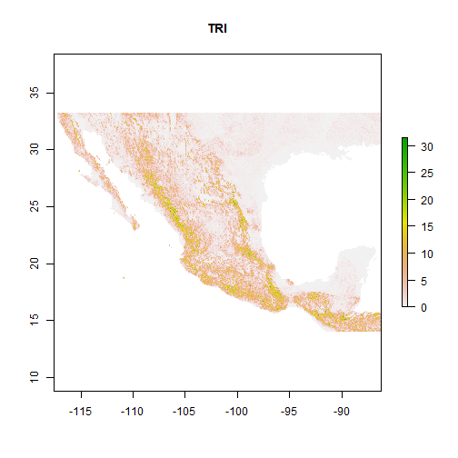
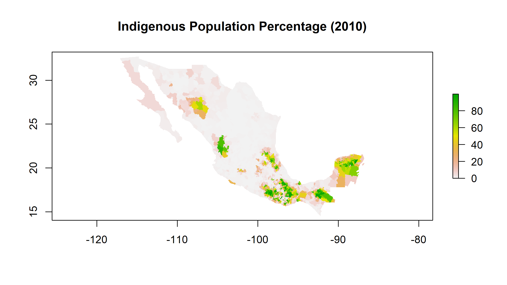

<style>
body {
    overflow: scroll;
}
</style>


Evaluating Impacts of Climate Change on Traditional Mexican Maize
========================================================
author: Steven C. Gonzalez
date: December 6th, 2017
autosize: true
width: 1920
height: 1080
font-family: arial
css: exlaim.css
Presented to:<br />
Dr. Russell Weaver (Chair) <br />
Dr. Jennifer Jensen <br />
Dr. Thomas Ballinger <br />

M.S.Thesis Proposal <br />
Department of Geography, Texas State University <br />
601 University Drive San Marcos, TX 78666-4684<br />
code: www.github.com/stevenconnorg/maices-enm <br />
contact: scg67@txstate.edu


Introduction
=======================================================
type: section

- Climate change is expected heavily impact natural and human systems worldwide  (Walther, G.-R. et al., 2002; IPCC 2007, 2013; Kang, Y, S. Khan 2009; Hoegh-Guldberg, O. 2010)

- The IPCC reports numerous negative impacts of climate change on domesticated crops regardless of the emission scenario implemented(Brown and Funk 2008; Ureta et al. 2012; IPCC 2013) 

- Ensuring global food security in an increasingly warming world with  exponentially increasing world population requires multidisciplinary research  (Brown and Funk 2008; Ureta et al. 2012; IPCC 2013, 2015) 

***

<br/>

https://www.elsevier.com 


Mexico: Maize's 'C.O.D.'
=======================================================
type: section

- Maize (<i>Zea mays</i> subsp. <i>mays</i> L.) supplies a staple food crop for more than 200 million people worldwide (Nuss and Tanumihardjo 2010; Ureta et al. 2013)

- Climate change is expected to alter maize suitability, especially between the tropics (Ramirez-Cabral et al., 2017)

- Mexico, maize's C.O.D., harbors traditional maize landraces that account for 60% of maize genetic diversity globally (Ureta et al. 2013)

- Preservation of agrobiodiversity at centers of domestication critical for global food security (Thrupp 2000; Esquinas-Alcazar 2005; Ureta et al. 2013).  

***


<div align="center">
Credit: The International Maize and Wheat Improvement Center (CIMMYT)
</div>

Maize Diversity & Evolution
=======================================================
type: section

https://lacienciaysusdemonios.com/2009/10/06/el-huerto-evolutivo-4-del-teocinte-teosinte-al-maiz-la-evolucion-es-la-repanocha/ 

***

- > 9,000 years from Mexican annual teosinte (<i>Z. mays</i> ssp. <i>Parviglumus</i> and ssp. <i>mexicana</i> ) via artificial selection by indigenous cultures (Matsuoka et al. 2002; Kato et al. 2009)
- Maize landraces have been grown (Ruiz Corral et al. 2008):
      - from sea-level to 2,900 (m asl)
      - avg. growing temp 12.0 &deg;C - 29.1 &deg;C
      - avg. seasonal precip. 400 mm to 3555 mm 
- Regional clusters of phenotypically similar landraces exist (Cutler 1942; Anderson 1947; E.J. Wellhausen et al., 1952; Dyer & Lopez-Feldman 2013)


Maize Mirrors Humanity
=======================================================
type: section

<div align="center">
 http://tarotdemaximo.blogspot.com
</div>
***

- As a domesticated crop, maize is intimately contingent upon societal influences
- Edgar Anderson - "maize [as] as sensitive mirror of the people of who grow it" (Anderson, 1942, 1947)
- Today, numerous studies indicate human influences on maize distribution and diversity, including:
      - Seed management practices (Anderson 1947; Dyer and Lopez-Feldman 2013)
      - Indigenous religious practices (relating to shape and color) (R. Ortega-Paczka., 2003) 
      - Ethnolinguistic diversity (Perales, Benz, and Brush 2005; Brush and Perales 2007; Rivero-Romero et al. 2016)
      - Indigenous agricultural knowledge (Garcia-Martinez et al. 2016; Rivero-Romero et al. 2016)
      - Agro-technological practices (Garcia-Martinez et al. 2016; Rivero-Romero et al. 2016; Toledo and Barrera-Bassols 2017)
      - variations across ethnic groups (Perales, Benz, and Brush 2005; Brush and Perales 2007)
    


Purpose Statements
=======================================================
1. Model current relationships between maize landraces and their niches 
    + Project maize niches into geographic space 
    + Forecast these projections with future climate models 
2. Identify patterns
    + Evaluate spatio-temporal relationships between indigeneity and maize diversity (Variable importance)
    + Quantify maize landrace diversity and it's projected change (Shannon Diversity Index)
    + Identify similarities among species occurrence patterns (Jaccard similarity)
    + Geovisualization
3. Provide the groundwork for future work


Research Questions
=======================================================
1. How do social and environmental factors contribute to maize landraces' current distribution? 
2.	What are the characteristics of each maize landraces ''bioclimate envelope''?
3.	Can the contributions of indigeneity and society to maize landraces distribution and diversity be discerned and modelled at the national level?
4.	What is the nature of the relationship between maize landrace diversity and indigeneity in Mexico? 
5.	How is climate change projected to alter current maize landrace distributions?
6.	Which maize landraces are suseptible of extinction/expansion?

Ecological Niche
=======================================================
type: section

<div align="center">
http://lakes.chebucto.org/PEOPLE/PIC/hutchinson_tree.jpg
</div>

***
<br />
- Strongly guided by developments of the term 'biological niche' in the 20th century. 
- Joseph Grinnell, Charles Elton 
    - systematically associating environmental attributes to specific niches
    - niches corresponded to species' environments 
- George Evelyn Hutchinson claimed biological niches as the roles a community or species performs at any particular time (Colwell and Rangel 2009). 
- The Hutchinsonian Niche is an attribute of a species in relation to its biotic (bionomic) and abiotic (scenopoetic) environment to <i>n</i>-level of ecological space (Colwell and Rangel 2009; Holt 2009). 
- Under this definition, a species' biological niche defines its role in its habitat, but not solely its habitat itself.


Fundamental vs. Realized Niche
=======================================================
type: sub-section


<font size = "5px"> https://www.frontiersin.org/files/Articles/257078/fvets-04-00105-HTML/image_m/fvets-04-00105-g001.jpg </font>

*** 
<br />
<br />
- hyper-dimensional niche volume in which "every point... corresponds to a state of the environment that would permit [a] species... to exist indefinitely" (Hutchinson 1957; Holt 2009). 
- A species' potential geographic distribution in true 4D space, constrained by its n-dimensional bioclimatic envelope. 
- 'Grinnellian niche'
- In reality, a species'niche is inherently limited by 'bionomic' interactions. 
- Hutchinson argued that two species that shared resources cannot coexist in a "limited system" (Pulliam 2000)
- A true "realized niche" is necessarily smaller than the fundamental niche. 
- A species' realized niches represents the portion of a species' fundamental niche that exists in reality and that does not overlap with other species niches (Griesemer 1992)


Biotic-Abiotic-Mobility Diagram
=======================================================


(Guisan et al., 2017; A. Townsend Peterson et al. 2011; Soberon & Peterson, 2005)

***

- G : Studied geographic area
  - A : Suitable abiotic environment (Grinellean niche)
  - B : Suitable biotic environment (Eltonian niche)
  - C : Colonizable range

1.  Realize Niche, suitable to all three (Hutchinson's Niche)
2. Sutiable abiotic with unsuitable biotic conditions (e.g.: high competition)
3. Colonization outside of suitable environment (sink populations)
4. Sink in unsuitable biotic and abiotic environments (historical effects)

Ecological Niche Modelling
=======================================================
type: section

- Uses species presence and/or absence observation data and ecological data at those observation sites to estimate complex relationships of species niche (Elith et al. 2011). 
- Project hyperdimensional ecological space onto 2- or 3D geographic space
- Numerous uses including:
      1. Identifying potential spread of vector borne diseases 
      2. Identifying range of invasive species
      3. Threatened species management
      4. Crop modelling
- Numerous ecological niche modeling algorithms have been developed to project ecological niche spaces into geographic spaces (e.g.: Bioclimatic Envelopes, Genetic Algorithm Rule-set Production, Maximum Entropy, Artificial Neural Networks, Support Vector Machines, Boosted Regression Trees)
- Ensemble Ecological Niche Modelling weights individual models based on performance; increases performance (Filho et. al, 2010, Araujo & New 2007)
- WA and Mean consensus methods provided significantly more robust predictions than single-models and the other consensus methods (Marimon et al., 2009)


Data
=======================================================
1. Georeferenced maize observations
2. Ethno-linguistic Data
3. Gridded Climatologies
  - derived "Bioclimatic Variables"
4. Topography/Land Cover

Georeferenced Maize Observations
=======================================================


- 22931 available through <i>La Comision Nacional para el Conocimiento y Uso de la Biodiversidad </i>(CONABIO)
- Cleaned records of erroneous records and those flagged 'Inconsistent'
- 18060 remaining records
- 64 unique maize races


*** 


Climatological Data
=======================================================
type: section
- WorldClim 
  - 30 arc-second resolution
  - ANUSPLIN up to 60,000 weather stations (with >10 years data)
  - largest available archive of downscaled climate data for ecology  (Guisan et al., 2017)
  - >2,700 citations for ecological studies including ENMs and SDMs (Booth et al., 2014)

- Current Data from WorldClim 2.0 (Fick & Hijmans, 2017)
  - 1970-2000
  - Maximum and Minimum Monthly Temperatures (&deg;C * 10)
  - Monthly Precipitation (mm)
  - also includes solar radiation, windspeed, water vapor pressure

- Future Data from Worldclim 1.4 (Hijmans et al., 2005)
  - 2041-2060, 2061-2080
  - dynamically-downscaled from 19 GCM used in CMIP5 (Coupled Model Intercomparison Project 5; Meehl et al., 2009) and the Fifth Assessment Report (IPCC, 2013 )
  - RCP 8.5 

Projecting onto Future Climatologies
=======================================================
type: sub-section
- Ensemble future climate models to reduce uncertainty across:
    - Relative Concentration Pathways
    - GCM
- Monthly future climatologies were averaged across five GCMs:
    - CCSM4 (Community Climate System Model, UCAR)
    - MIROC5 (Model for Interdisciplinary Research on Climate)
    - MPI-ESM-LR (Max-Plank Institute) 
    - HADGEM2-ES (Met Office Hadley)
    - GFDL-CM3 (Geophysical Fluid Dynamics Laboratory )
- Any of these five model performs better singularly than ensemble of all other models in predicting previous climatologies (Conde et al. 2011)
- 5th National Communication of Mexico for the United Nations Framework Convention on Climate Change (2012)
- Here, using updated analogs of GCMs used in (Conde et al. 2011) 


Bioclimatic Variable Processing
=======================================================
type: sub-section

- Derived from first ecological niche modelling alogorithm 'BIOCLIM' (Nix, 1986)
- More ecologically importance predictor variables
- Can reduce multicollineary, VIF; expands options
- Calculated from monthly Tmax, Tmin, Tmean, and Prec
- 19 Bioclimatic proxy variables from monthly means using 'dismo' (Hijmans et al., 2017)
- Potentially 16 'complementary' variables from 'envirem' package in R (Title & Bemmels, 2017)
    - Must use (WorldClim 2.0) current terrestial solar radiation for both current and future climatologies
    - Must average Tmin and Tmax to get Tmean (.99 R^2) (Title & Bemmels, 2017)

'dismo' Biovars
=======================================================

- BIO1 = Annual Mean Temperature
- BIO2 = Mean Diurnal Range (Mean of monthly (max temp - min temp))
- BIO3 = Isothermality (BIO2/BIO7) (* 100)
- BIO4 = Temperature Seasonality (standard deviation *100)
- BIO5 = Max Temperature of Warmest Month
- BIO6 = Min Temperature of Coldest Month
- BIO7 = Temperature Annual Range (BIO5-BIO6)
- BIO8 = Mean Temperature of Wettest Quarter
- BIO9 = Mean Temperature of Driest Quarter
- BIO10 = Mean Temperature of Warmest Quarter 

***

- BIO11 = Mean Temperature of Coldest Quarter
- BIO12 = Annual Precipitation
- BIO13 = Precipitation of Wettest Month
- BIO14 = Precipitation of Driest Month
- BIO15 = Precipitation Seasonality (Coefficient of Variation)
- BIO16 = Precipitation of Wettest Quarter
- BIO17 = Precipitation of Driest Quarter
- BIO18 = Precipitation of Warmest Quarter
- BIO19 = Precipitation of Coldest Quarter

'envirem' Biovars
=======================================================

- Annual PET
- Thornthwaite Aridity Index 
- Climatic Moisture Index
- Continentality
- EmbergerQ
- Growing Deg Days 0
- Growing Deg Days 5
- Growing Deg Days 10
- Max Temp Coldest
- Min Temp Warmest

***

- Month Count By Temp 10
- PET Coldest Quarter
- PET Driest Quarter
- PET seasonality
- PET Warmest Quarter
- PET Wettest Quarter
- Thermicity Index

======================================================
<div align="center">


</div>

Topographic Variable Processing
======================================================
- Terrain Indices from Elevation from WorldClim 1.4 via SRTM (Shuttle Radar Topographic Mission)  with 'raster' package (Hijmans, 2017)
  - Aspect
  - Slope
  - Roughness (difference between the maximum and the minimum value of a cell and its 8 surrounding cells) as in Wilson et al. (2007)

***



Land Cover and Soils
======================================================
FAO Harmonized Soil Database 1.2 (Fischer et al., 2008)
- Soil Quality Data  (Ordered Factor 1-4; 'No or slight limitations' to 'Very severe limitations')
    1. Nutrient availability
    2. Nutrient retention capacity
    3. Rooting conditions
    4. Oxygen availability to roots
    5. Excess salts
    6. Toxicity
    7. Workability (constraining field management)
- Land cover (Continuous)
    1. rain-fed cultivated land
    2. irrigated cultivated land, according to GMIA 4.0
    3. total cultivated land
    4. forest land, calibrated to FRA2000 land statistics
    5. grass/scrub/woodland
    6. built-up land (residential and infrastructure)
    7. barren/very sparsely vegetated land
    8. Mapped Water Bodies


Ethno-linguistic Diversity Variables
=======================================================
- La Comisión Nacional para el Conocimiento y Uso de la Biodiversidad (CONABIO)
- 1990 indigenous population % at <i>municipio</i> level
- Rasterized identical resolution

*** 



========================================================


Variables to Thin
======================================================
- Indigenous Population Percentage
- Land Cover Classification
- Soil Quality 1-7
- 19 'dismo' bioclimatic variables
- 16 supplemental 'envirem' bioclimatic variables

Method
- 'usdm' R package vif function (Naimi et al., 2014)
- preferred over correlation thresholds due to 'hidden' correlation structures (Guisan et al., 2017)
- correlation structures may change over time
- select variables of ecological importance
- 'vifstep' with VIF threshold of 10 to get remaining variables (Guisan et al., 2017)


'vif' results
======================================================


```
               Variables          VIF
1        BIO1AnnMeanTemp 1.261212e+05
2   BIO2MeanDiurnalRange 3.433839e+02
3           BIO3Isotherm 1.008546e+02
4              BIO4TSeas 6.573645e+03
5      BIO5TWarmestMonth          Inf
6   BIO6MinTColdestMonth          Inf
7          BIO7TAnnRange          Inf
8      BIO8MeanTWettestQ 5.934433e+01
9       BIO9MeanTDriestQ 7.722524e+01
10    BIO10MeanTWarmestQ 2.508201e+03
11    BIO11MeanTColdestQ 1.265249e+04
12          BIO12AnnPrec 4.731866e+02
13 BIO13PrecWettestMonth 9.654969e+01
14  BIO14PrecDriestMonth 7.876804e+01
15     BIO15PrecSeas.COV 1.770142e+01
16     BIO16PrecWettestQ 1.680402e+02
17      BIO17PrecDriestQ 1.399311e+02
18     BIO18PrecWarmestQ 8.106017e+00
19     BIO19PrecColdestQ 2.657508e+01
20             EVMannPET 1.820028e+02
21     EVMthornthwaiteAI 1.348320e+08
22         EVMclimaticMI 1.348336e+08
23     EVMcontinentality 2.263212e+03
24          EVMembergerQ 7.249427e+01
25    EVMgrowingDegDays0 1.255414e+05
26    EVMgrowingDegDays5 1.173782e+02
27     EVMmaxTempColdest 5.476294e+02
28     EVMminTempWarmest 3.243490e+02
29    EVMmonthCountByT10 4.614369e+00
30        EVMPETColdestQ 2.230254e+02
31         EVMPETDriestQ 6.754274e+01
32            EVMPETseas 4.166684e+02
33        EVMPETWarmestQ 1.473191e+02
34        EVMPETWettestQ 5.270414e+01
35    EVMthermicityIndex 6.416108e+01
36             TotalCult 5.655149e+03
37               IrrCult 1.057087e+03
38          Rain.fedCult 4.608966e+03
39              Forested 4.483750e+01
40        Grass.Woodland 4.050543e+01
41                Barren 1.699018e+01
42                 Urban 1.927545e+00
43                 Water 2.626440e+00
44             roughness 1.458907e+01
45                aspect 1.029889e+00
46                 slope 1.279400e+01
```

'vifstep' results
======================================================


```r
presvifstep@results
```

```
               Variables      VIF
1      BIO8MeanTWettestQ 3.169749
2  BIO13PrecWettestMonth 7.203552
3      BIO15PrecSeas.COV 5.426713
4      BIO18PrecWarmestQ 5.112587
5      BIO19PrecColdestQ 6.479971
6      EVMminTempWarmest 3.258270
7     EVMmonthCountByT10 2.206976
8         EVMPETColdestQ 5.539127
9          EVMPETDriestQ 2.507005
10        EVMPETWarmestQ 4.670706
11               IrrCult 1.169090
12          Rain.fedCult 1.599255
13        Grass.Woodland 2.314950
14                Barren 1.730909
15                 Urban 1.075483
16                 Water 1.107406
17                aspect 1.023113
18                 slope 1.446115
```

'vifcor' results
======================================================


```r
presvifcor@results
```

```
              Variables       VIF
1  BIO2MeanDiurnalRange 18.522678
2          BIO3Isotherm 23.926854
3     BIO8MeanTWettestQ  3.749390
4      BIO9MeanTDriestQ 23.234599
5     BIO15PrecSeas.COV  6.459824
6     BIO18PrecWarmestQ  3.463208
7     BIO19PrecColdestQ  7.060739
8             EVMannPET 55.203847
9     EVMminTempWarmest 28.195976
10   EVMmonthCountByT10  2.540841
11        EVMPETDriestQ 15.802205
12       EVMPETWarmestQ 45.516679
13   EVMthermicityIndex 13.293752
14              IrrCult  4.539498
15         Rain.fedCult 14.357032
16             Forested 45.296046
17       Grass.Woodland 40.844532
18               Barren 15.374231
19                Urban  1.777139
20                Water  2.225376
21               aspect  1.027214
22                slope  1.546577
```


Proposed Methods
=======================================================
-  Ecological Niche modelling with biomod2 with up to 
    - 10 modelling algorithms
        - 'GLM','GBM','GAM','CTA','ANN','SRE','FDA','MARS','RF','MAXENT.Phillips', 'MAXENT.Tsuruoka'
    - 10 evaluation metrics
        - 'KAPPA', 'TSS', 'ROC', 'FAR', 'SR', 'ACCURACY', 'BIAS', 'POD', 'CSI' and 'ETS'
    - <i> n </i> modelling repetitions
    - <i> n </i> PA pseudo-absence repetitions
- Data format tuning with 'BIOMOD_Tuning' function
- Ensemble landrace models by weighted-average by model
- Average weighted-averages across models
- Parallel process on TxState LEAP HPC Cluster with OpenMpi/Rmpi and SLURM
    - 64 nodes with 28 CPUs, up to 128 Gb RAM
    
Pseudo-absence selection
=======================================================
- 'biomod2' requires daata formatting with pseudo-absences
- 4 strategies
    - 'random' - random
    - 'disk' - minimal and maximal distance
    - 'sre' - environmental stratefied 
    - 'user-defined' - predefined/true absences
    
***

<div align="center">

https://support.bccvl.org.au
</div>

Pseudo-absence selection Recommendations  
=======================================================
Barbet-Massin et al. 2012

1. ~ 10,000 of pseudo-absences when using regression techniques 
2. ~ 10 runs with ~100 pseudo-absences with multiple adaptive regression splines and discriminant analyses;
3. Equal number of pseudo-absences/presences with ~10 runs for classification techniques (e.g.: BRT, CART and RF). 
4. Random selection of pseudo-absences when using regression techniques 
5. Environmentally stratified pseudo-absences when using classification and machine-learning techniques

Potential Subsequent Analyses
=======================================================
- Binary distribution maps using probability thereshold
- Alpha-Diversity and Range Change/Extinction Rate
- Diversity Indices (and change)
- Evaluation across model type, maize landrace
- Cluster Analysis of Variable Importance
- Evaluation Importance of Indigeneity
- Dendrogram of distribution similarities ('fuzzySim' in R)
- Geovisulation of Impacted Indigenous Communities

Novelty of Research
=======================================================
- Averaging good-performing updated GCMs for forcasting
- Ensemble modelling
- Expanded datasets
- Careful pseudo-absence selection
- WorldClim 2.0 > 1.4
- CMIP5 Data

Bibliography
========================================================
class: small-code
<font size = "5px">
Use the `bibliography` function to add the bibliography.


</font>
